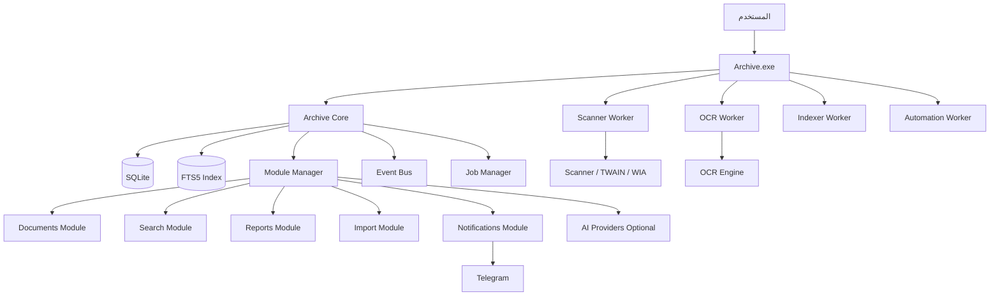

# Darhous Smart Archive
# Master Project Documentation

**الإصدار:** v1.0 FINAL  
**الحالة:** Consolidated / Approved Baseline  
**المحتوى:** جميع الوثائق الأساسية للمشروع بعد تطبيق التحديثات المتفق عليها.

---

## الفهرس

1. Software Architecture Document (SAD) v1.0 FINAL  
2. Plugin SDK Specification v1.0 FINAL  
3. Database & Data Model Specification v1.1 FINAL  
4. Visual Identity & UI/UX Design System v1.0 FINAL  
5. Core Implementation Plan v1.0 FINAL  

---

## التحديثات المدمجة في هذه النسخة

تم دمج المتطلب الجديد الخاص بـ:

**Automatic Computer Discovery & Continuous Indexing**

ويشمل:

- فحص الأقراص المحلية تلقائيًا.
- عرض الملفات المدعومة حسب الامتداد في الفحص الأولي.
- Technical Exclusions لمجلدات النظام.
- User Exclusions من الإعدادات.
- Indexed In Place كتصرف افتراضي للملفات المكتشفة.
- FileSystemWatcher.
- Hourly Reconciliation.
- Daily Full Reconciliation.
- اكتشاف الملفات الجديدة والمفقودة.
- عدم اتباع Reparse Points/Junctions افتراضيًا.
- واجهة Sources/Discovery في UI.
- نماذج البيانات `source_drives`, `source_exclusions`, `discovery_runs`.

---


---

# 1. Software Architecture Document (SAD) v1.0 FINAL


# Darhous Smart Archive
## Software Architecture Document (SAD)
**الإصدار:** v1.0  
**الحالة:** FINAL / Approved Baseline  
**المنصة المستهدفة:** Windows 10 / Windows 11  
**نمط التطبيق:** Desktop Native Application — Local First — Single Device  
**اللغة الأساسية للواجهة:** العربية RTL  
**الاسم الرسمي للمشروع:** Darhous Smart Archive  

---

# 1. الغرض من الوثيقة

هذه الوثيقة هي المرجع المعماري الأساسي لتطبيق **Darhous Smart Archive**.  
هدفها تثبيت القرارات المعمارية الرئيسية قبل بدء التنفيذ، وتحديد حدود الـCore، الموديولات، الإضافات، قاعدة البيانات، الفهرسة، البحث، الماسحات والطابعات، الـOCR، الأتمتة، النسخ الاحتياطي، الذكاء الاصطناعي، التحديثات، التنبيهات، وسيناريوهات الأعطال.

يُفترض أن يعتمد عليها أي مطور يعمل على المشروع مستقبلًا، وأن تُستخدم كأساس لوثائق لاحقة مثل:

- Plugin SDK Specification
- Database Schema Specification
- API / Contracts Specification
- Architecture Decision Records (ADR)
- Testing Strategy
- Deployment & Release Guide
- Developer Plugin Documentation

---

# 2. الرؤية العامة

Darhous Smart Archive هو برنامج أرشيف إلكتروني مكتبي يعمل محليًا على Windows، ويهدف إلى إدارة وفهرسة والبحث داخل ما يصل إلى **1,000,000 مستند** على جهاز واحد، مع دعم إدخال المستندات من:

- Scanner
- PDF
- DOC / DOCX
- XLS / XLSX
- PPT / PPTX
- Outlook MSG / EML
- ملفات موجودة مسبقًا في أماكنها
- ملفات يتم استيرادها إلى مستودع الأرشيف المدار بواسطة البرنامج

البرنامج ليس Web App ولا يحتاج إلى Server في الإصدار الأول.

الهدف الوظيفي الأساسي:

> **Search → Result → Preview / Open Original**

مع إضافة إمكانيات تنظيم وفهرسة وحصر وتقارير وأتمتة ونسخ احتياطي ونظام Plugins قابل للتوسع.

---

# 3. أهداف المعمارية

## 3.1 الأهداف الأساسية

1. البرنامج يعمل كـ **Windows EXE**.
2. يعمل محليًا بالكامل في الوظائف الأساسية.
3. يدعم ما يصل إلى مليون مستند.
4. البحث يجب أن يكون سريعًا حتى مع الحجم الكبير.
5. يدعم البحث داخل محتوى الملفات.
6. يدعم العربية بشكل جيد.
7. يدعم نظام Plugins حقيقي منذ الإصدار الأول.
8. يسمح بتثبيت Plugins مستقبلًا دون إعادة بناء الـCore.
9. فشل Plugin اختياري لا يجب أن يؤدي إلى سقوط البرنامج بالكامل.
10. فشل Scanner / OCR / AI / Telegram لا يجب أن يعطل Documents أو Search.
11. الفهرس قابل لإعادة البناء.
12. الملفات الأصلية لا تعتبر جزءًا من قاعدة البيانات نفسها.
13. قاعدة البيانات لا تحتوي على Binary files إلا عند الحاجة القصوى.
14. النظام قابل للتطوير مستقبلًا إلى:
    - Multi-user
    - Network Mode
    - Online Plugin Store
    - Semantic Search
    - AI-assisted Classification
    - Cloud / NAS storage

---

# 4. القيود والافتراضات

## 4.1 الإصدار الأول

- جهاز واحد فقط.
- Windows 10 وWindows 11.
- لا يوجد Server مركزي.
- قاعدة البيانات Local.
- لا يوجد Multi-user concurrent access من أكثر من جهاز في V1.
- البرنامج عربي RTL.
- يمكن استخدام الإنترنت لبعض Plugins الاختيارية فقط.
- الذكاء الاصطناعي Cloud اختياري وليس شرطًا لعمل النظام.
- النسخ الاحتياطي محلي ويمكن تصديره إلى:
  - فلاشة USB
  - قرص داخلي آخر
  - مجلد محلي
  - مسار يحدده المستخدم

---

# 5. مبادئ معمارية ملزمة

## 5.1 Core Stability Principle

> يجب أن يظل الـCore والبحث وإدارة المستندات قابلين للعمل حتى لو تعطلت أي إضافة اختيارية أو Scanner Provider أو OCR Provider أو Notification Provider أو AI Provider.

## 5.2 Local First

البرنامج يعمل بدون إنترنت في الوظائف الأساسية:

- Documents
- Search
- Folders
- Indexing
- Reports
- Scan
- OCR Local
- Backup
- Audit

## 5.3 Plugin First Extensibility

أي ميزة قابلة للتغيير أو الاستبدال يجب أن تُعرض عبر Contract / Interface واضح.

## 5.4 Search Index Is Not Source of Truth

الـSearch Index ليس مصدر الحقيقة.  
مصدر الحقيقة هو:

1. الملفات الأصلية
2. Metadata الأساسية في قاعدة البيانات

إذا تلف الفهرس، يجب أن يمكن إعادة بنائه بالكامل.

## 5.5 Safe Defaults

- Cloud AI = Disabled افتراضيًا.
- Plugins غير الموقعة = مرفوضة افتراضيًا.
- Developer Mode = Off افتراضيًا.
- حذف المستند = إلى سلة داخلية أولًا.
- تحديثات Core = قابلة للرجوع Rollback.
- تعريفات الأجهزة = Windows أو Vendor official only.

## 5.6 Process Isolation

الأجزاء الأكثر عرضة للتعطل تعمل خارج العملية الرئيسية عند الحاجة.

---

# 6. النمط المعماري

يعتمد النظام على مزيج من:

- Clean Architecture
- Modular Monolith
- Plugin Architecture
- Event-Driven Architecture
- Out-of-Process Workers
- Outbox Pattern
- CQRS جزئي عند الحاجة
- Background Job Processing
- Repository / Service abstractions
- Dependency Injection

---

# 7. النظرة العليا للنظام



---

# 8. مكونات الحل

## 8.1 Archive.Desktop

البرنامج الرئيسي.

مسؤول عن:

- Main Window
- Navigation
- Search UI
- Document Preview
- Settings
- User Session
- Plugins UI
- Health Dashboard
- Notifications UI
- Update UI
- Backup UI

لا يجب أن يحتوي على تفاصيل Vendor-specific للماسحات أو الذكاء الاصطناعي.

---

## 8.2 Archive.Core

يحتوي فقط على البنية المشتركة.

### مسؤولياته

- Application Lifecycle
- Module Manager
- Plugin Host
- Event Bus
- Job Manager
- Health Monitoring
- Configuration
- Permission model
- Error boundaries
- Logging abstractions
- Outbox processing abstractions
- Service registry
- Plugin compatibility checks

### غير مسموح داخل Core

- Epson-specific code
- Telegram-specific code
- Gemini-specific code
- OCR engine implementation
- PDF parsing implementation
- Outlook parsing implementation
- Printer vendor logic
- Scanner vendor logic

---

## 8.3 Archive.PluginSdk

مشروع مستقل ومستقر نسبيًا.

هو العقد الرسمي بين المنصة والـPlugins.

### Contracts أساسية

```csharp
IArchiveModule
IPlugin
IPluginContext
IPluginSettingsProvider
IPluginUiExtension
IPluginCommand
IDocumentService
IDocumentImporter
IDocumentExporter
ISearchProvider
IScannerProvider
IPrinterProvider
IOcrProvider
INotificationProvider
IAiProvider
IReportProvider
IAutomationTask
IBackupProvider
IDeviceProvider
IHealthContributor
```

---

# 9. نظام Plugins

## 9.1 الهدف

السماح بإضافة ميزات جديدة مستقبلًا من داخل البرنامج عبر:

**Settings → Plugins → Import Plugin**

بدون تعديل الـCore.

## 9.2 صيغة الحزمة

الامتداد المقترح:

```text
.archiveplugin
```

مثال:

```text
Archive.Telegram.archiveplugin
Archive.AI.Gemini.archiveplugin
Archive.Scanner.Naps2.archiveplugin
```

## 9.3 بنية الحزمة

```text
plugin.package
├── manifest.json
├── bin/
├── resources/
├── migrations/
├── workers/
├── docs/
└── signature.sig
```

## 9.4 Manifest

مثال:

```json
{
  "id": "Archive.AI.Gemini",
  "name": "Gemini AI Provider",
  "version": "1.0.0",
  "minCoreVersion": "1.0.0",
  "entryPoint": "Archive.AI.Gemini.dll",
  "publisher": "Darhous",
  "permissions": [
    "documents.read",
    "metadata.write",
    "network.outbound"
  ],
  "dependencies": []
}
```

---

# 10. حالات الـPlugin

كل Plugin يمتلك حالة واحدة من:

- Not Installed
- Installed
- Disabled
- Enabled
- Starting
- Healthy
- Degraded
- Failed
- Incompatible
- Update Available

## 10.1 واجهة الإدارة

```text
Settings
└── Modules & Plugins

Core
----------------------------
Database             Required
Plugin Manager       Required
Documents Core       Required

Official Modules
----------------------------
Search               Enabled
Scanner              Enabled
OCR                  Enabled
Reports              Enabled
Automation           Enabled
Telegram             Enabled
Backup               Enabled
AI                   Disabled

Plugin Library
----------------------------
[Import Plugin]
[Install]
[Update]
[Disable]
[Remove]
[Details]
```

---

# 11. Developer Mode

يوجد خيار:

**Settings → Developer → Developer Mode**

افتراضيًا:

```text
Off
```

عند تفعيله:

- يسمح بتثبيت Plugins غير موقعة.
- يعرض تحذير واضح.
- يسجل العملية في Audit Log.
- يسمح بعرض Plugin diagnostics.
- يسمح بإظهار SDK compatibility information.

يجب توفير Developer Documentation مستقلة مستقبلًا.

---

# 12. مكتبة الإضافات

## 12.1 V1

Local Plugin Library:

- Installed
- Available Local Packages
- Updates
- Import Plugin

## 12.2 مستقبلًا

Online Plugin Repository.

### يجب تجهيز الـArchitecture من البداية لدعم:

- Remote catalog
- Package download
- Digital signatures
- Version compatibility
- Update channels
- Rollback
- Ratings / metadata مستقبلًا

---

# 13. الصلاحيات

## 13.1 Roles

### Admin

يستطيع:

- كل وظائف المستخدم.
- Settings.
- Users.
- Plugins.
- Logs.
- Audit.
- Backup / Restore.
- Updates.
- AI settings.
- Device management.
- Developer Mode.

### User

يستطيع:

- البحث.
- العرض.
- الإضافة.
- Scanner.
- تعديل Metadata.
- الحصر.
- التقارير.
- التصدير.
- النقل بين التصنيفات.
- الحذف إلى سلة المهملات.

لا يستطيع:

- Settings الحساسة.
- Plugins management.
- Audit logs.
- User management.
- Developer Mode.

### Read Only

يستطيع:

- البحث.
- العرض.
- Preview.
- فتح المستند.
- الحصر.
- بعض التصدير حسب الإعداد.

لا يستطيع تعديل شيء.

### Guest Mode

يظهر عند عدم تسجيل الدخول إذا كان مفعلًا.

صلاحياته:

- Read Only فقط.
- لا Settings.
- لا Logs.
- لا تعديل.
- لا Scan.
- لا Import.
- لا Delete.

يمكن تعطيله من Settings.

---

# 14. نظام الدخول

يدعم:

- Username / Password
- Remember Me
- Switch User
- Logout
- Guest Mode
- Session timeout اختياري

يجب تخزين كلمات المرور باستخدام خوارزمية Hash آمنة، ولا تخزن بصيغة Plain Text.

---

# 15. Audit / Activity Log

الـAudit Log في Darhous Smart Archive ليس سجل أخطاء فقط، بل **سجل نشاط كامل للمستخدمين**.

يجب أن يسجل على الأقل:

- اسم المستخدم
- التاريخ والوقت
- الإجراء
- التفاصيل
- العنصر المتأثر عند وجوده
- نتيجة العملية
- Correlation / Job ID عند الحاجة

أمثلة للإجراءات التي يجب تسجيلها:

- Login
- Logout
- Switch User
- Failed Login
- Search
- Sort
- Filter
- Change View
- Open Document
- Preview Document
- Add Document
- Delete Document
- Restore Document
- Move Document
- Bulk Move
- Rename Document
- Edit Metadata
- Add / Remove Tag
- Create / Rename / Delete Folder
- Scan
- Import
- Export
- Print
- Backup
- Restore
- Plugin Install
- Plugin Enable
- Plugin Disable
- Plugin Remove
- Plugin Update
- Application Update
- Settings Changes

مثال شاشة اللوج:

```text
المستخدم   الوقت       الإجراء    التفاصيل
Ahmed      11:42:03    بحث        "الحماية المدنية"
Ahmed      11:42:08    فرز        الأحدث أولًا
Peter      11:45:12    إضافة      ARC-000152
Peter      11:47:03    نقل         المرور → الحماية
Admin      12:01:09    حذف         ARC-000152
```

يجب أن يستطيع الـAdmin:

- البحث داخل اللوج.
- الفلترة حسب المستخدم.
- الفلترة حسب نوع الإجراء.
- الفلترة حسب التاريخ.
- التصدير إلى Excel / CSV / PDF.
- مشاهدة تفاصيل قبل/بعد التغيير عند توفرها.

حقول مقترحة:

```text
AuditId
Timestamp
UserId
UsernameSnapshot
Action
ActionCategory
EntityType
EntityId
EntityNameSnapshot
Details
SearchQuery
SortExpression
FilterExpression
BeforeJson
AfterJson
MachineName
Result
ErrorCode
CorrelationId
JobId
```

---

# 16. إدارة المستندات

## 16.1 أنواع المصادر

- Managed Archive
- Indexed In Place

### Managed Archive

البرنامج ينقل أو ينسخ الملف إلى مستودع الأرشيف.

### Indexed In Place

الملف يظل في مكانه الأصلي ويتم فهرسته وربطه بمساره.

---

# 17. نموذج المستند

حقول أساسية:

```text
DocumentId
ArchiveNumber
Title
OriginalFileName
StoredFileName
FilePath
StorageMode
FileType
FileSize
SHA256
PageCount
DocumentDate
ScanDate
ArchiveDate
FileCreatedDate
FileModifiedDate
FolderId
Status
CreatedBy
CreatedAt
UpdatedAt
DeletedAt
CurrentVersionId
```

---

# 18. Version History

كل مستند يمكن أن يحتوي على عدة Versions.

مثال:

```text
Document
├── v1
├── v2
├── v3
└── Current = v3
```

يجب أن يستطيع المستخدم:

- رؤية كل الإصدارات.
- فتح إصدار قديم.
- مقارنة Metadata.
- جعل إصدار قديم Current إذا لزم.

---

# 19. سلة المحذوفات الداخلية

الحذف لا يؤدي للحذف النهائي مباشرة.

الحالة:

```text
Active → Recycle Bin → Permanent Delete
```

يجب أن تدعم:

- Restore
- Delete Permanently
- Empty Bin
- Retention configurable

---

# 20. التصنيفات والمجلدات المنطقية

البرنامج يعتمد **Outlook-style Folder Tree** في الجزء الجانبي من الصفحة الرئيسية.

مثال:

```text
📁 كل الأرشيف
📁 المرور
    📁 مرور قنا
    📁 مرور القاهرة
📁 الحماية
    📁 الحماية المدنية
    📁 الوقاية
📁 الكتب الدورية
    📁 2024
    📁 2025
    📁 2026
📁 قطاع الأمن
📁 غير مصنف
🗑 سلة المحذوفات
```

يستطيع المستخدم المصرح له:

- إنشاء Folder.
- إنشاء Subfolder.
- Rename.
- Move.
- Delete.
- Drag & Drop للمستندات.
- نقل مستند واحد أو مجموعة مستندات إلى Folder آخر.
- تحديد عدة مستندات دفعة واحدة ثم تنفيذ Bulk Move.

هذه الفولدرات **منطقية داخل قاعدة البيانات**، وليست بالضرورة فولدرات فعلية على القرص.

فوائد ذلك:

- تغيير التصنيف بدون نقل آلاف الملفات الفعلية.
- عدم كسر المسارات.
- سرعة إعادة التنظيم.
- دعم الحصر والتقارير.
- سهولة بناء Saved Views وSmart Folders فوق نفس البيانات.

## 20.1 فصل المجلدات عن الـSaved Views

قاعدة معمارية:

> Folder = تصنيف حقيقي للمستند.  
> Saved View = نتيجة بحث / فلترة محفوظة.

لا يتم خلط الاثنين في نموذج البيانات حتى لو ظهرا معًا في الشريط الجانبي.

---

# 21. Tags

يدعم Tags مثل:

- عاجل
- متابعة
- مالي
- لجنة
- حادث
- قانوني
- مهم

يمكن ربط عدة Tags بنفس المستند.

---

# 22. Custom Fields

يجب دعم إضافة حقول مخصصة مستقبلًا بدون تعديل Core Schema كل مرة.

أمثلة:

- رقم المكاتبة
- رقم القضية
- نوع المركبة
- اسم الموظف
- الإدارة
- رقم الملف

أنواع مقترحة:

- Text
- Number
- Date
- Boolean
- Dropdown
- Multi-select

---

# 23. أنواع الملفات المدعومة في V1

## 23.1 PDF

- Text PDF
- Searchable PDF
- Image PDF
- OCR عند الحاجة

## 23.2 Microsoft Word

- DOCX
- DOC

## 23.3 Microsoft Excel

- XLSX
- XLS

## 23.4 Microsoft PowerPoint

- PPTX
- PPT

## 23.5 Outlook

- MSG
- EML

يتم تصميم Importer architecture لإضافة صيغ أخرى مستقبلًا.

---

# 24. النص الكامل والفهرسة

## 24.1 محرك البحث الافتراضي

SQLite FTS5.

## 24.2 مبدأ العمل

عند إدراج مستند:

```text
File
↓
Text Extractor
↓
Normalization
↓
Metadata
↓
FTS Index
```

## 24.3 دعم العربية

يتم حفظ:

1. النص الأصلي.
2. نسخة Normalized للبحث.

Normalization تشمل:

- أ / إ / آ / ٱ → ا
- ى → ي
- إزالة التشكيل
- إزالة التطويل
- تطبيع المسافات
- إزالة بعض علامات Unicode غير المرئية

لا يتم تعديل الملف الأصلي.

---

# 25. خيارات البحث

واجهة البحث تحتوي على Checkbox / Toggles مثل:

```text
[✓] اسم الملف
[✓] Metadata
[✓] محتوى المستند
```

يدعم:

- Exact phrase
- All words
- Any word
- Exclude word
- Prefix search
- Filters
- Date range
- Folder
- File type
- Tags
- Status
- User
- Source

---


## 25.1 البحث كفلترة مباشرة للواجهة

نتائج البحث لا تحتاج صفحة مستقلة.

البحث يطبق مباشرة على قائمة المستندات الحالية، مع احترام:

- Folder الحالي.
- التاريخ.
- Smart Folder.
- Saved View.
- File Type.
- Tags.
- Search scope.
- Sort order.

تُحدث النتيجة في نفس الصفحة كلما تغير Query أو Filter.

# 26. نتيجة البحث

كل نتيجة تعرض:

- اسم المستند
- نوع الملف
- المجلد / الجهة
- التاريخ
- Snippet من النص
- Highlight للكلمات
- Tags
- المسار
- حالة الفهرسة

الإجراءات:

- Double Click → فتح الملف الأصلي
- Preview
- Open folder
- Copy path
- Export
- Move
- Tag
- Delete
- View versions

---


# 26.1 Multi-Select & Bulk Operations

كل مستند في List / Details View يمكن تحديده.

أمثلة:

```text
☑ مستند 1
☐ مستند 2
☑ مستند 3
☑ مستند 4
```

بعد الاختيار يمكن تنفيذ:

- Move to Folder
- Add / Remove Tags
- Export
- Print
- Add to Favorites
- Delete to Recycle Bin
- Re-index
- Retry OCR
- Change Metadata عند السماح

مثال نقل جماعي:

```text
نقل 3 مستندات إلى:

📁 المرور
📁 الحماية
📁 الكتب الدورية
📁 قطاع الأمن
```

يجب تسجيل العمليات الجماعية في الـAudit Log، مع الاحتفاظ بعدد العناصر ومعرفاتها أو Batch ID.

# 27. الأداء المستهدف

النظام مصمم لـ:

```text
1,000,000 documents
```

أهداف أولية:

- البحث الشائع: أقل من ثانية في معظم الحالات.
- فتح نتائج البحث بدون تجميد UI.
- Indexing في Background.
- OCR في Worker منفصل.
- استيراد Bulk بدون تجميد البرنامج.
- Pagination / Virtualization للنتائج الكبيرة.

---

# 28. قاعدة البيانات

## 28.1 المحرك

SQLite.

## 28.2 الوضع

WAL mode.

## 28.3 مبادئ

- لا تخزين ملفات PDF / Word داخل DB.
- تخزين Metadata فقط.
- Index مستقل وقابل لإعادة البناء.
- Migrations versioned.

---

# 29. الجداول الأساسية المقترحة

```text
Users
Roles
UserSessions
Documents
DocumentVersions
Folders
Tags
DocumentTags
CustomFields
CustomFieldValues
Plugins
PluginSettings
Jobs
JobHistory
AuditLog
OutboxEvents
Notifications
Devices
ScannerProfiles
BackupHistory
AppSettings
SearchSavedViews
RecycleBin
```

FTS:

```text
DocumentsFts
```

---

# 30. Search Provider Abstraction

```csharp
ISearchProvider
```

المحرك الافتراضي:

```text
SQLite FTS5
```

يمكن مستقبلًا تركيب:

```text
Lucene Search Plugin
Semantic Search Plugin
Vector Search Plugin
```

بدون تغيير بقية النظام.

---

# 31. العرض باليوم / الشهر / السنة

ميزة Core وليست Plugin.

## 31.1 Year View

```text
2026
----------------
يناير      1201
فبراير     1343
مارس       1582
...
```

## 31.2 Month View

```text
سبتمبر 2026
----------------
1 سبتمبر   42
2 سبتمبر   63
3 سبتمبر   51
...
```

## 31.3 Day View

```text
11 سبتمبر 2026
----------------
09:13   مستند 1
09:26   مستند 2
09:42   مستند 3
```

---

# 32. أنواع التاريخ

المستخدم يختار طريقة العرض حسب:

- Archive Date
- Document Date
- Scan Date
- File Created Date
- File Modified Date

الافتراضي:

```text
Archive Date
```

---

# 33. Calendar View

يوجد Calendar يعرض عدد المستندات لكل يوم.

مثال:

```text
September 2026

Sun Mon Tue Wed Thu Fri Sat
        1   2   3   4   5
        42  61  38  0   0
```

الضغط على اليوم يعرض مستنداته.

---

# 34. الفرز

يدعم:

- Newest
- Oldest
- Name A-Z
- Name Z-A
- Archive number
- Document date
- Archive date
- File size
- Page count
- File type
- Folder / Entity
- Last modified

ويفضل دعم Multi-sort مستقبلًا.

---

# 35. الحصر وSaved Views

المستخدم يستطيع إنشاء "حصر" وحفظه كـSaved View.

مثال:

```text
الجهة = مرور قنا
الفترة = 01/01/2026 → 31/08/2026
النوع = PDF
النص يحتوي = مركبات
```

يظهر:

```text
284 مستندًا
```

يمكن حفظه باسم:

```text
حصر مكاتبات مرور قنا 2026
```

وعند فتحه لاحقًا يتم تحديث النتائج حسب البيانات الحالية.

الـSaved View:

- لا ينقل المستندات.
- لا يغير Folder.
- يحفظ Query + Filters + Sort + Search Scope.
- يمكن تثبيته في الشريط الجانبي.
- يمكن مشاركته بين المستخدمين مستقبلًا إذا توسع النظام.

يجب الفصل في الـData Model بين:

```text
Folder
SavedView
SmartFolder
```

---

# 36. التصدير والتقارير

من V1:

- Excel
- PDF
- CSV
- Print

يجب أن تدعم التقارير:

- نتائج البحث
- الحصر
- المستندات حسب فترة
- المستندات حسب جهة
- المستندات حسب نوع
- الإحصائيات

---

# 37. الصفحة الرئيسية — Archive Explorer

الصفحة الرئيسية ليست Dashboard منفصلًا عن البحث، بل هي **مستكشف الأرشيف الرئيسي** الذي تتم داخله أغلب العمليات اليومية.

الهدف:

> نفس قائمة المستندات تبقى أمام المستخدم، ويقوم الفولدر والبحث والتاريخ والفلاتر والفرز بتقليص ما لا ينطبق عليها بدل الانتقال بين صفحات مستقلة.

التصميم المفاهيمي:

```text
┌──────────────────────────────────────────────────────────────────┐
│ 🔎 بحث في الأرشيف...                         + إضافة     Scan   │
├────────────────┬──────────────────────────────────┬───────────────┤
│ التقسيمات      │ المستندات                       │ Preview       │
│                │                                  │ اختياري       │
│ 📁 المرور      │ □ خطاب مرور قنا.pdf             │               │
│ 📁 الحماية     │ □ مذكرة الحماية المدنية.pdf    │               │
│ 📁 الكتب       │ □ كتاب دوري 15.pdf              │               │
│    الدورية     │ □ كتاب دوري 22.docx             │               │
│ 📁 قطاع الأمن  │                                  │               │
│                │                                  │               │
│ + تقسيم جديد   │                                  │               │
├────────────────┴──────────────────────────────────┴───────────────┤
│ 15,284 مستند  | آخر فهرسة: منذ 7 دقائق                          │
└──────────────────────────────────────────────────────────────────┘
```

## 37.1 Live Filtering

عند عدم وجود Search:

- تعرض القائمة كل المستندات داخل النطاق الحالي.

عند الكتابة في مربع البحث:

- نفس القائمة تتقلص لحظيًا.
- لا يتم الانتقال إلى صفحة Results منفصلة.
- مسح نص البحث يعيد القائمة السابقة.

مثال:

```text
15,284
↓
731
↓
84
↓
12
```

## 37.2 Search Scope

إذا كان المستخدم داخل Folder مثل:

```text
📁 المرور
```

فالبحث الافتراضي يكون:

```text
● البحث داخل "المرور"
○ البحث في كل الأرشيف
```

## 37.3 Preview Pane

يوجد Preview Pane اختياري يمكن:

- إظهاره.
- إخفاؤه.
- تغيير عرضه.

ويعرض Preview للمستند المحدد بدون الحاجة لفتح التطبيق الخارجي كل مرة.

## 37.4 Breadcrumb

أعلى قائمة المستندات يظهر:

```text
كل الأرشيف > المرور > مرور قنا
```

لتسهيل التنقل داخل الشجرة.

## 37.5 Search Chips

الفلاتر النشطة تظهر كـChips قابلة للإزالة، مثل:

```text
[المرور ×] [2026 ×] [PDF ×] [محتوى المستند ×]
```

## 37.6 Bulk Actions

عند تحديد أكثر من مستند يظهر شريط إجراءات:

```text
3 محددين

[نقل] [نسخ] [Tag] [تصدير] [طباعة] [مفضلة] [حذف]
```

## 37.7 Recent & Favorites

الصفحة الجانبية تدعم:

- Recent Documents
- Favorites

لتسريع الوصول للمستندات كثيرة الاستخدام.

## 37.8 Smart Folders

تظهر بجانب الفولدرات العادية، لكنها Views ديناميكية ولا تغيّر تصنيف المستند.

أمثلة:

```text
⭐ المفضلة
🕘 حديثًا
📅 أضيف اليوم
📅 آخر 7 أيام
📁 غير مصنف
⚠ يحتاج مراجعة
📄 PDF فقط
🔎 يحتاج OCR
```

## 37.9 Index Status

يظهر لكل مستند Status صغير عند الحاجة:

```text
مفهرس
يحتاج OCR
قيد الفهرسة
فشل الفهرسة
يحتاج مراجعة
```

## 37.10 Undo

العمليات الجماعية القابلة للتراجع مثل:

- Move
- Delete to Recycle Bin
- Tag change

يجب أن تدعم Undo لفترة قصيرة لمنع أخطاء التشغيل اليومية.

## 37.11 Keyboard Shortcuts

الحد الأدنى:

```text
Ctrl+F   البحث
Ctrl+N   إضافة مستند
F2       إعادة تسمية
Delete   إرسال للسلة
Ctrl+A   تحديد الكل
Ctrl+P   طباعة
Esc      إلغاء التحديد / إغلاق Preview Context
```

## 37.12 الإحصائيات داخل الصفحة الرئيسية

بدل Dashboard منفصل إلزامي، يمكن عرض Summary Strip أو Cards قابلة للإظهار تشمل:

- إجمالي المستندات
- أضيف اليوم
- أضيف هذا الشهر
- يحتاج مراجعة
- Jobs failed
- حالة Scanner
- حالة Index
- حالة Backup
- حالة Plugins

ولا يجب أن تعيق مساحة المستندات أو تدفق العمل الرئيسي.

---

# 38. Scanner Architecture

## 38.1 Scanner Provider

```csharp
IScannerProvider
```

التطبيق الافتراضي المقترح:

```text
NAPS2 SDK Provider
```

مع دعم:

- TWAIN
- WIA
- ADF
- Flatbed
- Resolution
- Color mode
- Duplex
- Page size
- Blank page removal
- Deskew
- OCR pipeline

---

# 39. Scanner Profiles

من V1 يجب دعم Profiles:

- مستند كامل → كل الدفعة ملف واحد
- كل صفحة → ملف مستقل
- كل صفحتين → ملف
- كل N صفحات → ملف
- Duplex
- Single-sided
- Flatbed
- ADF
- Color
- Grayscale
- Black & White

مثال:

```text
A4 - Single - 300 DPI - Arabic OCR
```

---

# 40. إضافة مستند من داخل البرنامج

Workflow:

```text
New Document
↓
Choose Folder / Entity
↓
Choose Input:
   Scan
   Existing File
   Drag & Drop
↓
Preview
↓
Save
↓
Index
↓
Available in Search
```

---

# 41. OCR

## 41.1 القاعدة

يجب الحفاظ على شكل الصفحة الأصلي.

الـOCR يضيف Text Layer فقط.

## 41.2 اللغة

الإعداد الافتراضي:

- Arabic
- English optional

## 41.3 OCR Provider

```csharp
IOcrProvider
```

التطبيق الافتراضي:

- Tesseract / NAPS2 OCR integration

يمكن تركيب Providers أخرى مستقبلًا.

---

# 42. OCR Decision Flow

```text
PDF
↓
هل يوجد Text Layer؟
├── نعم → استخراج النص مباشرة
└── لا
    ↓
   OCR
    ↓
Searchable PDF
    ↓
Index
```

---

# 43. Device Center

صفحة:

```text
Settings → Devices
```

تعرض:

### Scanners
- Device name
- Status
- Driver
- Provider
- Default profile
- Test button

### Printers
- Device name
- Status
- Driver
- Default printer
- Test Print

---

# 44. تعريفات الأجهزة

البرنامج لا يقوم بتنزيل Driver عشوائيًا.

إذا الجهاز غير معرف:

```text
Device detected
↓
Driver missing
↓
Show recommendation:
"قم بتثبيت تعريف Epson DS-1630"
```

ويعرض:

- استخدام Windows Update
- فتح صفحة الشركة الرسمية مستقبلًا
- تعليمات التثبيت

لا يتم تثبيت تعريف غير موثوق أو غير موقع.

---

# 45. Printer Provider

```csharp
IPrinterProvider
```

البرنامج يدعم:

- Print current document
- Print selected documents
- Print report
- Default printer
- Printer status عند توفره

---


# 46. Automatic Computer Discovery & Continuous Indexing

هذه الوظيفة **Core Feature أساسية** وليست Plugin اختيارية.

القاعدة الافتراضية:

> مصدر البيانات الأولي للأرشيف هو كل الملفات المدعومة الموجودة على الأقراص المحلية المسموح بها، مع استبعاد مجلدات النظام والاستثناءات التي يحددها المستخدم.

## 46.1 Initial Computer Discovery

عند أول تشغيل، يقوم النظام بمرحلة Discovery أولية:

```text
Enumerate local drives
↓
Apply Technical Exclusions
↓
Apply User Exclusions
↓
Scan filenames / paths / extensions
↓
Count supported files
↓
Show summary by extension and drive
↓
User starts indexing
```

المرحلة الأولى لا تقوم بتحميل محتوى كل ملف بالكامل؛ يتم أولًا اكتشاف:

- Path
- Extension
- Size
- Created / Modified timestamps

ثم توضع الملفات المؤهلة في Jobs منفصلة للفهرسة واستخراج النص.

## 46.2 Supported Extensions

الامتدادات الأساسية في V1:

```text
.pdf
.doc
.docx
.xls
.xlsx
.ppt
.pptx
.msg
.eml
```

ويتم توسيعها مستقبلًا عبر Importer Providers.

## 46.3 Technical Exclusions

يتم استبعاد مسارات النظام افتراضيًا، ومنها:

```text
C:\Windows
C:\Program Files
C:\Program Files (x86)
System Volume Information
$Recycle.Bin
Temp directories
Darhous internal directories
```

كما لا يتم اتباع Reparse Points / Junctions افتراضيًا لمنع حلقات الفحص غير المنتهية.

## 46.4 User Exclusions

من Settings يستطيع الـAdmin أو المستخدم المصرح له استثناء:

- Drive كامل.
- Folder.
- Subfolder.

وتكون الاستثناءات قابلة للإضافة والإزالة وإعادة الفحص.

## 46.5 Default Storage Behavior

الملفات المكتشفة تلقائيًا تدخل افتراضيًا بنمط:

```text
Indexed In Place
```

أي أن الملف يظل في مكانه الأصلي، بينما يحتفظ Darhous Smart Archive بالـMetadata والفهرس والمسار.

يمكن لاحقًا تحويل ملف محدد إلى:

```text
Managed Archive
```

بنسخ آمن داخل ArchiveStorage.

## 46.6 Continuous Indexing

بعد الفحص الأولي يبدأ النظام في المراقبة المستمرة:

```text
FileSystemWatcher
+
Hourly Reconciliation
+
Daily Full Reconciliation
```

عند اكتشاف ملف جديد:

```text
Detect
→ Extension validation
→ Hash
→ Duplicate check
→ Text extraction / OCR if needed
→ Register
→ Index
→ Audit
```

وعند اختفاء ملف Indexed-In-Place:

```text
Status = Missing
```

ولا يتم حذف سجل المستند تلقائيًا.

## 46.7 Discovery Safety

المسح الكامل للكمبيوتر MUST:

- ألا يحذف ملفات.
- ألا يغير الملفات الأصلية.
- ألا يرسل المحتوى إلى الإنترنت.
- يحترم Windows permissions.
- يمنع recursion عبر junction loops.
- يتيح Pause / Resume / Cancel أثناء الفهرسة الكبيرة.
- يعمل في Background بدون تجميد UI.

## 46.8 Sources View

يجب أن يدعم النظام عرض المصادر منطقيًا مثل:

```text
كل الكمبيوتر
C:
D:
E:
المجلدات المراقبة
غير مفهرس
الملفات المفقودة
```

مع إظهار Source لكل مستند ومساره وحالة التخزين.

## 46.9 Default Discovery Scope — قرار معتمد

المشكلة: فحص كل الأقراص المحلية تلقائيًا من أول تشغيل (بدون أي تمييز محتوى) ينتج آلاف أو مئات آلاف المستندات دفعة واحدة تحت "غير مصنف" (`folder_id = NULL`)، لأن V1 لا يملك تصنيفًا تلقائيًا بالذكاء الاصطناعي (مؤجل — §69). هذا يمس التجربة الأولى للمستخدم مباشرة، لذلك القرار التالي معتمد كسلوك افتراضي رسمي:

> **الفحص الأولي الافتراضي ليس "كل الأقراص".** عند أول تشغيل، يعرض النظام شاشة Onboarding تطلب من المستخدم اختيار مجلد واحد أو أكثر ليبدأ منها (تُسجَّل في `watch_folders` — Database Spec §58)، مع خيار صريح وواضح **"فحص الكمبيوتر بالكامل"** كإجراء إضافي يطلبه المستخدم عن وعي، وليس السلوك التلقائي.

آلية العمل:

```text
First Run
↓
Onboarding: "اختر المجلدات التي تريد أرشفتها"
   [+ إضافة مجلد]   [فحص كمبيوتر كامل (اختياري)]
↓
إذا اختار مجلدات محددة:
   Discovery يعمل فقط على watch_folders المحددة
↓
إذا اختار "فحص كمبيوتر كامل":
   يعمل Discovery الموصوف في §46.1–46.8 كما هو (كل الأقراص، مع Technical/User Exclusions)
   مع تحذير واضح بعدد الملفات المتوقع قبل البدء الفعلي
```

بهذا يبقى "فحص الكمبيوتر بالكامل" ميزة Core كاملة الوظائف كما هو موثق في §46.1–46.8 دون أي تغيير تقني، لكنه ينتقل من "سلوك افتراضي مفروض" إلى "خيار يختاره المستخدم بوعي" — وهذا يحل مشكلة ازدحام "غير مصنف" دون الحاجة لأي تصنيف تلقائي إضافي في V1.


# 47. Import Existing Archive

يدعم اختيار:

- Folder واحد
- عدة Folders
- Drive كامل اختياريًا

ثم:

```text
Scan Directory
↓
Detect supported files
↓
Hash
↓
Duplicate check
↓
Extract text
↓
Index
↓
Register
```

---

# 48. منع التكرار

كل ملف يحصل على:

```text
SHA-256
```

إذا ظهر نفس المحتوى باسم مختلف:

```text
Potential Duplicate
```

لا يتم الحذف تلقائيًا.

خيارات:

- Ignore
- Link
- Keep both
- Review later

---

# 49. File Watcher

يدعم مراقبة مجلدات محددة.

عند إضافة ملف جديد:

```text
File Created
↓
Wait until write complete
↓
Process
↓
Index
↓
Notify
```

---

# 50. Automation Architecture

العامل الأساسي:

```text
Archive.Automation.Worker.exe
```

وظائفه:

- Folder watching
- Scheduled scans
- Reconciliation
- Backup jobs
- Notification dispatch
- Retry jobs

---

# 51. الفحص الدوري

المقترح:

## Near-real-time
FileSystemWatcher.

## Hourly
Reconciliation لمجلدات المراقبة.

## Daily
Full consistency check.

---

# 52. Job System

كل عملية طويلة تمثل Job.

حالات:

- Pending
- Running
- Succeeded
- Failed
- Cancelled
- Retrying
- Needs Review

أمثلة:

- OCR
- Index
- Scan
- Import
- Backup
- Export
- Plugin Update

---

# 53. Crash Recovery

عند إغلاق البرنامج أو انقطاع الكهرباء:

```text
Running jobs
↓
Recovery check
↓
Requeue safe jobs
↓
Mark unsafe jobs Needs Review
```

---

# 54. Outbox Pattern

الأحداث المهمة تحفظ أولًا في قاعدة البيانات.

مثال:

```text
DocumentAdded
IndexCompleted
TelegramNotificationRequested
BackupCompleted
```

إذا توقف البرنامج قبل الإرسال:

- الحدث لا يضيع.
- يتم Retry لاحقًا.

---

# 55. Event Bus

الأحداث لا تربط Modules مباشرة.

مثال:

```text
DocumentAdded
├── Indexer
├── Audit
├── Notifications
└── Backup
```

Scanner لا يعرف Telegram.

---

# 56. أحداث رئيسية مقترحة

```text
DocumentAdded
DocumentUpdated
DocumentDeleted
DocumentRestored
DocumentVersionAdded
FolderCreated
IndexStarted
IndexCompleted
IndexFailed
OcrStarted
OcrCompleted
OcrFailed
ScanCompleted
ImportCompleted
BackupCompleted
PluginInstalled
PluginFailed
UpdateAvailable
UpdateInstalled
```

---

# 57. Process Isolation

## داخل Archive.exe

- Shell
- Documents
- Folders
- Search UI
- Reports UI
- Settings
- Plugin Manager

## Workers منفصلة

```text
Archive.Scanner.Worker.exe
Archive.Ocr.Worker.exe
Archive.Indexer.Worker.exe
Archive.Automation.Worker.exe
Archive.AI.Worker.exe
```

---

# 58. Health Monitoring

صفحة:

```text
System Health
```

مثال:

```text
Core                 Healthy
Database             Healthy
Search Index         Healthy
Scanner              Healthy
OCR                  Healthy
Automation           Healthy
Telegram             Healthy
AI                   Disabled
Backup               Healthy
```

إجراءات:

- Restart Worker
- View logs
- Disable Plugin
- Retry Job
- Rebuild Index

---

# 59. Telegram Module

Official Module في V1.

إعدادات:

- Bot Token
- Chat ID
- Enabled / Disabled
- Notification rules

تنبيهات مقترحة:

- Import completed
- Daily archive summary
- Backup failed
- OCR failed
- Index failed
- Plugin failed
- Update installed

مثال:

```text
تم تحديث الأرشيف
تم إدراج: 73
مكرر: 3
يحتاج مراجعة: 2
أخطاء: 0
```

---

# 60. Windows Notifications

يجب دعم Windows Toast Notifications من V1.

أمثلة:

- تم إدراج 25 مستندًا.
- انتهى النسخ الاحتياطي.
- يوجد تحديث جديد.
- Scanner غير متصل.
- فشل OCR.
- Plugin يحتاج تحديث.

يجب أن تكون قابلة للتفعيل أو الإيقاف حسب النوع.

---

# 61. Notification Center

داخل البرنامج يوجد مركز تنبيهات.

أنواع:

- Info
- Success
- Warning
- Error
- Update
- Device
- Backup
- Plugin

مع حالات:

- Unread
- Read
- Dismissed

---

# 62. النسخ الاحتياطي

المقصود في V1:

- Local export
- USB flash
- Local disk
- User-selected folder

## 61.1 Backup Package

امتداد مقترح:

```text
.dsabackup
```

يحتوي على:

- Database
- Settings
- Plugin state
- Metadata
- Optional files حسب نوع النسخة

## 61.2 أنواع النسخ

### Metadata Backup
قاعدة البيانات + الإعدادات فقط.

### Full Backup
قاعدة البيانات + الملفات المدارة.

### Configuration Backup
Settings + plugin configuration فقط.

---

# 63. Restore

من Settings:

```text
Backup & Restore
├── Create Backup
├── Import Backup
├── Restore
└── Validate Backup
```

قبل Restore:

- Validate
- Show summary
- Create safety snapshot
- Restore
- Verify

---

# 64. التحديثات

يوجد في Settings:

```text
Updates
```

## Manual

زر:

```text
Check for Updates
```

إذا وُجد تحديث:

```text
Update available
[Install Now]
[Later]
```

## Automatic

خيار:

```text
[✓] البحث عن تحديثات عند تشغيل البرنامج
[✓] تثبيت التحديثات تلقائيًا
```

عند تفعيل Auto Update:

```text
App starts
↓
Check
↓
Download
↓
Verify signature
↓
Install automatically
↓
Restart if required
```

---

# 65. Rollback

يجب دعم Rollback لآخر نسخة سليمة إذا فشل تحديث Core أو Plugin.

---

# 66. Plugin Updates

كل Plugin لديه Version مستقل.

الحالات:

```text
Current
Update Available
Incompatible
Rollback Available
```

---

# 67. AI Architecture

الذكاء الاصطناعي جزء رسمي من Settings، لكنه اختياري.

```text
Settings → AI
```

## Providers المطلوبة

- OpenAI
- Gemini
- Anthropic Claude
- OpenRouter

ويُجهز Contract لإضافة:

- Local AI
- Future providers

---

# 68. إعدادات AI

لكل Provider:

- Enable / Disable
- API Key / Token
- Model
- Temperature عند الحاجة
- Max tokens
- Timeout
- Usage limits
- Test Connection

---

# 69. AI Security / Privacy

رغم أن البرنامج Local، فإن Providers السحابية ترسل محتوى المستند للخارج.

لذلك:

- AI Disabled افتراضيًا.
- عند التفعيل يظهر تنبيه واضح.
- المستخدم يوافق على إرسال المحتوى للخدمة المختارة.
- Token يخزن مشفرًا.
- يمكن تقييد AI على Documents محددة.
- لا يعتمد Core على AI.

---

# 70. AI Use Cases المستقبلية

- استخراج الجهة
- استخراج رقم المكاتبة
- استخراج التاريخ
- استخراج الموضوع
- Keywords
- Summary
- Auto tags
- Suggested folder
- Suggested filename
- Semantic search
- Natural language query
- Duplicate similarity

لكن كل ذلك اختياري.

---

# 71. AI Failure Policy

إذا فشل AI:

- المستند يظل محفوظًا.
- الفهرسة الأساسية تستمر.
- البحث الأساسي يستمر.
- Job يسجل Failed/Retry.
- لا يتم إلغاء الإدراج.

---

# 72. n8n

ليس جزءًا من V1.

لكن يتم تجهيز:

```text
IAutomationConnector
```

بحيث يمكن إضافة:

```text
Archive.n8n.Connector.archiveplugin
```

مستقبلًا.

---

# 73. Logging

استخدام Logging مركزي.

مقترح:

- Serilog
- Rolling files
- Structured logs

أنواع:

- App log
- Worker log
- Plugin log
- Update log
- Device log

---

# 74. Error Handling

أي خطأ يجب أن يحتوي:

```text
ErrorCode
Timestamp
Component
Module
Message
ExceptionType
CorrelationId
JobId
UserId
```

---

# 75. Security Model

## أساسيات

- Password hashing
- Encrypted secrets
- Signed plugin packages
- Signed update packages
- No arbitrary DLL loading
- Developer Mode opt-in
- Audit sensitive actions
- Least privilege

---

# 76. Plugin Permissions

أمثلة:

```text
documents.read
documents.write
documents.delete
metadata.read
metadata.write
network.outbound
device.scan
device.print
settings.read
settings.write
notifications.send
```

قبل تثبيت Plugin تظهر الصلاحيات المطلوبة.

---

# 77. Plugin Database Ownership

Plugin لا يعدل Core tables مباشرة.

إما:

- يستخدم Core API
- أو يمتلك جداول خاصة به

Naming:

```text
Plugin_<PluginId>_*
```

---

# 78. Plugin Migrations

كل Plugin يمكن أن يحتوي على Migrations خاصة به.

قبل Update:

- Validate
- Backup
- Apply migration
- Health check
- Rollback if possible

---

# 79. UI Extension Points

Plugins يمكنها إضافة:

- Sidebar Page
- Settings Page
- Toolbar Button
- Context Menu Command
- Document Tab
- Search Provider
- Export Action
- Report
- Device Provider

---

# 80. Plugin Isolation

### In-Process

للإضافات البسيطة والموثوقة.

### Out-of-Process

للإضافات:

- Native
- Scanner
- OCR
- AI
- Heavy processing
- Unstable vendor SDKs

---

# 81. Driver / Device Plugin Strategy

يمكن إضافة Device Plugins مستقبلًا.

لكن Driver installation لا يكون جزءًا مباشرًا من Core.

إذا التعريف غير موجود:

- عرض اسم الجهاز.
- إبلاغ المستخدم بالتعريف المطلوب.
- استخدام Windows أو Vendor installer.
- إمكانية إضافة Driver Catalog مستقبلًا.

---

# 82. Technology Stack

## Core

```text
.NET 10 LTS
C#
WPF
```

## UI

```text
WPF
CommunityToolkit.Mvvm
```

## Database

```text
SQLite
FTS5
WAL
```

## Scanner

```text
NAPS2 SDK
TWAIN
WIA
```

## OCR

```text
Tesseract / NAPS2 OCR
```

## PDF

```text
PdfPig / suitable PDF library
```

## DOCX / XLSX / PPTX

```text
Open XML SDK
```

## Legacy Office

Worker-based Office Interop where required.

## Scheduling

```text
Quartz.NET
```

## Logging

```text
Serilog
```

## Resilience

```text
Microsoft.Extensions.Resilience / Polly
```

## Updates

```text
Velopack or equivalent
```

---

# 83. Solution Structure

```text
src/

Darhous.Archive.Core/
Darhous.Archive.PluginSdk/
Darhous.Archive.Application/
Darhous.Archive.Desktop/
Darhous.Archive.Persistence/

Modules/
    Darhous.Archive.Modules.Documents/
    Darhous.Archive.Modules.Folders/
    Darhous.Archive.Modules.Search/
    Darhous.Archive.Modules.Import/
    Darhous.Archive.Modules.Reports/
    Darhous.Archive.Modules.Notifications/
    Darhous.Archive.Modules.Backup/
    Darhous.Archive.Modules.Devices/

Workers/
    Darhous.Archive.Scanner.Worker/
    Darhous.Archive.Ocr.Worker/
    Darhous.Archive.Indexer.Worker/
    Darhous.Archive.Automation.Worker/
    Darhous.Archive.AI.Worker/

Plugins/
    Official/
    ThirdParty/

Tests/
    Core.Tests/
    PluginSdk.Tests/
    Persistence.Tests/
    Search.Tests/
    Integration.Tests/
    Worker.Tests/
```

> **ملاحظة:** هذا الهيكل هو النسخة المعمارية الأولية. الهيكل **النهائي المعتمد للتنفيذ** — بعد إضافة Discovery وModules.Preview/Updates/Plugins ومشاريع Contracts/Audit/Configuration/Security — موثق في **Core Implementation Plan §5 (Solution Structure)**، وهو المرجع الذي يجب اتباعه عند إنشاء الـRepository الفعلي.

---

# 84. مجلد التثبيت

مثال:

```text
Darhous Smart Archive/
├── DarhousArchive.exe
├── Core/
├── Modules/
├── Plugins/
├── Workers/
├── Runtime/
└── Resources/
```

بيانات المستخدم:

```text
ProgramData/
└── DarhousSmartArchive/
    ├── Data/
    ├── Index/
    ├── Logs/
    ├── Backups/
    ├── Temp/
    ├── PluginData/
    └── Updates/
```

---

# 85. تخزين الملفات المدارة

اقتراح:

```text
ArchiveStorage/
├── Documents/
│   ├── 2026/
│   ├── 2027/
│   └── ...
├── RecycleBin/
└── Quarantine/
```

التصنيفات المنطقية لا تعتمد على هذا الهيكل الفيزيائي.

---

# 86. Quarantine

أي ملف:

- تالف
- مشكوك فيه
- غير مدعوم
- فشل Import
- فشل OCR

يمكن نقله منطقيًا إلى:

```text
Needs Review / Quarantine
```

بدون فقدانه.

---

# 87. Integrity Check

مرة يوميًا أو يدويًا:

- Verify DB
- Verify file paths
- Verify hashes لبعض الملفات
- Verify index consistency
- Detect orphan files
- Detect orphan database records

---

# 88. Rebuild Index

يوجد أمر:

```text
Settings → Search → Rebuild Index
```

يعيد بناء FTS من الملفات وMetadata.

لا يؤثر على الملفات الأصلية.

---

# 89. اختبار الأداء

يجب اختبار النظام على بيانات:

```text
10,000
100,000
500,000
1,000,000
```

مع قياس:

- Search latency
- Import speed
- Index size
- Memory
- Startup time
- Backup time
- UI responsiveness

---

# 90. الاختبارات

## Unit Tests

- Core
- Plugin lifecycle
- Permissions
- Search normalization
- Metadata

## Integration Tests

- SQLite
- FTS
- Import
- Worker IPC
- Plugin install
- Backup / restore

## Failure Tests

- Scanner crash
- OCR crash
- Plugin crash
- Power loss simulation
- DB lock
- Corrupt index
- Failed update

---

# 91. سيناريو: Plugin يفشل

```text
Plugin starts
↓
Throws error
↓
Host catches
↓
Plugin marked Failed
↓
Plugin UI disabled
↓
Core continues
↓
Windows notification
↓
Audit + Log
```

---

# 92. سيناريو: Scanner Worker يفشل

```text
Scanner Worker crashes
↓
Main app stays alive
↓
Health = Failed
↓
Automatic restart attempt
↓
If failed:
    notify user
    allow manual restart
```

---

# 93. سيناريو: OCR يفشل

```text
Document saved
↓
OCR fails
↓
Document remains valid
↓
Status = Needs OCR
↓
Retry later
```

---

# 94. سيناريو: Search Index يتلف

```text
Database OK
Files OK
Index corrupted
↓
Disable full text search temporarily
↓
Rebuild Index
↓
Restore service
```

---

# 95. سيناريو: تحديث فاشل

```text
Download
↓
Signature verification
↓
Install
↓
Health check
↓
Failure
↓
Rollback previous version
```

---

# 96. تنبيهات Windows

أنواع قابلة للإعداد:

```text
New documents indexed
Import completed
Backup completed
Backup failed
Scanner disconnected
Plugin failed
Update available
Update installed
OCR failed
Search index issue
```

يمكن للمستخدم اختيار:

- All
- Important only
- Errors only
- Off

---

# 97. الإحصائيات

يمكن عرض:

- عدد المستندات
- عدد الصفحات
- عدد الملفات حسب النوع
- مستندات اليوم
- مستندات الشهر
- مستندات السنة
- حسب الجهة
- حسب Folder
- حسب Tag
- حسب المستخدم
- حسب المصدر

---

# 98. الترحيل المستقبلي إلى Multi-user

V1 جهاز واحد.

لكن يجب عدم ربط Business Logic مباشرة بـSQLite-specific access.

ينصح بواجهات:

```csharp
IDocumentRepository
IUnitOfWork
ISearchProvider
```

بحيث يمكن مستقبلًا الانتقال إلى:

```text
PostgreSQL / SQL Server
```

إذا ظهر Multi-user Network Edition.

---

# 99. الترخيص

في الوقت الحالي:

- البرنامج مخصص للمالك فقط.
- لا يوجد Licensing commercial في V1.

لكن يتم تجنب تصميم يمنع إضافة License Provider مستقبلًا.

Contract مستقبلي:

```csharp
ILicenseProvider
```

---

# 100. حدود V1

V1 لا يتطلب:

- Multi-device concurrent usage
- Web portal
- Mobile app
- Cloud storage
- n8n integration
- Online AI mandatory usage
- Public Plugin Store backend
- Commercial licensing

لكن يجب أن تكون المعمارية جاهزة لتلك التوسعات.

---

# 101. خطة التنفيذ المعمارية

## المرحلة 0 — Foundations

- Repository
- Solution structure
- Coding standards
- CI basics
- SAD
- ADR setup

## المرحلة 1 — Core Platform

- Core
- PluginSdk
- Module Manager
- Event Bus
- Job Manager
- Logging
- Health
- Settings
- Authentication
- Roles
- Audit

## المرحلة 2 — Persistence

- SQLite
- Migrations
- Documents
- Folders
- Tags
- Versions
- Recycle Bin

## المرحلة 3 — Plugin Platform

- .archiveplugin
- Import
- Install
- Enable
- Disable
- Remove
- Update
- Rollback
- Permissions
- Developer Mode
- Local Plugin Library

## المرحلة 4 — Search

- Text extraction
- Arabic normalization
- FTS5
- Filters
- Snippets
- Saved searches
- Date views

## المرحلة 5 — Import

- PDF
- Word
- Excel
- PowerPoint
- Outlook
- Bulk import
- Index-in-place
- Managed archive

## المرحلة 6 — Scanner

- Scanner Worker
- NAPS2
- Profiles
- ADF
- Flatbed
- Page separation
- OCR

## المرحلة 7 — Automation

- File watcher
- Hourly reconciliation
- Daily integrity checks
- Job retries

## المرحلة 8 — Reports / Export

- Excel
- PDF
- CSV
- Print
- Saved reports

## المرحلة 9 — Notifications

- Windows notifications
- Notification center
- Telegram

## المرحلة 10 — Backup / Restore

- Local
- USB
- Export
- Import
- Validate
- Restore

## المرحلة 11 — Updates

- Manual check
- Auto check
- Auto install
- Rollback

## المرحلة 12 — AI

- Provider abstraction
- OpenAI
- Gemini
- Claude
- OpenRouter
- Local AI ready architecture

---

# 102. ADRs المقترحة

يتم إنشاء ADR منفصل لكل قرار مهم:

```text
ADR-001 Use .NET 10 and WPF
ADR-002 Use SQLite as V1 database
ADR-003 Use SQLite FTS5 as default search engine
ADR-004 Use plugin-first extensibility
ADR-005 Use .archiveplugin package format
ADR-006 Use out-of-process scanner and OCR workers
ADR-007 Search index is rebuildable
ADR-008 Logical folders are database entities
ADR-009 Support managed and index-in-place storage
ADR-010 Cloud AI is optional and disabled by default
ADR-011 Use internal recycle bin
ADR-012 Use version history
ADR-013 Use guest read-only mode
ADR-014 Use Windows toast notifications
ADR-015 Support online plugin catalog architecture from day one
```

---

# 103. قرارات تم اعتمادها

| القرار | الحالة |
|---|---|
| الاسم Darhous Smart Archive | معتمد |
| واجهة عربية RTL | معتمد |
| Windows 10 / 11 | معتمد |
| جهاز واحد في V1 | معتمد |
| Admin / User / Read Only / Guest | معتمد |
| Login + Remember Me + Switch User | معتمد |
| Managed + Index In Place | معتمد |
| Internal Recycle Bin | معتمد |
| Version History | معتمد |
| Target 1M documents | معتمد |
| PDF/Office/Outlook support | معتمد |
| Local backup/export/import | معتمد |
| Plugin Architecture | معتمد |
| Developer Mode | معتمد |
| Online Plugin Library readiness | معتمد |
| Full in-app scanning | معتمد |
| OCR preserves page appearance | معتمد |
| Date views Day/Month/Year | معتمد |
| Export from V1 | معتمد |
| Telegram in V1 | معتمد |
| Windows Notifications | معتمد |
| الصفحة الرئيسية Archive Explorer موحدة | معتمد |
| Live Filtering في نفس الصفحة | معتمد |
| Outlook-style Folder Tree | معتمد |
| Bulk selection / Bulk move | معتمد |
| Smart Folders | معتمد |
| Saved Views منفصلة عن Folders | معتمد |
| Preview Pane اختياري | معتمد |
| Breadcrumb | معتمد |
| Search Chips | معتمد |
| Recent / Favorites | معتمد |
| Undo للعمليات المناسبة | معتمد |
| Index status لكل مستند | معتمد |
| Keyboard shortcuts | معتمد |
| Audit Log يشمل Search / Sort / Filter / Open | معتمد |
| Automatic Computer Discovery كوظيفة Core | معتمد |
| فحص الأقراص المحلية افتراضيًا مع الاستثناءات | معتمد |
| Technical Exclusions لمجلدات النظام | معتمد |
| User Exclusions | معتمد |
| Indexed In Place افتراضيًا للملفات المكتشفة | معتمد |
| Continuous Indexing + Hourly/Daily Reconciliation | معتمد |
| n8n future connector | معتمد |
| AI providers in Settings | معتمد |
| Manual + automatic updates | معتمد |
| Driver guidance via Windows/vendor | معتمد |
| Licensing deferred | معتمد |

---

# 104. قرارات تحتاج مواصفات تفصيلية لاحقًا

هذه ليست أسئلة تمنع بدء التنفيذ، لكنها تحتاج مستندات تفصيلية لاحقًا:

1. شكل الـPlugin SDK النهائي.
2. تنسيق `.archiveplugin` النهائي.
3. طريقة IPC بين Desktop والWorkers.
4. Schema التفصيلي للجداول.
5. طريقة Preview لكل نوع ملف.
6. Retention الافتراضي لسلة المحذوفات.
7. سياسة Backup الافتراضية.
8. تصميم واجهة AI.
9. تنسيق Online Plugin Catalog API.
10. استراتيجية توقيع Plugins والتحديثات.
11. Package signing certificate strategy.
12. Migration policy عند ترقية Core كبير.

---

# 105. تعريف النجاح المعماري

يعتبر التصميم ناجحًا إذا تحققت الحالات التالية:

### Case A
تعطل Telegram Plugin.

النتيجة المطلوبة:

```text
Archive: يعمل
Search: يعمل
Scanner: يعمل
Telegram: Failed فقط
```

### Case B
تعطل Scanner Driver.

```text
Archive: يعمل
Search: يعمل
Scanner Worker: Restart/Failed
```

### Case C
تلف Search Index.

```text
Files: سليمة
Database: سليمة
Index: Rebuild
```

### Case D
تثبيت Plugin جديد.

```text
Import Plugin
→ Validate
→ Install
→ Enable
→ Feature appears
```

بدون إعادة بناء Core.

### Case E
إضافة 100,000 مستند.

يظل البرنامج Responsive ويستخدم Background Jobs.

### Case F
إضافة Provider AI جديد.

يتم عبر Plugin دون تعديل Documents أو Search Core.

---


# 104.1 تغييرات الإصدار v0.2

تمت إضافة واعتماد المتطلبات التالية:

1. تحويل الصفحة الرئيسية إلى Archive Explorer موحد بدل فصل البحث عن النتائج.
2. Live filtering لنفس قائمة المستندات.
3. Outlook-style logical folders في الشريط الجانبي.
4. إنشاء / إعادة تسمية / نقل / حذف Folder وSubfolder.
5. Multi-select وBulk actions وBulk move.
6. Smart Folders.
7. الفصل الصريح بين Folders وSaved Views.
8. Preview Pane اختياري.
9. Breadcrumb navigation.
10. Search Chips للفلاتر النشطة.
11. Recent Documents وFavorites.
12. Undo للعمليات اليومية المناسبة.
13. Index status للمستند.
14. Keyboard shortcuts.
15. Audit Log موسع يسجل Search / Sort / Filter / View / Open وغيرها.
16. دعم تصدير Audit Log.
17. Search scope داخل Folder أو في كامل الأرشيف.

# 106. الخلاصة

Darhous Smart Archive يجب أن يُبنى كمنصة أرشيف Desktop قابلة للنمو وليس كتطبيق مغلق.

التركيبة الأساسية المعتمدة:

```text
Clean Architecture
+
Modular Monolith
+
Plugin Platform
+
Out-of-Process Workers
+
Event Driven
+
Outbox
+
SQLite + FTS5
+
Local First
```

الـCore صغير وثابت.

الميزات تركب عبر Modules وPlugins.

الأجزاء الخطرة تُعزل في Workers مستقلة.

الفهرس قابل لإعادة البناء.

الملفات الأصلية تظل مصدرًا أساسيًا مستقلًا.

البرنامج قادر على التوسع من أرشيف محلي بجهاز واحد إلى منصة أكبر مستقبلًا دون الحاجة لإعادة كتابة الأساس من الصفر.

---

# 107. الخطوة التالية

بعد اعتماد هذه الوثيقة، الوثيقة التالية المقترحة هي:

**Darhous Smart Archive — Plugin SDK Specification v0.1**

ثم:

**Database Schema Specification v0.1**

ثم:

**Core Implementation Plan v0.1**

وبعدها يبدأ تنفيذ الـCore فعليًا.


---

# 2. Plugin SDK Specification v1.0 FINAL


# Darhous Smart Archive
## Plugin SDK Specification
**الإصدار:** v1.0  
**الحالة:** Final / Approved Baseline  
**الوثيقة المرجعية الأعلى:** Darhous Smart Archive SAD v0.2  
**المنصة:** Windows 10 / Windows 11  
**التقنية الأساسية:** .NET 10 / C# / WPF  
**لغة الواجهة الأساسية:** العربية RTL  
**الغرض:** المواصفة الرسمية والملزمة لنظام الإضافات والموديولات في Darhous Smart Archive.

---

# 1. مقدمة

هذه الوثيقة هي المواصفة النهائية لنظام Plugins في **Darhous Smart Archive**.

أي إضافة رسمية أو خارجية يجب أن تلتزم بهذه المواصفة حتى تعتبر متوافقة مع النظام.

يهدف النظام إلى السماح بإضافة أو استبدال قدرات مثل:

- Scanner Providers
- Printer Providers
- OCR Engines
- Search Engines
- Importers
- Exporters
- AI Providers
- Notification Providers
- Reports
- Automation
- Preview Providers
- Backup Providers
- Device Providers
- UI Extensions

بدون إعادة بناء الـCore أو ربط البرنامج بمورد أو مكتبة واحدة.

---

# 2. الكلمات المعيارية

تستخدم الكلمات التالية بالمعنى المعياري:

- **MUST / يجب**: إلزامي.
- **MUST NOT / يجب ألا**: ممنوع.
- **SHOULD / ينبغي**: موصى به بقوة.
- **SHOULD NOT / ينبغي ألا**: يفضل تجنبه.
- **MAY / يمكن**: اختياري.

---

# 3. مبادئ النظام

## 3.1 Core Independence

الـCore يعرف Contracts فقط ولا يعرف تفاصيل Vendor أو Provider.

مثال:

```text
Core يعرف:
IScannerProvider

Core لا يعرف:
Epson DS-1630
Canon DR-C240
NAPS2
TWAIN Vendor DLL
```

## 3.2 Stable Public Contracts

أي Plugin MUST يعتمد فقط على:

```text
Darhous.Archive.PluginSdk.*
```

ولا يعتمد على Assemblies داخلية.

## 3.3 Failure Isolation

فشل Plugin اختياري MUST NOT يؤدي إلى انهيار التطبيق بالكامل.

## 3.4 Least Privilege

كل Plugin يحصل فقط على الصلاحيات التي يعلنها ويوافق عليها الـAdmin.

## 3.5 No Arbitrary DLL Loading

لا يسمح النظام باستيراد DLL عشوائية.

الاستيراد الرسمي فقط عبر:

```text
*.archiveplugin
```

## 3.6 Local First

عمل الـCore لا يعتمد على اتصال الإنترنت.

## 3.7 Rebuildable Integrations

أي Index أو Cache أو AI metadata يجب أن يكون قابلًا لإعادة البناء من مصدر الحقيقة.

---

# 4. مكونات Plugin Platform

```text
Darhous Archive Core
│
├── Plugin Host
├── Plugin SDK
├── Package Manager
├── Plugin Registry
├── Compatibility Engine
├── Dependency Resolver
├── Permission Manager
├── Trust Manager
├── Plugin Health Manager
├── Plugin Update Manager
├── Plugin Storage Manager
├── Plugin Secrets Manager
├── Plugin UI Registry
├── Plugin Worker Host
└── Plugin Audit Adapter
```

---

# 5. حزم SDK الرسمية

يتم نشر SDK كمجموعة NuGet packages:

```text
Darhous.Archive.PluginSdk.Abstractions
Darhous.Archive.PluginSdk.Contracts
Darhous.Archive.PluginSdk.Wpf
Darhous.Archive.PluginSdk.Testing
```

## 5.1 Abstractions

يحتوي Interfaces الأساسية فقط.

## 5.2 Contracts

يحتوي DTOs وEvents وRequest/Response models.

## 5.3 Wpf

يحتوي Extension Points الخاصة بالواجهة.

## 5.4 Testing

يحتوي:

- Mock host
- Manifest validator
- Contract compatibility tests
- Plugin integration test base
- Health test helpers
- Permission test helpers

---

# 6. أنواع الـPlugins

القيم الرسمية لحقل `category`:

```text
module
scanner
printer
ocr
ai
notification
importer
exporter
report
search
preview
automation
device
metadata
classification
backup
storage
ui
integration
```

Plugin واحد MAY يعلن أكثر من Capability.

---

# 7. صيغة الحزمة

الامتداد الرسمي:

```text
.archiveplugin
```

الحزمة فعليًا ملف ZIP قياسي بامتداد `.archiveplugin`.

مثال:

```text
Darhous.AI.Gemini-1.2.0.archiveplugin
```

---

# 8. بنية الحزمة

```text
plugin.archiveplugin
│
├── manifest.json
├── checksums.json
├── signature.p7s
│
├── bin/
│   ├── Plugin.dll
│   └── dependencies/
│
├── workers/
│   └── Plugin.Worker.exe
│
├── resources/
│   ├── icon.png
│   ├── strings.ar.json
│   └── strings.en.json
│
├── migrations/
│   └── ...
│
├── docs/
│   ├── README.md
│   └── CHANGELOG.md
│
└── licenses/
    └── THIRD_PARTY_NOTICES.txt
```

---

# 9. manifest.json — Schema

كل Plugin MUST يحتوي `manifest.json`.

مثال كامل:

```json
{
  "schemaVersion": "1.0",
  "id": "Darhous.AI.Gemini",
  "name": "Gemini AI Provider",
  "displayNameAr": "موفر Gemini للذكاء الاصطناعي",
  "description": "Gemini integration for Darhous Smart Archive.",
  "version": "1.0.0",
  "publisher": "Darhous",
  "publisherId": "darhous",
  "category": "ai",
  "entryPoint": "bin/Darhous.AI.Gemini.dll",
  "entryType": "Darhous.AI.Gemini.GeminiPlugin",
  "targetFramework": "net10.0-windows",
  "sdkVersion": "1.0",
  "minCoreVersion": "1.0.0",
  "maxCoreVersion": "1.x",
  "isolation": "outOfProcess",
  "requiresRestart": false,
  "trustLevel": "official",
  "capabilities": [
    "ai.provider",
    "settings.page"
  ],
  "permissions": [
    "documents.read",
    "metadata.write",
    "network.outbound",
    "secrets.read"
  ],
  "dependencies": [],
  "optionalDependencies": [],
  "updateChannel": "stable",
  "homepage": null,
  "supportUrl": null,
  "license": "Proprietary",
  "minimumHostApi": "1.0"
}
```

---

# 10. الحقول الإلزامية

```text
schemaVersion
id
name
version
publisher
category
entryPoint
entryType
targetFramework
sdkVersion
minCoreVersion
capabilities
permissions
```

---

# 11. Plugin ID

Plugin ID MUST:

- يكون فريدًا.
- يكون ثابتًا عبر الإصدارات.
- لا يتغير عند تغيير الاسم التجاري.
- يستخدم Reverse DNS-like naming.

أمثلة:

```text
Darhous.Scanner.Naps2
Darhous.AI.OpenAI
Darhous.Search.Lucene
VendorName.Archive.Barcode
```

Regex مقترح:

```text
^[A-Za-z0-9]+(\.[A-Za-z0-9_-]+)+$
```

---

# 12. Versioning

يتم اعتماد Semantic Versioning:

```text
MAJOR.MINOR.PATCH
```

مثال:

```text
1.0.0
1.4.2
2.0.0
```

---

# 13. Compatibility

يتم التحقق من:

```text
Core version
SDK version
Target framework
Host API version
Dependencies
OS requirements
Architecture x64/arm64 عند الحاجة
```

Plugin غير المتوافق لا يتم تشغيله.

الحالة:

```text
Incompatible
```

---

# 14. Plugin Lifecycle States

القيم الرسمية:

```text
NotInstalled
Installed
Disabled
Starting
Healthy
Degraded
Failed
Stopping
PendingRestart
UpdateAvailable
Incompatible
Quarantined
```

---

# 15. Lifecycle

```text
Import
↓
Validate
↓
Install
↓
Disabled
↓
Enable
↓
Starting
↓
Healthy
```

عند الفشل:

```text
Starting → Failed
```

عند Crash Loop:

```text
Failed → Quarantined
```

---

# 16. IArchivePlugin

```csharp
public interface IArchivePlugin
{
    PluginIdentity Identity { get; }

    ValueTask ConfigureAsync(
        IPluginConfigurationContext context,
        CancellationToken cancellationToken);

    ValueTask StartAsync(
        IPluginRuntimeContext context,
        CancellationToken cancellationToken);

    ValueTask StopAsync(
        CancellationToken cancellationToken);
}
```

---

# 17. PluginIdentity

```csharp
public sealed record PluginIdentity(
    string Id,
    Version Version,
    string Publisher,
    string Name
);
```

---

# 18. Configure Rules

`ConfigureAsync` MUST:

- يسجل الخدمات.
- يسجل Events.
- يسجل UI extensions.
- لا ينفذ network calls طويلة.
- لا يبدأ jobs طويلة.
- لا يفتح Scanner.
- لا يعدل بيانات المستخدم.

---

# 19. Start Rules

`StartAsync` MAY:

- يختبر provider.
- يبدأ background service مسجل رسميًا.
- يهيئ cache خاصًا بالـPlugin.

MUST NOT:

- يجمد UI.
- ينشئ Threads غير مُدارة بدون SDK.
- يطلب Admin rights مباشرة.

---

# 20. Stop Rules

`StopAsync` MUST:

- يتوقف بأمان.
- يلغي jobs عند الحاجة.
- يغلق resources.
- يحترم CancellationToken.

---

# 21. Plugin Configuration Context

```csharp
public interface IPluginConfigurationContext
{
    IServiceRegistry Services { get; }
    IEventSubscriptionRegistry Events { get; }
    IUiExtensionRegistry Ui { get; }
    IBackgroundTaskRegistry BackgroundTasks { get; }
    IHealthRegistry Health { get; }
}
```

---

# 22. Plugin Runtime Context

```csharp
public interface IPluginRuntimeContext
{
    IServiceResolver Services { get; }
    IPluginStorage Storage { get; }
    IPluginSecrets Secrets { get; }
    IPluginLogger Logger { get; }
    IPluginEnvironment Environment { get; }
}
```

---

# 23. الخدمات الرسمية

```text
IDocumentService
IFolderService
ITagService
ISearchService
IUserContext
IAuditService
IJobService
IEventBus
INotificationService
IPluginStorage
IPluginSecrets
IAppClock
ISettingsService
IHealthService
```

---

# 24. Document API

```csharp
public interface IDocumentService
{
    Task<DocumentDescriptor?> GetAsync(
        Guid documentId,
        CancellationToken cancellationToken);

    IAsyncEnumerable<DocumentDescriptor> QueryAsync(
        DocumentQuery query,
        CancellationToken cancellationToken);

    Task<DocumentContentHandle> OpenContentAsync(
        Guid documentId,
        DocumentAccessMode mode,
        CancellationToken cancellationToken);

    Task UpdateMetadataAsync(
        Guid documentId,
        MetadataPatch patch,
        CancellationToken cancellationToken);
}
```

---

# 25. منع الوصول المباشر للبيانات

Plugin MUST NOT:

- يفتح ملف قاعدة Core مباشرة.
- يكتب SQL على Core DB.
- يعدل ملفات الأرشيف مباشرة بدون Document API.
- يحذف مستندات خارج Service رسمي.

---

# 26. Plugin Storage

لكل Plugin مساحة مستقلة:

```text
%ProgramData%\DarhousSmartArchive\PluginData\<PluginId>\
```

يتم توفيرها فقط عبر:

```csharp
IPluginStorage
```

---

# 27. قاعدة بيانات الـPlugin

القاعدة الافتراضية لكل Plugin مستقل هي SQLite خاصة به:

```text
PluginData\<PluginId>\plugin.db
```

Third-party Plugins MUST NOT تملك Core tables.

Official Core Modules MAY تستخدم Core migrations فقط إذا كانت جزءًا معتمدًا من المنصة.

---

# 28. Plugin Secrets

Secrets تخزن باستخدام Windows Data Protection API (DPAPI) ضمن سياق الجهاز/المستخدم المناسب حسب تصميم التطبيق.

لا يتم تخزين:

```text
API keys
tokens
passwords
```

Plain Text.

---

# 29. Permission Catalog

## Documents

```text
documents.read
documents.create
documents.write
documents.delete
documents.restore
documents.version.read
documents.version.write
```

## Metadata

```text
metadata.read
metadata.write
```

## Folders

```text
folders.read
folders.write
```

## Tags

```text
tags.read
tags.write
```

## Search

```text
search.query
search.provider
search.index.write
```

## Devices

```text
device.enumerate
device.scan
device.print
device.configure
```

## Network

```text
network.outbound
network.inbound
```

## Notifications

```text
notifications.send
notifications.register
```

## Settings

```text
settings.read
settings.write
```

## Secrets

```text
secrets.read
secrets.write
```

## Reports / Export

```text
reports.create
exports.create
```

## Automation

```text
automation.register
automation.execute
```

## UI

```text
ui.extend
```

## AI

```text
ai.process
```

## Audit

```text
audit.write
admin.audit.read
```

---

# 30. Permission Enforcement

الـCore MUST يفرض الصلاحيات.

مثال:

```text
Plugin
↓
Document Delete API
↓
Permission Manager
↓
Allow / Deny
```

---

# 31. Permission Prompt

قبل التثبيت:

```text
الإضافة تطلب:

✓ قراءة المستندات
✓ تعديل Metadata
✓ الاتصال بالإنترنت
✗ حذف المستندات

[تثبيت] [إلغاء]
```

---

# 32. Permission Changes After Update

إذا طلب تحديث صلاحيات جديدة:

```text
Update Paused
↓
Admin Approval Required
```

لا يتم تحديث Plugin تلقائيًا حتى الموافقة.

---

# 33. Roles and Plugin Administration

Install / Update / Enable / Disable / Remove:

```text
Admin only
```

User / ReadOnly / Guest لا يملكون إدارة Plugins.

---

# 34. Developer Mode

الموقع:

```text
Settings → Developer → Developer Mode
```

الافتراضي:

```text
Off
```

عند التفعيل:

- يسمح بحزم غير موقعة.
- يظهر تحذير دائم.
- يسجل Audit event.
- لا يعطل permission enforcement.
- لا يسمح بـDLL عشوائية.

---

# 35. Package Integrity

`checksums.json` MUST يحتوي SHA-256 لكل ملف تنفيذي أو مهم.

مثال:

```json
{
  "bin/Plugin.dll": "8f...",
  "workers/Plugin.Worker.exe": "fa..."
}
```

---

# 36. توقيع الحزمة

التوقيع الرسمي:

```text
CMS / PKCS#7 detached signature
```

ملف:

```text
signature.p7s
```

يوقع Canonical Manifest + Checksums.

الشهادة:

- X.509 Code Signing Certificate.
- Trust chain يجب أن تكون موثوقة أو Publisher موجودًا في Trust Store الرسمي للبرنامج.

---

# 37. Trust Levels

```text
Official
Verified
ThirdParty
Developer
```

---

# 38. Package Validation Order

```text
Open package
↓
Validate ZIP structure
↓
Validate manifest JSON
↓
Validate checksums
↓
Validate signature
↓
Validate publisher
↓
Validate Core/SDK compatibility
↓
Validate dependencies
↓
Review permissions
↓
Stage install
```

---

# 39. Atomic Installation

التثبيت MUST يستخدم Staging.

```text
Temp staging
↓
Validation
↓
Install to versioned directory
↓
Register
↓
Health check
↓
Commit
```

---

# 40. Plugin Install Directory

```text
%ProgramData%\DarhousSmartArchive\Plugins\
└── <PluginId>\
    ├── 1.0.0\
    ├── 1.1.0\
    └── current.json
```

---

# 41. Plugin Registry

Core يحتفظ بسجل:

```text
PluginId
InstalledVersion
ActiveVersion
Status
Publisher
TrustLevel
InstalledAt
LastStartedAt
LastStoppedAt
LastHealthAt
CrashCount
UpdateChannel
PackageHash
RequiresRestart
```

---

# 42. Dependency Model

مثال:

```json
"dependencies": [
  {
    "id": "Darhous.Documents",
    "version": ">=1.0.0 <2.0.0"
  }
]
```

---

# 43. Dependency Rules

قبل Enable:

- dependency موجودة.
- version متوافق.
- dependency ليست Disabled.
- dependency ليست Failed.

---

# 44. Circular Dependencies

مرفوضة:

```text
A → B → A
```

---

# 45. Optional Dependencies

يسمح بها.

Plugin MUST يعمل بدونها.

---

# 46. UI Extension Points

القيم الرسمية:

```text
sidebar.page
settings.page
toolbar.command
document.context.command
document.details.tab
search.filter
home.card
device.page
report.entry
export.action
notification.channel
```

---

# 47. WPF UI Contracts

UI Plugins تستخدم:

```text
Darhous.Archive.PluginSdk.Wpf
```

ولا تعتمد على Internal Views.

---

# 48. RTL

أي UI رسمي MUST:

- يدعم FlowDirection RTL.
- يدعم Arabic resources.
- لا يفترض LTR فقط.

---

# 49. Localization

الموارد:

```text
strings.ar.json
strings.en.json
```

العربية Mandatory.

الإنجليزية Optional في V1 لكنها موصى بها.

---

# 50. Theme

Plugin SHOULD يستخدم Theme resources الرسمية.

MUST NOT يفرض ألوانًا تكسر Theme.

---

# 51. Sidebar Page Descriptor

```csharp
public sealed record SidebarPageDescriptor(
    string Id,
    string Title,
    string IconKey,
    int Order,
    Func<object> ViewModelFactory
);
```

---

# 52. Plugin Command

```csharp
public interface IPluginCommand
{
    string Id { get; }
    string DisplayName { get; }

    bool CanExecute(
        PluginCommandContext context);

    Task ExecuteAsync(
        PluginCommandContext context,
        CancellationToken cancellationToken);
}
```

---

# 53. Event Bus

Plugins SHOULD تتواصل عبر Events بدل direct references.

---

# 54. Core Events

```text
DocumentAdded
DocumentUpdated
DocumentDeleted
DocumentRestored
DocumentVersionAdded

FolderCreated
FolderUpdated
FolderDeleted

SearchExecuted

ScanCompleted
OcrCompleted
OcrFailed

IndexCompleted
IndexFailed

BackupCompleted
BackupFailed

ExportCompleted

UserLoggedIn
UserLoggedOut

PluginInstalled
PluginUpdated
PluginFailed

ApplicationStarted
ApplicationStopping
```

---

# 55. Event Envelope

```csharp
public sealed record ArchiveEventEnvelope<T>(
    Guid EventId,
    DateTimeOffset Timestamp,
    string EventType,
    T Payload,
    Guid? CorrelationId,
    Guid? UserId
);
```

---

# 56. Event Delivery

ثلاثة مستويات:

```text
Transient
Reliable
Critical
```

## Transient
In-memory.

## Reliable
Outbox.

## Critical
Outbox + retry + explicit acknowledgement.

---

# 57. Background Jobs

Plugin يسجل jobs عبر Job Service فقط.

MUST NOT ينشئ Scheduler مستقلًا خارج النظام.

---

# 58. Job Contract

```csharp
public interface IPluginBackgroundTask
{
    string Id { get; }

    Task ExecuteAsync(
        IPluginTaskContext context,
        CancellationToken cancellationToken);
}
```

---

# 59. Job States

```text
Pending
Running
Succeeded
Failed
Retrying
Cancelled
NeedsReview
```

---

# 60. Job Metadata

```text
JobId
PluginId
JobType
Status
Progress
UserId
CreatedAt
StartedAt
CompletedAt
RetryCount
ErrorCode
ErrorMessage
CorrelationId
```

---

# 61. Scheduling

Schedules الرسمية:

```text
OnStartup
OnEvent
Hourly
Daily
Weekly
CronExpression
```

Quartz.NET يمكن استخدامه داخليًا لكن ليس جزءًا من Contract.

---

# 62. In-Process Plugins

مسموحة فقط للإضافات الخفيفة والموثوقة.

أمثلة:

- UI
- Report
- Export
- Lightweight metadata

---

# 63. Out-of-Process Plugins

مطلوبة أو موصى بها لـ:

- Scanner
- OCR
- AI
- Native SDK
- Vendor drivers
- Heavy processing
- Third-party untrusted code مستقبلًا

---

# 64. IPC Standard

المعيار الرسمي في v1:

```text
Windows Named Pipes
```

Control protocol:

```text
Length-prefixed UTF-8 JSON messages
```

كل Message يحتوي:

```text
protocolVersion
messageType
requestId
correlationId
payload
```

---

# 65. Large Data Transfer

ملفات PDF/images لا تمر كـBase64 عبر IPC.

بدلًا من ذلك:

```text
Worker
↓
Managed Temp Storage
↓
File handle / temporary path token
↓
Host validates and imports
```

---

# 66. IPC Authentication

عند تشغيل Worker:

- Host يولد Session Token عشوائي.
- يمرر token عبر secure startup channel.
- Worker يجب أن يرسله في handshake.
- Pipe ACL يقيد الوصول للمستخدم الحالي/الحساب المسموح.

---

# 67. Worker Handshake

```text
Host starts worker
↓
Pipe connection
↓
Protocol version
↓
Plugin ID
↓
Plugin version
↓
Session token
↓
Capabilities
↓
Health
↓
Ready
```

---

# 68. Worker Restart Policy

```text
Attempt 1: immediate
Attempt 2: 5 seconds
Attempt 3: 30 seconds
Then: Failed
```

---

# 69. Crash Loop Protection

إذا حدث:

```text
3 crashes within 10 minutes
```

يصبح:

```text
Quarantined
```

ولا يعاد تشغيله تلقائيًا.

---

# 70. Plugin Quarantine

Quarantined Plugin:

- لا يتم تشغيله عند startup.
- يظهر للـAdmin.
- يمكن View Logs.
- يمكن Rollback.
- يمكن Enable manually بعد acknowledgement.

---

# 71. Health Contract

```csharp
public interface IPluginHealthContributor
{
    Task<HealthReport> CheckAsync(
        CancellationToken cancellationToken);
}
```

---

# 72. Health States

```text
Healthy
Degraded
Failed
Disabled
Unknown
```

---

# 73. Health Check Intervals

الافتراضي:

```text
Foreground critical provider: 60 sec
Background provider: 5 min
On-demand providers: on use
```

يمكن للـHost تعديلها.

---

# 74. Search Provider Contract

```csharp
public interface ISearchProvider
{
    string ProviderId { get; }

    Task<SearchResultPage> SearchAsync(
        SearchRequest request,
        CancellationToken cancellationToken);

    Task IndexAsync(
        SearchIndexDocument document,
        CancellationToken cancellationToken);

    Task RemoveAsync(
        Guid documentId,
        CancellationToken cancellationToken);

    Task RebuildAsync(
        IProgress<SearchRebuildProgress> progress,
        CancellationToken cancellationToken);
}
```

---

# 75. Default Search Provider

```text
SQLite FTS5
```

مستقبلًا:

```text
Lucene
Semantic
Vector
```

---

# 76. Scanner Provider Contract

```csharp
public interface IScannerProvider
{
    string ProviderId { get; }

    Task<IReadOnlyList<ScannerDevice>> EnumerateAsync(
        CancellationToken cancellationToken);

    Task<ScanCapabilities> GetCapabilitiesAsync(
        string deviceId,
        CancellationToken cancellationToken);

    Task<ScanSessionResult> ScanAsync(
        ScanRequest request,
        IProgress<ScanProgress> progress,
        CancellationToken cancellationToken);
}
```

---

# 77. Scanner Capabilities

```text
ADF
Flatbed
SingleSided
Duplex
DPI list
Color modes
Paper sizes
Blank-page skip
Deskew
Auto-rotate
Multi-feed detection
```

---

# 78. Printer Provider

```csharp
public interface IPrinterProvider
{
    Task<IReadOnlyList<PrinterDevice>> EnumerateAsync(...);
    Task<PrintResult> PrintAsync(...);
}
```

---

# 79. OCR Provider

```csharp
public interface IOcrProvider
{
    string ProviderId { get; }

    Task<OcrResult> RecognizeAsync(
        OcrRequest request,
        IProgress<OcrProgress> progress,
        CancellationToken cancellationToken);
}
```

---

# 80. OCR Requirement

OCR Provider MUST preserve page appearance unless the user chooses otherwise.

Default behavior:

```text
Image/PDF appearance unchanged
+
searchable text layer
```

---

# 81. AI Provider

```csharp
public interface IAiProvider
{
    string ProviderId { get; }

    Task<IReadOnlyList<AiModelInfo>> ListModelsAsync(
        CancellationToken cancellationToken);

    Task<AiResponse> ExecuteAsync(
        AiRequest request,
        CancellationToken cancellationToken);
}
```

---

# 82. Official AI Providers

Planned:

```text
OpenAI
Gemini
Anthropic Claude
OpenRouter
```

Local AI Provider contract reserved.

---

# 83. AI Failure Rule

AI failure MUST NOT cancel document ingestion.

---

# 84. Notification Provider

```csharp
public interface INotificationProvider
{
    string ProviderId { get; }

    Task SendAsync(
        NotificationMessage message,
        CancellationToken cancellationToken);
}
```

Official:

```text
Windows Toast
Telegram
```

---

# 85. Importer Contract

```csharp
public interface IDocumentImporter
{
    IReadOnlyCollection<string> SupportedExtensions { get; }

    Task<ImportProbeResult> ProbeAsync(
        ImportProbeRequest request,
        CancellationToken cancellationToken);

    Task<ImportResult> ImportAsync(
        ImportRequest request,
        CancellationToken cancellationToken);
}
```

---

# 86. Official Importers

```text
PDF
DOC/DOCX
XLS/XLSX
PPT/PPTX
MSG/EML
```

---

# 87. Exporter Contract

```csharp
public interface IDocumentExporter
{
    string FormatId { get; }
    string DisplayName { get; }

    Task<ExportResult> ExportAsync(
        ExportRequest request,
        CancellationToken cancellationToken);
}
```

Official targets:

```text
Excel
PDF
CSV
Print
```

---

# 88. Preview Provider

```csharp
public interface IPreviewProvider
{
    bool CanPreview(string extension);

    Task<PreviewContent> CreatePreviewAsync(
        PreviewRequest request,
        CancellationToken cancellationToken);
}
```

---

# 89. Backup Provider

```csharp
public interface IBackupProvider
{
    Task<BackupResult> CreateAsync(...);
    Task<BackupValidationResult> ValidateAsync(...);
    Task<RestoreResult> RestoreAsync(...);
}
```

---

# 90. Update Channels

```text
stable
beta
developer
```

Default:

```text
stable
```

---

# 91. Plugin Update Flow

```text
Discover update
↓
Download package
↓
Verify signature/checksum
↓
Check compatibility
↓
Check new permissions
↓
Stage
↓
Stop old
↓
Backup plugin state
↓
Install new
↓
Run migration
↓
Start
↓
Health check
↓
Commit
```

---

# 92. Rollback

آخر نسخة Healthy يجب الاحتفاظ بها.

عند فشل التحديث:

```text
Rollback automatically
```

---

# 93. Update Requires Restart

إذا manifest يحتوي:

```json
"requiresRestart": true
```

يتم Stage للتحديث ثم التفعيل عند restart.

---

# 94. Plugin Remove Flow

```text
Disable
↓
Check active jobs
↓
Ask keep/delete plugin data
↓
Unregister
↓
Remove binaries
↓
Keep audit history
```

---

# 95. Plugin Data on Remove

الخيارات:

```text
Keep data
Delete data
Export data then delete
```

Admin only.

---

# 96. Plugin Settings

```csharp
public interface IPluginSettingsProvider
{
    string SectionId { get; }
    PluginSettingsDescriptor Describe();
}
```

Values تُدار عبر Core Settings API.

---

# 97. Plugin Settings Schema

الأنواع:

```text
string
integer
decimal
boolean
enum
secret
filePath
folderPath
duration
url
```

---

# 98. Plugin Logs

كل Plugin يحصل على scoped logger.

حقول تلقائية:

```text
PluginId
PluginVersion
CorrelationId
JobId
UserId
Timestamp
Level
```

---

# 99. Audit Integration

كل عملية User-visible أو data-changing MUST تسجل Audit.

مثال:

```text
User: Ahmed
Action: AI Analyze
Plugin: Darhous.AI.Gemini
Document: ARC-000125
Result: Success
```

---

# 100. Exception Boundary

Host MUST يلف كل Plugin invocation داخل exception boundary.

Plugin MUST NOT يسمح Unhandled Exception بالوصول للـUI loop.

---

# 101. Timeout Defaults

```text
Health check: 5 sec
Settings validation: 10 sec
Network test: 15 sec
Worker handshake: 10 sec
Stop timeout: 15 sec
```

عمليات طويلة تستخدم Jobs ولا تعتمد على timeout ثابت قصير.

---

# 102. Cancellation

كل عملية I/O أو طويلة MUST تدعم CancellationToken.

---

# 103. Async

ممنوع تنفيذ:

- OCR
- AI
- Scan
- heavy parsing
- network I/O

على UI Thread.

---

# 104. UI Responsiveness

أي Plugin يسبب UI freeze متكرر يمكن اعتباره Degraded أو يتم نقله مستقبلًا إلى Worker.

---

# 105. Guest / ReadOnly Enforcement

Plugin MUST يحترم User role وPermission model.

Guest لا يمكنه تجاوز ReadOnly.

---

# 106. Safe Mode

إذا فشل Plugin أساسي أو حدث upgrade خطير:

```text
Archive Safe Mode
```

يسمح بـ:

- Login Admin
- Read documents
- Plugin management
- Logs
- Rollback
- Backup
- Restore
- Repair index

---

# 107. Plugin Discovery

Host يقرأ Plugins فقط من Registry والدلائل المعتمدة.

لا يعمل filesystem scan عشوائي على كل DLLs.

---

# 108. Local Plugin Library

V1 يدعم:

```text
Installed
Available Packages
Updates
Developer
```

---

# 109. Online Plugin Library

Architecture MUST تكون جاهزة للحقول:

```text
PluginId
Name
Publisher
Version
Description
Category
Permissions
CoreCompatibility
DownloadUrl
PackageSha256
Signature
ReleaseNotes
TrustLevel
```

---

# 110. Online Repository API — Baseline

المستقبل يستخدم HTTPS.

Endpoints المفاهيمية:

```text
GET /plugins
GET /plugins/{id}
GET /plugins/{id}/versions
GET /plugins/{id}/download/{version}
```

لا تعتبر Public API نهائية قبل بناء المتجر.

---

# 111. Plugin Store Install Security

حتى من المتجر الرسمي:

- package signature check
- checksum
- permission review
- compatibility check
- dependency check

إلزامية.

---

# 112. Official Plugin Set

```text
Darhous.Search.SqliteFts
Darhous.Scanner.Naps2
Darhous.Ocr.Tesseract
Darhous.Import.Pdf
Darhous.Import.Office
Darhous.Import.Outlook
Darhous.Export.Excel
Darhous.Export.Pdf
Darhous.Notifications.Windows
Darhous.Notifications.Telegram
Darhous.Backup.Local
Darhous.AI.OpenAI
Darhous.AI.Gemini
Darhous.AI.Claude
Darhous.AI.OpenRouter
```

---

# 113. Core Components غير القابلة للإزالة

```text
Core Runtime
Plugin Manager
Authentication Kernel
Authorization Kernel
Audit Kernel
Document Identity Kernel
Database Kernel
Configuration Kernel
```

---

# 114. Required Modules

Module يمكن أن يعلن:

```json
"required": true
```

لا يظهر Remove.

---

# 115. Plugin Certification Requirements

أي Official Plugin MUST يجتاز:

- Manifest validation
- Package integrity
- Install
- Enable
- Disable
- Restart
- Update
- Rollback
- Permission tests
- Crash test
- Health test
- Logging test
- Audit test
- Uninstall
- Data retention test

---

# 116. Plugin Test Host

سيتم إنشاء أداة:

```text
Darhous Plugin Test Host
```

وظائفها:

- load package
- validate manifest
- display permissions
- run lifecycle
- test health
- simulate host events
- test UI descriptors
- test worker handshake
- generate compliance report

---

# 117. Developer Documentation

يجب توفير:

```text
Getting Started
Plugin Anatomy
Manifest Reference
Permission Reference
Events Reference
UI Extensions
Document API
Search Provider
Scanner Provider
OCR Provider
AI Provider
Workers
IPC
Packaging
Signing
Testing
Publishing
Updating
Migration
Troubleshooting
```

---

# 118. Plugin Template

مستقبلًا:

```bash
dotnet new darhous-archive-plugin
```

يولد:

```text
MyPlugin/
├── MyPlugin.csproj
├── Plugin.cs
├── manifest.json
├── resources/
├── README.md
└── Tests/
```

---

# 119. Plugin CLI

أداة مستقبلية:

```text
darhous-plugin validate
darhous-plugin pack
darhous-plugin sign
darhous-plugin inspect
```

---

# 120. Packaging Rules

`pack` MUST:

- validate manifest
- build checksums
- reject forbidden files
- create ZIP-based `.archiveplugin`
- optionally sign

---

# 121. Forbidden Package Content

الحزمة MUST NOT تحتوي:

- password files
- raw secrets
- arbitrary installer scripts
- unsigned driver packages
- executables outside declared paths
- auto-run scripts غير معلنة

---

# 122. Native Dependencies

إذا Plugin يحتوي Native DLL:

- MUST يعلن `nativeCode=true`.
- SHOULD يكون Out-of-Process.
- MUST يحدد architectures المدعومة.

---

# 123. Driver Installation

Plugin SDK v1 لا يسمح لPlugin بتثبيت Driver مباشرة.

Device Plugin MAY يعرض:

```text
Driver missing
Open Windows Update
Open vendor page
```

التثبيت الإداري للتعريفات يبقى جزءًا من Device Manager وسياسة النظام، وليس API عامة لأي Plugin.

---

# 124. Update of Core and Plugins

Core Update وPlugin Update منفصلان.

Plugin لا يستطيع تحديث Core بنفسه.

---

# 125. Backward Compatibility

داخل نفس Major SDK:

- Contracts SHOULD تبقى backward compatible.
- إضافة أعضاء optional مقبولة.
- إزالة/تغيير signature غير مقبولة.

---

# 126. Deprecation Policy

API deprecated:

1. Mark `[Obsolete]`.
2. توثيق البديل.
3. الاحتفاظ بها حتى Major SDK التالي قدر الإمكان.
4. عدم حذفها في Patch release.

---

# 127. SDK Version Negotiation

Plugin يعلن:

```text
sdkVersion = 1.0
```

Host يعلن supported range.

عدم التوافق:

```text
Incompatible
```

---

# 128. Startup Ordering

يتم بناء Dependency Graph.

الترتيب:

```text
Required Core Services
↓
Required Modules
↓
Plugins حسب dependencies
↓
Optional providers
```

---

# 129. Startup Failure Policy

Optional Plugin:

```text
Failed
App continues
```

Required Module:

```text
Safe Mode
```

---

# 130. Plugin Status UI

صفحة Details تعرض:

```text
Name
Version
Publisher
Trust level
Status
Health
Permissions
Dependencies
Installed date
Last update
Crash count
Logs
Data size
Update channel
```

---

# 131. Plugin Notifications

Windows Notification عند:

- Plugin failed
- Plugin quarantined
- Update available
- Update installed
- Permission approval required

---

# 132. Backup Integration

Full Backup MUST يحتوي:

- Plugin Registry
- Plugin Settings
- Plugin Data marked as backup-required
- Installed package metadata

Secrets حسب سياسة Backup منفصلة ومشفرة.

---

# 133. Restore Integration

عند Restore:

- restore registry
- restore plugin data
- verify installed package version
- request package reinstall if binary missing
- run compatibility check

---

# 134. Plugin Data Version

كل Plugin Storage MUST يحتوي internal schema version.

---

# 135. Data Migration

Update Plugin:

```text
Old Data Version
↓
Migration
↓
New Data Version
```

Migration MUST تكون idempotent أو transaction-safe قدر الإمكان.

---

# 136. Telemetry

لا يوجد Telemetry خارجي افتراضيًا.

أي Plugin يريد Telemetry:

- يطلب `network.outbound`.
- يوضح ذلك للمستخدم.
- يكون قابلًا للإيقاف.

---

# 137. Privacy

Cloud Plugins MUST توضح أن البيانات قد تغادر الجهاز.

AI Plugins تعرض:

```text
سيتم إرسال محتوى المستند إلى مزود خارجي.
```

قبل التفعيل الأول.

---

# 138. AI Secrets

API keys:

- masked in UI.
- لا تظهر في logs.
- لا تدخل Audit details.
- لا يتم تصديرها Plain Text.

---

# 139. Plugin Performance Guidance

Plugin SHOULD:

- لا يحمّل كل المستندات إلى الذاكرة.
- يستخدم streaming.
- يستخدم pagination.
- يحترم concurrency limits.
- يستخدم background jobs.

---

# 140. Search Provider Performance Contract

Search Provider SHOULD يدعم:

- pagination
- cancellation
- snippets
- ranking
- field filters
- scope filters
- time filters

---

# 141. Scanner Provider Performance

Scanner Worker SHOULD:

- stream page progress
- support cancellation
- handle device disconnect
- clean temporary files
- report per-page failures

---

# 142. OCR Provider Performance

OCR SHOULD:

- process pages incrementally
- report progress
- preserve original file
- use temp working copies
- commit final output atomically

---

# 143. Error Model

```csharp
public sealed record PluginError(
    string Code,
    string Message,
    string? TechnicalDetails,
    bool IsTransient,
    string? SuggestedAction
);
```

---

# 144. Error Codes

Format:

```text
PLUGINID.CATEGORY.NUMBER
```

مثال:

```text
GEMINI.NETWORK.001
NAPS2.DEVICE.002
OCR.ENGINE.003
```

---

# 145. Correlation

كل request/job/event SHOULD يحمل:

```text
CorrelationId
```

لتجميع logs.

---

# 146. Audit Identity

عند تنفيذ Plugin action يسجل:

```text
User
PluginId
PluginVersion
Action
Timestamp
Entity
Result
```

---

# 147. Plugin Configuration Export

يمكن تصدير إعدادات Plugin غير الحساسة.

Secrets لا تصدر افتراضيًا.

---

# 148. Plugin Configuration Import

يجب Validate قبل Apply.

---

# 149. Official Publisher Trust

يتم تضمين Darhous official signing certificate/public trust identity في التطبيق.

---

# 150. Third-Party Publisher Trust

في المستقبل يمكن للـAdmin إضافة Publisher certificate إلى Trust Store.

---

# 151. Certificate Revocation

Online mode MAY يفحص revocation عندما يكون الإنترنت متاحًا.

Offline mode لا يمنع تشغيل Plugin مثبت سابقًا إلا إذا كان Trust revoked محليًا.

---

# 152. Package Hash

كل Version تحتفظ بـPackage SHA-256 في Registry.

---

# 153. Atomic Version Switch

Update لا يكتب فوق النسخة الحالية.

يتم:

```text
Install new version directory
↓
Health
↓
Update current pointer
```

---

# 154. Rollback Pointer

Rollback يغير ActiveVersion إلى النسخة السابقة السليمة.

---

# 155. Cleanup

نسخ قديمة:

- آخر Healthy version محفوظة دائمًا.
- إصدارات أقدم تنظف وفق retention policy.

---

# 156. UI Hot Activation

إذا Plugin UI pure managed و`requiresRestart=false` يمكن تفعيله بدون Restart.

غير ذلك:

```text
PendingRestart
```

---

# 157. Unload

يستخدم AssemblyLoadContext collectible عندما يكون آمنًا.

لكن لا يتم ضمان unload كامل لكل dependency.

---

# 158. In-Process Loader

التنفيذ المقترح:

```text
AssemblyLoadContext
```

ويمكن استخدام مكتبة جاهزة مثل:

```text
McMaster.NETCore.Plugins
```

لكن الـSDK لا يعتمد عليها كعقد عام.

---

# 159. Official Plugin Build Rules

Official plugins:

- Nullable enabled.
- Treat warnings as errors في CI حيث مناسب.
- deterministic builds.
- version stamped.
- changelog required.
- third-party licenses declared.

---

# 160. CI Validation

Pipeline يجب أن ينفذ:

```text
Build
Unit tests
SDK compatibility
Package validation
Dependency vulnerability scan
License report
Integration tests
Pack
Sign
Artifact publish
```

---

# 161. Vulnerability Handling

إذا dependency فيها vulnerability حرجة:

- Plugin MAY يتم Disable تلقائيًا فقط إذا صدر قرار أمني رسمي.
- يظهر Warning.
- Update يُعطى أولوية.

---

# 162. Plugin Marketplace Readiness

من V1 يجب أن يكون Plugin Registry قادرًا على حفظ:

```text
SourceRepository
StoreId
PublisherId
ReleaseNotesUrl
UpdateChannel
```

حتى لو Local Library فقط.

---

# 163. n8n Future Connector

سيكون Plugin من فئة:

```text
integration
automation
```

ولا يتطلب تعديل Core.

---

# 164. Example — Telegram Plugin

```text
ID: Darhous.Notifications.Telegram
Isolation: inProcess/outOfProcess optional
Permissions:
- network.outbound
- secrets.read
- notifications.send
```

---

# 165. Example — NAPS2 Scanner

```text
ID: Darhous.Scanner.Naps2
Isolation: outOfProcess
Permissions:
- device.enumerate
- device.scan
- documents.create
```

---

# 166. Example — Tesseract OCR

```text
ID: Darhous.Ocr.Tesseract
Isolation: outOfProcess
Permissions:
- documents.read
- documents.write
```

---

# 167. Example — Gemini

```text
ID: Darhous.AI.Gemini
Isolation: outOfProcess
Permissions:
- documents.read
- metadata.write
- network.outbound
- secrets.read
- ai.process
```

---

# 168. Example — Lucene Search

```text
ID: Darhous.Search.Lucene
Isolation: outOfProcess or inProcess
Permissions:
- search.provider
- search.index.write
- documents.read
```

---

# 169. Plugin Definition of Done

Plugin لا يعتبر جاهزًا للإصدار حتى:

- Package valid.
- Signature valid.
- Permissions documented.
- Install succeeds.
- Enable succeeds.
- Health succeeds.
- Disable succeeds.
- Restart scenario succeeds.
- Update succeeds.
- Rollback succeeds.
- Logs work.
- Audit works.
- Uninstall works.
- Data retention works.
- Failure isolation test succeeds.

---

# 170. Plugin SDK v1 Definition of Done

SDK v1 يعتبر جاهزًا عندما ينجح End-to-End scenario:

```text
Import sample plugin
↓
Validate
↓
Install
↓
Approve permissions
↓
Enable
↓
Plugin adds sidebar page
↓
Plugin adds settings page
↓
Plugin subscribes to DocumentAdded
↓
Plugin runs background job
↓
Plugin writes own storage
↓
Plugin publishes health
↓
Disable
↓
UI disappears
↓
Enable
↓
UI returns
↓
Update to v1.1
↓
Health passes
↓
Rollback to v1.0
↓
Remove
```

بدون تعديل Core.

---

# 171. Non-Goals v1

غير مطلوب في SDK v1:

- paid marketplace
- revenue sharing
- licensing marketplace
- cloud account sync
- cross-platform plugin runtime
- mobile plugin runtime
- browser extension runtime
- OS-level virtualization sandbox
- automatic driver installation by arbitrary plugin

---

# 172. القرارات المعتمدة

| القرار | الحالة |
|---|---|
| `.archiveplugin` = ZIP package | معتمد |
| `manifest.json` schema v1 | معتمد |
| Semantic Versioning | معتمد |
| SHA-256 checksums | معتمد |
| CMS/PKCS#7 X.509 package signing | معتمد |
| Unsigned blocked by default | معتمد |
| Developer Mode for unsigned packages | معتمد |
| No arbitrary DLL loading | معتمد |
| Permission enforcement by Core | معتمد |
| Plugin-owned isolated storage | معتمد |
| Third-party plugin DB منفصلة | معتمد |
| Event-driven communication | معتمد |
| Outbox for reliable events | معتمد |
| UI extension points | معتمد |
| WPF SDK package | معتمد |
| Named Pipes IPC | معتمد |
| Length-prefixed JSON protocol | معتمد |
| Large files exchanged via managed temp storage | معتمد |
| Out-of-process Scanner/OCR/AI | معتمد |
| Crash-loop quarantine | معتمد |
| Automatic rollback on failed update | معتمد |
| Admin-only plugin management | معتمد |
| Online Plugin Store readiness | معتمد |
| Plugin Test Host | معتمد |
| Plugin CLI مستقبلًا | معتمد |
| Safe Mode | معتمد |
| Official/Verified/ThirdParty/Developer trust levels | معتمد |

---

# 173. العناصر المؤجلة للتنفيذ وليست قرارات معمارية مفتوحة

العناصر التالية تحتاج Implementation Detail لاحقًا، لكن القرار المعماري محسوم:

1. القيمة الفعلية لشهادة Code Signing.
2. URL النهائي لمتجر Plugins.
3. أسماء NuGet feed الرسمية.
4. الشكل النهائي لأيقونات UI.
5. إصدار CLI الأول.
6. تفاصيل Theme resource keys.
7. نصوص رسائل الخطأ النهائية.

هذه البنود لا تمنع بدء الـCore.

---

# 174. الوثائق التابعة

بعد هذه الوثيقة:

1. **Darhous Smart Archive — Database & Data Model Specification**
2. **Darhous Smart Archive — UI/UX Specification**
3. **Darhous Smart Archive — Core Implementation Plan**
4. **Darhous Smart Archive — Plugin Developer Guide**
5. **Darhous Smart Archive — Manifest JSON Schema**
6. **Darhous Smart Archive — IPC Protocol Reference**

---

# 175. الخلاصة

Plugin System في Darhous Smart Archive هو جزء أساسي من المنصة وليس إضافة ثانوية.

كل Plugin يتم التعامل معه كحزمة مستقلة لها:

```text
Identity
Version
Manifest
Capabilities
Permissions
Dependencies
Trust
Isolation
Storage
Health
Lifecycle
Logs
Audit
Updates
Rollback
UI Extensions
Events
Workers
```

وبذلك يستطيع البرنامج إضافة مزايا جديدة مستقبلًا دون إعادة بناء الـCore أو تعريض الأرشيف بالكامل للسقوط عند فشل جزء منفصل.

**هذه الوثيقة هي المواصفة الرسمية المعتمدة لنسخة Plugin SDK v1.0، وتصلح كأساس مباشر لبدء تنفيذ الـCore وPlugin Host.**


---

# 3. Database & Data Model Specification v1.1 FINAL


# Darhous Smart Archive
## Database & Data Model Specification
**الإصدار:** v1.1  
**الحالة:** FINAL / Approved Baseline  
**الوثائق المرجعية:**  
- Darhous Smart Archive SAD v0.2  
- Darhous Smart Archive Plugin SDK Specification v1.0  

**المنصة:** Windows 10 / Windows 11  
**نمط التشغيل:** Local-First / Single Device  
**السعة المستهدفة:** حتى 1,000,000 مستند  
**لغة الواجهة الأساسية:** العربية RTL  

---

# 1. الغرض

هذه الوثيقة هي المواصفة الرسمية والملزمة لطبقة البيانات في **Darhous Smart Archive**.

تحدد:

- محرك قاعدة البيانات.
- حدود قاعدة البيانات.
- مصادر الحقيقة.
- الجداول والعلاقات.
- المفاتيح والفهارس.
- نموذج المستند والإصدارات.
- المستخدمين والصلاحيات.
- الفولدرات والتصنيفات.
- Tags وCustom Fields.
- Saved Views وSmart Folders.
- Audit / Activity Log.
- Jobs وOutbox.
- Notifications.
- Plugins.
- Scanner profiles والأجهزة.
- النسخ الاحتياطي.
- الفهرسة والبحث.
- FTS5.
- التزامن.
- Transactions.
- WAL.
- Migrations.
- Integrity.
- Performance strategy لمليون مستند.

أي تغيير يكسر هذه المواصفة يحتاج **ADR** ورفع إصدار المواصفة.

---

# 2. القرار النهائي لمحرك البيانات

## 2.1 قاعدة البيانات الأساسية

المحرك المعتمد:

```text
SQLite
```

الوصول من .NET:

```text
Microsoft.Data.Sqlite
+
Dapper
```

إدارة Migrations:

```text
FluentMigrator
```

لا يستخدم EF Core كطبقة Persistence أساسية في V1.

---

# 3. لماذا SQLite هو القرار المعتمد

SQLite هو الأنسب للنسخة الحالية لأن النظام:

- يعمل على جهاز واحد.
- Desktop EXE.
- Local-first.
- لا يحتاج Database Server.
- يحتاج Setup بسيطًا.
- يحتاج Backup / Restore سهلًا.
- يحتاج استقرارًا مرتفعًا.
- يحتاج نقل الأرشيف إلى جهاز آخر مستقبلًا بسهولة.
- لا يوجد Concurrent Multi-machine write في V1.

مليون **سجل Metadata** ليس حجمًا غير طبيعي لـSQLite عند تصميم الفهارس والاستعلامات بشكل صحيح.

الملفات نفسها لا تُخزن داخل SQLite.

---

# 4. لماذا لا نستخدم SQL Server أو PostgreSQL في V1

## SQL Server / PostgreSQL

قواعد ممتازة، لكنها تضيف:

- Service مستقلة.
- Installation أكبر.
- إدارة وصيانة أكثر.
- Backup أكثر تعقيدًا.
- Port / service configuration.
- صلاحيات إضافية.
- فائدة محدودة في وضع جهاز واحد.

إذا انتقل المنتج مستقبلًا إلى Multi-user Network Edition يمكن إضافة Persistence Provider جديد.

---

# 5. قابلية الترحيل مستقبلًا

Business Logic MUST NOT يعتمد مباشرة على SQLite.

العقود:

```csharp
IDocumentRepository
IFolderRepository
IUserRepository
IAuditRepository
IUnitOfWork
ISearchProvider
```

تسمح مستقبلًا باستخدام:

```text
PostgreSQL
SQL Server
```

بدون إعادة كتابة Domain Logic.

---

# 6. قاعدة البيانات ليست مخزن الملفات

قاعدة إلزامية:

> ملفات PDF / Word / Excel / PowerPoint / Outlook لا تخزن كـBLOB داخل قاعدة البيانات.

يتم تخزين:

- Metadata.
- Paths.
- Hashes.
- Relations.
- State.

الملفات تظل في File Storage.

---

# 7. تقسيم قواعد البيانات

يستخدم النظام ثلاث قواعد SQLite مستقلة:

```text
archive.db
search.db
audit.db
```

## 7.1 archive.db

مصدر الحقيقة للبيانات التشغيلية:

- Users.
- Documents.
- Versions.
- Folders.
- Tags.
- Custom Fields.
- Jobs.
- Outbox.
- Plugins.
- Notifications.
- Devices.
- Backup history.
- Settings.

## 7.2 search.db

قاعدة قابلة لإعادة البناء بالكامل:

- FTS5.
- Search shadow metadata.
- Index state.

لا تعتبر Source of Truth.

## 7.3 audit.db

قاعدة Append-oriented لسجل نشاط المستخدم:

- Search.
- Sort.
- Filter.
- Add.
- Move.
- Delete.
- Login.
- Settings.
- Plugin actions.
- إلخ.

فصلها يمنع نمو Activity Log من التأثير على قاعدة الأرشيف الأساسية.

---

# 8. مواقع قواعد البيانات

الموقع الافتراضي:

```text
%ProgramData%\DarhousSmartArchive\Data\
```

الملفات:

```text
archive.db
search.db
audit.db
```

يتم منع المستخدم العادي من تعديلها مباشرة.

---

# 9. SQLite Runtime Settings

كل اتصال Core Database MUST يطبق:

```sql
PRAGMA foreign_keys = ON;
PRAGMA journal_mode = WAL;
PRAGMA synchronous = NORMAL;
PRAGMA busy_timeout = 5000;
PRAGMA temp_store = MEMORY;
```

عند إنشاء قاعدة جديدة:

```sql
PRAGMA auto_vacuum = INCREMENTAL;
```

يتم تنفيذ:

```sql
PRAGMA optimize;
```

دوريًا بعد عمليات Bulk كبيرة وفي maintenance.

---

# 10. WAL

يستخدم WAL لتحقيق:

- قراءات متزامنة أثناء الكتابة.
- تقليل Blocking.
- استجابة UI أفضل.

Checkpoint يتم تلقائيًا، مع Maintenance checkpoint بعد Imports كبيرة أو قبل Backup عند الحاجة.

---

# 11. نموذج الكتابة

في V1:

> Workers لا تكتب مباشرة في archive.db.

Scanner / OCR / AI / Import Workers ترجع Results إلى Host عبر IPC.

طبقة Persistence الرئيسية هي المسؤولة عن Commit.

الهدف:

- تقليل Lock conflicts.
- ضمان Transactions.
- تبسيط Audit.
- حماية Integrity.

---

# 12. Write Transactions

كل Transaction MUST:

- تكون قصيرة.
- لا تحتوي Network calls.
- لا تحتوي OCR.
- لا تحتوي File scanning طويل.
- لا تنتظر UI.

للعمليات التي تتطلب قفلًا مبكرًا:

```sql
BEGIN IMMEDIATE;
```

ثم Commit سريع.

---

# 13. Bulk Operations

Bulk Import / Bulk Move / Bulk Tag يستخدم Batches.

القيمة الافتراضية:

```text
250 records per transaction
```

يمكن تعديلها داخليًا حسب Benchmark.

لا يتم وضع 100,000 سجل في Transaction واحدة.

---

# 14. أنواع البيانات القياسية

## IDs الداخلية

```text
INTEGER PRIMARY KEY
```

لاستخدام RowID الفعال في SQLite.

## Public IDs

كل Entity رئيسي يحصل على:

```text
uid TEXT UNIQUE NOT NULL
```

القيمة UUID v7.

تستخدم:

- APIs.
- Plugins.
- Export.
- Future network migration.

## Timestamp

```text
INTEGER
```

Unix milliseconds UTC.

## Date only

```text
TEXT
```

صيغة:

```text
YYYY-MM-DD
```

## Boolean

```text
INTEGER CHECK(value IN (0,1))
```

## JSON

```text
TEXT
```

مع Validation عبر التطبيق و`json_valid()` حيث يستخدم.

---

# 15. سياسة أسماء الجداول

الجداول Core تستخدم:

```text
snake_case
```

مثال:

```text
documents
document_versions
saved_views
```

جداول Third-party Plugin لا تدخل `archive.db`.

---

# 16. Schema Migrations

جدول:

```text
schema_migrations
```

الحقول:

| الحقل | النوع |
|---|---|
| version | INTEGER PK |
| name | TEXT |
| applied_at | INTEGER |
| checksum | TEXT |
| app_version | TEXT |

كل Migration:

- Versioned.
- Ordered.
- Tested.
- لا تعدل بيانات حساسة بدون Transaction.
- Backup قبل Breaking migration.

---

# 17. الجداول الأساسية — Overview

```text
app_users
roles
user_sessions
user_preferences

documents
document_versions
document_properties

folders
tags
document_tags

custom_fields
custom_field_values

saved_views
smart_folders
user_favorites
recent_documents

recycle_bin_entries

storage_roots
source_drives
source_exclusions
discovery_runs
watch_folders

import_batches
import_items

jobs
job_history
outbox_events

plugins
plugin_permissions
plugin_settings

devices
scanner_profiles
scan_sessions

notifications
notification_preferences

backup_history
update_history

app_settings
number_sequences
schema_migrations
```

---

# 18. roles

الأدوار الأساسية Seeded:

```text
admin
user
readonly
guest
```

Schema:

| الحقل | النوع | القيود |
|---|---|---|
| id | INTEGER | PK |
| uid | TEXT | UNIQUE |
| code | TEXT | UNIQUE NOT NULL |
| display_name | TEXT | NOT NULL |
| is_system | INTEGER | NOT NULL |
| created_at | INTEGER | NOT NULL |

System roles لا تحذف.

---

# 19. app_users

| الحقل | النوع | القيود |
|---|---|---|
| id | INTEGER | PK |
| uid | TEXT | UNIQUE NOT NULL |
| username | TEXT | UNIQUE NOT NULL |
| display_name | TEXT | NOT NULL |
| password_hash | TEXT | NOT NULL |
| password_scheme | TEXT | NOT NULL |
| role_id | INTEGER | FK roles |
| is_active | INTEGER | NOT NULL DEFAULT 1 |
| must_change_password | INTEGER | NOT NULL DEFAULT 0 |
| failed_login_count | INTEGER | DEFAULT 0 |
| locked_until | INTEGER | NULL |
| last_login_at | INTEGER | NULL |
| created_at | INTEGER | NOT NULL |
| updated_at | INTEGER | NOT NULL |

Passwords لا تخزن Plain Text.

الخوارزمية المعتمدة:

```text
Argon2id
```

إذا لم تتوفر مكتبة موثوقة مناسبة أثناء التنفيذ، يستخدم PBKDF2-HMAC-SHA256 بقيم آمنة مع ADR، لكن Argon2id هو الاختيار الأول.

**المكتبة المعتمدة:** `Konscious.Security.Cryptography.Argon2` (حزمة NuGet .NET قياسية، صيانة نشطة، بدون اعتمادات Native خارج .NET نفسه — مناسبة لبيئة Desktop Offline). المعاملات الافتراضية: `MemorySize = 64 MB`, `Iterations = 3`, `DegreeOfParallelism = 2` (Argon2id)، قابلة للتعديل عبر `app_settings` دون تغيير كود.

---

# 20. Guest Mode

Guest ليس User record عاديًا.

يتم تمثيله Runtime Principal:

```text
PrincipalType = Guest
Role = guest
```

لا يمتلك:

- Password.
- Session persistent.
- Write permissions.

---

# 21. user_sessions

| الحقل | النوع |
|---|---|
| id | INTEGER PK |
| uid | TEXT UNIQUE |
| user_id | INTEGER FK |
| token_hash | TEXT |
| created_at | INTEGER |
| expires_at | INTEGER |
| last_seen_at | INTEGER |
| remember_me | INTEGER |
| revoked_at | INTEGER NULL |

الـRemember Me secret نفسه يحفظ محميًا بـWindows DPAPI، ولا يخزن Plain Text في DB.

---

# 22. user_preferences

| الحقل | النوع |
|---|---|
| user_id | INTEGER PK/FK |
| ui_json | TEXT |
| search_json | TEXT |
| notification_json | TEXT |
| updated_at | INTEGER |

أمثلة:

- Preview pane open.
- Sort mode.
- Last folder.
- List/Details view.
- Search scope.

---

# 23. documents — الكيان المنطقي

`documents` يمثل المستند المنطقي، وليس الملف الفعلي.

| الحقل | النوع | القيود |
|---|---|---|
| id | INTEGER | PK |
| uid | TEXT | UNIQUE NOT NULL |
| archive_number | TEXT | UNIQUE NOT NULL |
| title | TEXT | NOT NULL |
| title_normalized | TEXT | NOT NULL |
| folder_id | INTEGER | FK folders NULL |
| current_version_id | INTEGER | FK document_versions NULL |
| status | TEXT | NOT NULL |
| source_type | TEXT | NOT NULL |
| storage_mode | TEXT | NOT NULL |
| document_date | TEXT | NULL |
| scan_date | TEXT | NULL |
| archive_date | TEXT | NOT NULL |
| created_by | INTEGER | FK app_users NULL |
| created_at | INTEGER | NOT NULL |
| updated_by | INTEGER | FK app_users NULL |
| updated_at | INTEGER | NOT NULL |
| deleted_at | INTEGER | NULL |

---

# 24. Document Status

القيم الرسمية:

```text
active
processing
needs_review
needs_ocr
index_failed
missing
trashed
quarantined
```

---

# 25. Source Type

```text
scan
import
watch_folder
manual
outlook
plugin
migration
```

---

# 26. Storage Mode

```text
managed
indexed_in_place
```

## managed

البرنامج يملك نسخة الملف داخل ArchiveStorage.

## indexed_in_place

الملف يبقى في مكانه الأصلي.

---

# 27. archive_number

النمط الافتراضي:

```text
ARC-{YYYY}-{000001}
```

مثال:

```text
ARC-2026-000125
```

قابل للتغيير مستقبلًا من Settings، لكن الرقم بعد تخصيصه لا يعاد استخدامه.

---

# 28. number_sequences

| الحقل | النوع |
|---|---|
| sequence_key | TEXT PK |
| year | INTEGER |
| last_value | INTEGER |
| updated_at | INTEGER |

إنتاج Archive Number يتم Transactionally.

---

# 29. document_versions

يمثل الملف الفعلي لكل إصدار.

| الحقل | النوع | القيود |
|---|---|---|
| id | INTEGER | PK |
| uid | TEXT | UNIQUE |
| document_id | INTEGER | FK documents |
| version_no | INTEGER | NOT NULL |
| original_file_name | TEXT | NOT NULL |
| stored_file_name | TEXT | NOT NULL |
| file_path | TEXT | NOT NULL |
| file_extension | TEXT | NOT NULL |
| mime_type | TEXT | NULL |
| file_size | INTEGER | NOT NULL |
| sha256 | TEXT | NOT NULL |
| page_count | INTEGER | NULL |
| file_created_at | INTEGER | NULL |
| file_modified_at | INTEGER | NULL |
| imported_at | INTEGER | NOT NULL |
| created_by | INTEGER | FK user NULL |
| availability_status | TEXT | NOT NULL |
| is_searchable_pdf | INTEGER | NULL |
| ocr_provider | TEXT | NULL |
| content_extraction_status | TEXT | NOT NULL |
| notes | TEXT | NULL |

Unique:

```text
UNIQUE(document_id, version_no)
```

Index:

```text
sha256
file_path
document_id
```

---

# 30. Availability Status

```text
available
missing
corrupt
offline
```

`offline` يمكن استخدامه مع USB removable storage مستقبلًا.

---

# 31. Version Policy

- Version 1 عند أول إدخال.
- استبدال المحتوى ينشئ Version جديدة.
- الإصدارات القديمة لا تحذف تلقائيًا.
- `current_version_id` يشير للنسخة النشطة.
- Rollback يغير current version ولا يمسح التاريخ.

---

# 32. Deduplication

SHA-256 هو المفتاح الأساسي لاكتشاف Exact Duplicate.

لا يتم منع نفس الـHash تلقائيًا.

السياسة:

```text
Detect
↓
Warn
↓
User chooses
```

الخيارات:

- Keep both.
- Cancel.
- Link to existing.
- Review later.

---

# 33. document_properties

Metadata تقنية أو Importer-specific لا تظهر كCustom Field عادي.

| الحقل | النوع |
|---|---|
| id | INTEGER PK |
| document_id | INTEGER FK |
| namespace | TEXT |
| property_key | TEXT |
| property_value | TEXT |
| value_type | TEXT |
| created_at | INTEGER |

Unique:

```text
(document_id, namespace, property_key)
```

أمثلة:

```text
office.author
outlook.subject
outlook.from
outlook.to
pdf.producer
```

---

# 34. folders

Outlook-style Logical Folders.

| الحقل | النوع |
|---|---|
| id | INTEGER PK |
| uid | TEXT UNIQUE |
| parent_id | INTEGER FK folders NULL |
| name | TEXT |
| name_normalized | TEXT |
| sort_order | INTEGER |
| icon_key | TEXT NULL |
| is_system | INTEGER |
| is_hidden | INTEGER |
| created_by | INTEGER FK |
| created_at | INTEGER |
| updated_at | INTEGER |

Unique sibling name:

```text
UNIQUE(parent_id, name_normalized)
```

يتم منع Cycle عند Move.

---

# 35. System Folders

Seeded logical entries:

```text
All Archive      (virtual, not persisted as normal folder)
Unclassified
```

Recycle Bin ليست Folder عادية؛ هي System View.

---

# 36. Folder Rule

المستند له **Primary Logical Folder واحد** في V1.

التصنيف المتعدد يتم عبر:

- Tags.
- Saved Views.
- Smart Folders.

---

# 37. tags

| الحقل | النوع |
|---|---|
| id | INTEGER PK |
| uid | TEXT UNIQUE |
| name | TEXT |
| name_normalized | TEXT UNIQUE |
| color_key | TEXT NULL |
| created_by | INTEGER FK |
| created_at | INTEGER |

---

# 38. document_tags

| الحقل | النوع |
|---|---|
| document_id | INTEGER FK |
| tag_id | INTEGER FK |
| added_by | INTEGER FK |
| added_at | INTEGER |

Primary Key:

```text
(document_id, tag_id)
```

---

# 39. custom_fields

| الحقل | النوع |
|---|---|
| id | INTEGER PK |
| uid | TEXT UNIQUE |
| key | TEXT UNIQUE |
| display_name | TEXT |
| field_type | TEXT |
| options_json | TEXT NULL |
| is_required | INTEGER |
| is_searchable | INTEGER |
| is_active | INTEGER |
| sort_order | INTEGER |
| created_at | INTEGER |
| updated_at | INTEGER |

---

# 40. Custom Field Types

```text
text
number
date
boolean
single_select
multi_select
```

---

# 41. custom_field_values

| الحقل | النوع |
|---|---|
| id | INTEGER PK |
| document_id | INTEGER FK |
| field_id | INTEGER FK |
| value_text | TEXT NULL |
| value_number | REAL NULL |
| value_date | TEXT NULL |
| value_bool | INTEGER NULL |
| value_json | TEXT NULL |
| updated_by | INTEGER FK |
| updated_at | INTEGER |

Unique:

```text
(document_id, field_id)
```

يجب أن تكون قيمة واحدة فقط من typed columns مستخدمة حسب field type.

---

# 42. saved_views

Saved View = Query محفوظة، وليس Folder.

| الحقل | النوع |
|---|---|
| id | INTEGER PK |
| uid | TEXT UNIQUE |
| owner_user_id | INTEGER FK |
| name | TEXT |
| query_text | TEXT NULL |
| filters_json | TEXT |
| sort_json | TEXT |
| search_scope_json | TEXT |
| is_pinned | INTEGER |
| is_shared | INTEGER |
| created_at | INTEGER |
| updated_at | INTEGER |

---

# 43. smart_folders

Smart Folder = System/User dynamic view.

| الحقل | النوع |
|---|---|
| id | INTEGER PK |
| uid | TEXT UNIQUE |
| owner_user_id | INTEGER FK NULL |
| code | TEXT NULL |
| name | TEXT |
| definition_json | TEXT |
| is_system | INTEGER |
| is_enabled | INTEGER |
| sort_order | INTEGER |
| created_at | INTEGER |

System smart folders:

```text
Favorites
Recent
Added Today
Last 7 Days
Unclassified
Needs Review
PDF Only
Needs OCR
Index Failed
```

---

# 44. user_favorites

| الحقل | النوع |
|---|---|
| user_id | INTEGER FK |
| document_id | INTEGER FK |
| created_at | INTEGER |

PK:

```text
(user_id, document_id)
```

---

# 45. recent_documents

| الحقل | النوع |
|---|---|
| user_id | INTEGER FK |
| document_id | INTEGER FK |
| last_opened_at | INTEGER |
| open_count | INTEGER |

PK:

```text
(user_id, document_id)
```

تحتفظ بأحدث 500 مستند لكل User عبر maintenance policy.

---

# 46. recycle_bin_entries

| الحقل | النوع |
|---|---|
| document_id | INTEGER PK/FK |
| original_folder_id | INTEGER FK NULL |
| deleted_by | INTEGER FK |
| deleted_at | INTEGER |
| delete_reason | TEXT NULL |
| expires_at | INTEGER NULL |

Default:

```text
expires_at = NULL
```

أي أن الحذف لا يصبح نهائيًا تلقائيًا في V1 إلا إذا قرر Admin سياسة Retention لاحقًا.

---

# 47. Permanent Delete

Permanent Delete:

- Admin only افتراضيًا.
- Transactional Metadata removal.
- Managed file deletion بعد نجاح DB operation.
- Audit إلزامي.
- لا يعاد استخدام Archive Number.

---

# 48. storage_roots

| الحقل | النوع |
|---|---|
| id | INTEGER PK |
| uid | TEXT UNIQUE |
| name | TEXT |
| root_path | TEXT UNIQUE |
| storage_type | TEXT |
| is_default | INTEGER |
| is_enabled | INTEGER |
| created_at | INTEGER |

storage_type:

```text
managed
external
removable
```

---

# 49. Managed Archive Layout

التخزين الفيزيائي لا يعكس Logical Folders.

صيغة مقترحة:

```text
ArchiveStorage\
└── Documents\
    └── 2026\
        └── 09\
            └── <DocumentUID>\
                ├── v1\
                └── v2\
```

الميزة:

- Logical moves لا تحرك الملفات.
- Version history واضح.
- تصادم الأسماء غير موجود.

---


# 50. source_drives

يمثل الأقراص التي تدخل ضمن Automatic Computer Discovery.

| الحقل | النوع |
|---|---|
| id | INTEGER PK |
| uid | TEXT UNIQUE |
| drive_root | TEXT UNIQUE |
| volume_label | TEXT NULL |
| volume_serial | TEXT NULL |
| drive_type | TEXT |
| is_enabled | INTEGER |
| auto_discover | INTEGER |
| last_seen_at | INTEGER NULL |
| last_discovery_at | INTEGER NULL |
| last_reconcile_at | INTEGER NULL |
| created_at | INTEGER |
| updated_at | INTEGER |

`drive_type`:

```text
fixed
removable
network
unknown
```

السياسة الافتراضية:

- Local fixed drives: `auto_discover = 1`
- Removable drives: لا تفحص تلقائيًا إلا بعد اعتماد المستخدم.
- Network drives: لا تفحص تلقائيًا في V1.

---

# 51. source_exclusions

يمثل الاستثناءات من الفحص.

| الحقل | النوع |
|---|---|
| id | INTEGER PK |
| uid | TEXT UNIQUE |
| exclusion_type | TEXT |
| path | TEXT |
| path_normalized | TEXT |
| is_system | INTEGER |
| is_enabled | INTEGER |
| reason | TEXT NULL |
| created_by | INTEGER FK NULL |
| created_at | INTEGER |
| updated_at | INTEGER |

`exclusion_type`:

```text
drive
folder
subfolder
```

`is_system = 1` للاستثناءات التقنية الافتراضية مثل:

```text
Windows
Program Files
Program Files (x86)
System Volume Information
$Recycle.Bin
Temp
Darhous internal directories
```

Index:

```text
UNIQUE(path_normalized)
INDEX(is_enabled, is_system)
```

---

# 52. discovery_runs

يسجل كل Initial Discovery أو Reconciliation رئيسي.

| الحقل | النوع |
|---|---|
| id | INTEGER PK |
| uid | TEXT UNIQUE |
| run_type | TEXT |
| status | TEXT |
| requested_by | INTEGER FK NULL |
| started_at | INTEGER |
| completed_at | INTEGER NULL |
| drives_scanned | INTEGER |
| files_seen | INTEGER |
| supported_files | INTEGER |
| queued_for_index | INTEGER |
| skipped_by_exclusion | INTEGER |
| missing_detected | INTEGER |
| error_count | INTEGER |
| summary_json | TEXT NULL |

`run_type`:

```text
initial_discovery
hourly_reconciliation
daily_full_reconciliation
manual_rescan
drive_rescan
```

`status`:

```text
pending
running
paused
completed
cancelled
failed
```

---

# 53. Discovery Source Rules

المصدر الافتراضي هو كل الملفات المدعومة على الأقراص المحلية الثابتة المفعلة، بعد تطبيق:

```text
Technical Exclusions
+
User Exclusions
```

الملفات المكتشفة تدخل افتراضيًا كـ:

```text
storage_mode = indexed_in_place
```

ولا يتم نقلها أو تعديلها.

---

# 54. Discovery Enumeration Rule

مرحلة Discovery الأولية تجمع فقط:

```text
path
extension
size
created timestamp
modified timestamp
```

ولا تقوم باستخراج النص أو OCR داخل نفس عملية enumeration.

يتم إنشاء Jobs منفصلة للفهرسة لاحقًا.

---

# 55. Continuous Indexing Model

يعتمد النظام:

```text
FileSystemWatcher
+
Hourly Reconciliation
+
Daily Full Reconciliation
```

أي ملف جديد مدعوم يتم تحويله إلى Index Job.

أي ملف Indexed-In-Place يختفي:

```text
document_versions.availability_status = missing
documents.status = missing
```

بدون حذف السجل.

---

# 56. Reparse Points / Junctions

الافتراضي:

```text
Do not follow reparse points
```

وذلك لمنع:

- recursion loops
- duplicate traversal
- scanning خارج النطاق المقصود

يمكن إدراج Source صريح لمسار معين بدل اتباع Junction تلقائيًا.

---

# 57. Discovery Indexes

على `source_drives`:

```text
INDEX(is_enabled, auto_discover)
INDEX(last_discovery_at)
```

على `source_exclusions`:

```text
UNIQUE(path_normalized)
INDEX(is_enabled, is_system)
```

على `discovery_runs`:

```text
INDEX(run_type, started_at DESC)
INDEX(status, started_at DESC)
```

---

# 58. watch_folders


| الحقل | النوع |
|---|---|
| id | INTEGER PK |
| uid | TEXT UNIQUE |
| path | TEXT UNIQUE |
| include_subfolders | INTEGER |
| import_mode | TEXT |
| destination_folder_id | INTEGER FK NULL |
| is_enabled | INTEGER |
| last_reconciled_at | INTEGER NULL |
| created_by | INTEGER FK |
| created_at | INTEGER |

import_mode:

```text
managed_copy
managed_move
index_in_place
```

---

# 59. import_batches

| الحقل | النوع |
|---|---|
| id | INTEGER PK |
| uid | TEXT UNIQUE |
| source_type | TEXT |
| source_path | TEXT NULL |
| requested_by | INTEGER FK |
| status | TEXT |
| total_items | INTEGER |
| succeeded_items | INTEGER |
| failed_items | INTEGER |
| skipped_items | INTEGER |
| created_at | INTEGER |
| completed_at | INTEGER NULL |

---

# 60. import_items

| الحقل | النوع |
|---|---|
| id | INTEGER PK |
| batch_id | INTEGER FK |
| source_path | TEXT |
| status | TEXT |
| detected_extension | TEXT |
| sha256 | TEXT NULL |
| document_id | INTEGER FK NULL |
| error_code | TEXT NULL |
| error_message | TEXT NULL |
| created_at | INTEGER |
| completed_at | INTEGER NULL |

---

# 61. jobs

| الحقل | النوع |
|---|---|
| id | INTEGER PK |
| uid | TEXT UNIQUE |
| job_type | TEXT |
| owner_component | TEXT |
| plugin_id | TEXT NULL |
| user_id | INTEGER FK NULL |
| status | TEXT |
| progress_percent | REAL |
| payload_json | TEXT NULL |
| result_json | TEXT NULL |
| error_code | TEXT NULL |
| error_message | TEXT NULL |
| retry_count | INTEGER |
| max_retries | INTEGER |
| priority | INTEGER |
| correlation_id | TEXT NULL |
| created_at | INTEGER |
| started_at | INTEGER NULL |
| completed_at | INTEGER NULL |
| next_retry_at | INTEGER NULL |

---

# 62. Job Status

```text
pending
running
succeeded
failed
retrying
cancelled
needs_review
```

---

# 63. job_history

Append-only transitions.

| الحقل | النوع |
|---|---|
| id | INTEGER PK |
| job_id | INTEGER FK |
| from_status | TEXT NULL |
| to_status | TEXT |
| message | TEXT NULL |
| timestamp | INTEGER |

---

# 64. outbox_events

| الحقل | النوع |
|---|---|
| id | INTEGER PK |
| uid | TEXT UNIQUE |
| event_type | TEXT |
| payload_json | TEXT |
| correlation_id | TEXT NULL |
| user_id | INTEGER FK NULL |
| status | TEXT |
| retry_count | INTEGER |
| created_at | INTEGER |
| processed_at | INTEGER NULL |
| next_retry_at | INTEGER NULL |
| last_error | TEXT NULL |

Index:

```text
(status, next_retry_at)
```

---

# 65. Outbox Status

```text
pending
processing
processed
failed
dead_letter
```

---

# 66. plugins

| الحقل | النوع |
|---|---|
| id | INTEGER PK |
| plugin_id | TEXT UNIQUE |
| installed_version | TEXT |
| active_version | TEXT |
| publisher | TEXT |
| trust_level | TEXT |
| status | TEXT |
| update_channel | TEXT |
| package_hash | TEXT |
| crash_count | INTEGER |
| installed_at | INTEGER |
| updated_at | INTEGER |
| last_health_at | INTEGER NULL |

---

# 67. plugin_permissions

| الحقل | النوع |
|---|---|
| plugin_id | TEXT |
| permission | TEXT |
| granted | INTEGER |
| granted_by | INTEGER FK |
| granted_at | INTEGER |

PK:

```text
(plugin_id, permission)
```

---

# 68. plugin_settings

Non-secret settings فقط.

| الحقل | النوع |
|---|---|
| plugin_id | TEXT |
| setting_key | TEXT |
| value_json | TEXT |
| updated_by | INTEGER FK NULL |
| updated_at | INTEGER |

PK:

```text
(plugin_id, setting_key)
```

Secrets تحفظ عبر DPAPI/Plugin Secrets Store.

---

# 69. devices

| الحقل | النوع |
|---|---|
| id | INTEGER PK |
| uid | TEXT UNIQUE |
| device_type | TEXT |
| provider_id | TEXT |
| provider_device_id | TEXT |
| display_name | TEXT |
| manufacturer | TEXT NULL |
| model | TEXT NULL |
| driver_status | TEXT |
| is_default | INTEGER |
| last_seen_at | INTEGER NULL |
| settings_json | TEXT NULL |

device_type:

```text
scanner
printer
```

---

# 70. scanner_profiles

| الحقل | النوع |
|---|---|
| id | INTEGER PK |
| uid | TEXT UNIQUE |
| name | TEXT UNIQUE |
| device_id | INTEGER FK NULL |
| source | TEXT |
| duplex | INTEGER |
| dpi | INTEGER |
| color_mode | TEXT |
| paper_size | TEXT |
| blank_page_skip | INTEGER |
| deskew | INTEGER |
| auto_rotate | INTEGER |
| separation_mode | TEXT |
| separation_value | INTEGER NULL |
| ocr_enabled | INTEGER |
| ocr_languages | TEXT NULL |
| output_format | TEXT |
| is_default | INTEGER |
| created_by | INTEGER FK |
| created_at | INTEGER |
| updated_at | INTEGER |

---

# 71. Separation Modes

```text
single_document
every_page
every_two_pages
every_n_pages
manual
barcode_future
```

---

# 72. scan_sessions

| الحقل | النوع |
|---|---|
| id | INTEGER PK |
| uid | TEXT UNIQUE |
| user_id | INTEGER FK |
| device_id | INTEGER FK |
| profile_id | INTEGER FK |
| status | TEXT |
| pages_scanned | INTEGER |
| documents_created | INTEGER |
| started_at | INTEGER |
| completed_at | INTEGER NULL |
| error_code | TEXT NULL |

---

# 73. notifications

مركز التنبيهات داخل البرنامج.

| الحقل | النوع |
|---|---|
| id | INTEGER PK |
| uid | TEXT UNIQUE |
| user_id | INTEGER FK NULL |
| type | TEXT |
| severity | TEXT |
| title | TEXT |
| body | TEXT |
| source | TEXT |
| action_json | TEXT NULL |
| created_at | INTEGER |
| read_at | INTEGER NULL |
| dismissed_at | INTEGER NULL |

---

# 74. Severity

```text
info
success
warning
error
critical
```

---

# 75. notification_preferences

| الحقل | النوع |
|---|---|
| user_id | INTEGER PK/FK |
| windows_mode | TEXT |
| in_app_mode | TEXT |
| telegram_mode | TEXT |
| settings_json | TEXT |
| updated_at | INTEGER |

Modes:

```text
all
important
errors
off
```

---

# 76. backup_history

| الحقل | النوع |
|---|---|
| id | INTEGER PK |
| uid | TEXT UNIQUE |
| backup_type | TEXT |
| destination | TEXT |
| status | TEXT |
| file_name | TEXT NULL |
| file_size | INTEGER NULL |
| checksum | TEXT NULL |
| created_by | INTEGER FK NULL |
| started_at | INTEGER |
| completed_at | INTEGER NULL |
| error_message | TEXT NULL |

---

# 77. Backup Types

```text
metadata
full
configuration
```

---

# 78. update_history

| الحقل | النوع |
|---|---|
| id | INTEGER PK |
| component_type | TEXT |
| component_id | TEXT |
| from_version | TEXT NULL |
| to_version | TEXT |
| status | TEXT |
| initiated_by | INTEGER FK NULL |
| started_at | INTEGER |
| completed_at | INTEGER NULL |
| rollback_version | TEXT NULL |
| error_message | TEXT NULL |

---

# 79. app_settings

| الحقل | النوع |
|---|---|
| setting_key | TEXT PK |
| value_json | TEXT |
| updated_by | INTEGER FK NULL |
| updated_at | INTEGER |

لا تخزن Secrets.

---

# 80. Settings أمثلة

```text
updates.auto_check
updates.auto_install
guest.enabled
archive.default_storage_root
search.default_scope
backup.default_destination
notifications.windows.enabled
```

---

# 81. audit.db

Audit Log منفصل عن archive.db.

الهدف:

- عدم تضخيم Core DB.
- Append-heavy workload.
- Admin search/export سريع.

---

# 82. audit_events

| الحقل | النوع |
|---|---|
| id | INTEGER PK |
| uid | TEXT UNIQUE |
| timestamp | INTEGER |
| user_id | INTEGER NULL |
| username_snapshot | TEXT |
| role_snapshot | TEXT |
| action | TEXT |
| action_category | TEXT |
| entity_type | TEXT NULL |
| entity_uid | TEXT NULL |
| entity_name_snapshot | TEXT NULL |
| details | TEXT NULL |
| search_query | TEXT NULL |
| sort_expression | TEXT NULL |
| filter_expression | TEXT NULL |
| before_json | TEXT NULL |
| after_json | TEXT NULL |
| result | TEXT |
| error_code | TEXT NULL |
| correlation_id | TEXT NULL |
| job_uid | TEXT NULL |
| plugin_id | TEXT NULL |
| machine_name | TEXT |
| created_at | INTEGER |

---

# 83. Audit Actions

على الأقل:

```text
login
logout
switch_user
failed_login

search
sort
filter
change_view

open_document
preview_document

add_document
scan_document
import_document
rename_document
move_document
bulk_move
delete_document
restore_document
permanent_delete

edit_metadata
add_tag
remove_tag

create_folder
rename_folder
move_folder
delete_folder

export
print

backup
restore

plugin_install
plugin_enable
plugin_disable
plugin_update
plugin_remove

app_update

settings_change
```

---

# 84. Audit Retention

Default:

```text
Indefinite
```

لا حذف تلقائي في V1.

Admin MAY:

- Export.
- Archive.
- Purge manually.

أي Purge نفسه يسجل Event قبل الحذف.

---

# 85. Audit Indexes

```text
timestamp DESC
user_id, timestamp DESC
action, timestamp DESC
entity_uid, timestamp DESC
correlation_id
```

---

# 86. search.db

Search Index منفصلة وقابلة للحذف وإعادة البناء.

لا تدخل في Metadata Backup الافتراضي.

---

# 87. search_documents

Shadow metadata للبحث والفلترة.

| الحقل | النوع |
|---|---|
| document_id | INTEGER PK |
| document_uid | TEXT UNIQUE |
| version_id | INTEGER |
| title_display | TEXT |
| folder_id | INTEGER NULL |
| archive_date | TEXT |
| document_date | TEXT NULL |
| file_type | TEXT |
| status | TEXT |
| is_searchable | INTEGER |
| indexed_at | INTEGER |
| content_hash | TEXT |
| index_status | TEXT |
| error_code | TEXT NULL |

---

# 88. search_document_tags

| الحقل | النوع |
|---|---|
| document_id | INTEGER |
| tag_id | INTEGER |

PK:

```text
(document_id, tag_id)
```

---

# 89. FTS Table

```sql
CREATE VIRTUAL TABLE documents_fts USING fts5(
    document_id UNINDEXED,
    title,
    file_name,
    metadata,
    body,
    tokenize = 'unicode61',
    prefix = '2 3 4'
);
```

النصوص المدخلة تكون **Normalized Arabic Text** قبل الإدراج.

`prefix` مفعّل صراحة لأن SAD §25 يَعِد بـ Prefix Search كميزة V1، وبدونه تتدهور كفاءة استعلامات البادئة (`كلم*`) بشكل ملحوظ على فهرس بحجم مليون مستند. القيم `2 3 4` تغطي البادئات القصيرة والمتوسطة الأكثر استخدامًا في البحث العربي؛ تغيير هذا الإعداد لاحقًا يتطلب إعادة بناء الفهرس بالكامل، لذلك يجب أن يكون صحيحًا من أول Migration.

---

# 90. Search Fields

```text
title
file_name
metadata
body
```

UI يستطيع تشغيل/إغلاق أي Field.

---

# 91. Arabic Normalization

قبل Index وQuery:

```text
أ → ا
إ → ا
آ → ا
ٱ → ا
ى → ي
ـ → removed
Arabic diacritics → removed
zero-width characters → removed
multiple spaces → single space
```

النص الأصلي في الملف لا يتغير.

---

# 92. FTS Ranking

الترتيب الافتراضي يعتمد `bm25()`.

Weights:

```text
title      = 10.0
file_name  = 8.0
metadata   = 5.0
body       = 1.0
```

يمكن تعديلها في Search Provider implementation لاحقًا بدون تغيير Data Model.

---

# 93. Search Snippets

يتم استخدام FTS snippet/highlight على النص normalized.

الـDisplay title والMetadata النهائية تؤخذ من `archive.db`.

---

# 94. Search Scope

Scope Filters:

```text
current_folder
all_archive
saved_view
smart_folder
date_range
file_type
tags
status
```

---

# 95. Incremental Indexing

عند:

- DocumentAdded.
- DocumentUpdated.
- VersionChanged.
- FolderChanged.
- TagsChanged.
- MetadataChanged.

يتم تحديث search.db Incrementally.

---

# 96. Rebuild Search Index

الأمر:

```text
Settings → Search → Rebuild Index
```

الخطوات:

```text
Create new search.db.tmp
↓
Index all active documents
↓
Validate counts
↓
Atomic switch
↓
Delete old after safety window
```

لا يتم إعادة البناء داخل نفس DB النشطة.

---

# 97. Search Index Failure

إذا search.db تالفة:

- البرنامج يظل يعمل.
- Browsing folders يعمل.
- Metadata filters الأساسية يمكن أن تعمل.
- Full-text search يصبح Degraded.
- يظهر Rebuild option.

---

# 98. Search Provider Future Migration

`ISearchProvider` يسمح باستبدال FTS5 بـ:

```text
Lucene
Semantic Search
Vector Search
```

بدون تغيير archive.db.

---

# 99. الفهارس الأساسية في archive.db

## documents

```text
UNIQUE archive_number
INDEX folder_id, status
INDEX archive_date
INDEX document_date
INDEX updated_at
INDEX title_normalized
```

## document_versions

```text
UNIQUE document_id, version_no
INDEX document_id
INDEX sha256
INDEX file_path
INDEX availability_status
```

## folders

```text
INDEX parent_id, sort_order
UNIQUE parent_id, name_normalized
```

## document_tags

```text
INDEX tag_id, document_id
```

## jobs

```text
INDEX status, priority, created_at
INDEX next_retry_at
INDEX correlation_id
```

## outbox_events

```text
INDEX status, next_retry_at
INDEX event_type, created_at
```

---

# 100. Sorting Strategy

للتعامل مع العربية:

- Display text يبقى أصليًا.
- يتم حفظ `*_normalized` عندما يكون الحقل مستخدمًا بكثرة في Sort/Search.
- B-tree indexes تستخدم normalized columns.

لا يعتمد الأداء على SQLite `NOCASE` للعربية.

---

# 101. Pagination

ممنوع تحميل كل النتائج.

الـUI يستخدم:

```text
Page / virtualized batches
```

الحجم الافتراضي:

```text
100 rows
```

للنتائج الضخمة يفضل Keyset Pagination بدل `OFFSET` الكبير.

---

# 102. Keyset Pagination

مثال:

```text
ORDER BY updated_at DESC, id DESC
```

ثم:

```text
WHERE updated_at < @lastUpdated
   OR (updated_at = @lastUpdated AND id < @lastId)
```

يستخدم في قوائم مليونية.

---

# 103. Folder Counts

عدد المستندات بجانب Folder لا يحسب بـCOUNT كامل كل Refresh.

يتم:

- Cache counts.
- تحديثها بالأحداث.
- Reconcile دوريًا.

يمكن إضافة Table مستقبلية `folder_statistics` إذا أثبت Benchmark الحاجة.

---

# 104. Smart Folder Counts

نفس المبدأ:

- Lazy count.
- Cached.
- Async refresh.

---

# 105. Activity Log Performance

Search/Sort/Filter events قد تكون كثيرة.

يتم Buffer صغير في الذاكرة ثم Batch append إلى `audit.db`.

Maximum delay:

```text
2 seconds
```

وعند Application shutdown يتم Flush.

Critical Audit events تكتب فورًا.

---

# 106. Audit Critical Events

تكتب فورًا:

```text
login
failed_login
delete
permanent_delete
restore
settings_change
plugin_install
plugin_remove
backup
restore
app_update
```

---

# 107. Data Integrity Constraints

يجب تطبيق:

- Foreign Keys.
- Unique constraints.
- CHECK constraints.
- Transactional writes.
- Hash validation عند Copy managed files.

جميع الـForeign Keys تُفعَّل عبر `PRAGMA foreign_keys = ON` (راجع §9)، وسلوك الحذف التتابعي لكل علاقة محسوم مسبقًا كسياسة معمارية موحدة (§107.1) بدل تركه لكل Repository على حدة.

---

# 107.1 ON DELETE Policy

هذا الجدول هو المرجع الملزم لسلوك الحذف على مستوى قاعدة البيانات لكل علاقة أساسية. طبقة التطبيق (Application Layer) قد تفرض قواعد إضافية أكثر صرامة (مثل منع حذف Folder غير فارغ — §129)، لكن سلوك DB نفسه يجب أن يكون خط الدفاع الثاني الثابت بغض النظر عن مسار الحذف (كود التطبيق، أداة صيانة، استرجاع نسخة احتياطية).

```text
Parent → Child                                  ON DELETE
------------------------------------------------------------
folders → documents (folder_id)                 SET NULL   (يتحول إلى "غير مصنف" — §178)
folders → folders (parent_folder_id)             RESTRICT   (لا حذف فولدر له Subfolders)
documents → document_versions                    CASCADE
documents → document_tags                        CASCADE
documents → document_properties                   CASCADE
documents → custom_field_values                  CASCADE
documents → recycle_bin_entries                  CASCADE
documents → recent_documents                     CASCADE
documents → user_favorites                       CASCADE
tags → document_tags                             CASCADE
custom_fields → custom_field_values              CASCADE
app_users → user_sessions                        CASCADE
app_users → user_preferences                     CASCADE
app_users → documents (created_by)               RESTRICT   (Audit trail لا يفقد المرجع؛ استخدم is_active بدل الحذف الفعلي — §170)
app_users → audit_events (user_id)               RESTRICT   (سجل الـAudit لا يُحذف بحذف المستخدم)
roles → app_users                                RESTRICT   (يمنع حذف Role مستخدَم؛ راجع أيضًا Last Admin Protection §172)
plugins → plugin_permissions                     CASCADE
plugins → plugin_settings                        CASCADE
jobs → job_history                               CASCADE
source_drives → source_exclusions                CASCADE
source_drives → discovery_runs                   SET NULL
saved_views → app_users (owner)                  CASCADE   (Saved View شخصي يُحذف مع صاحبه؛ راجع §187 Saved View Ownership)
smart_folders → app_users (owner)                CASCADE
```

القاعدة العامة: أي علاقة بين كيان ومحتوى تابع له بالكامل (Versions, Tags, Properties, Custom Field Values) تكون `CASCADE`. أي علاقة يمثل فيها الحذف فقدانًا لمرجع تدقيقي أو تاريخي (Audit, Created By) تكون `RESTRICT` مع الاعتماد على Soft Delete (`is_active` / `deleted_at`) بدل الحذف الفعلي. العلاقة الوحيدة التي تستخدم `SET NULL` هي ربط المستند بالفولدر، لأن حذف الفولدر لا يجب أن يحذف مستنداته — فقط يعيدها إلى "غير مصنف".

---

# 108. File + DB Atomicity

لا توجد Transaction واحدة عبر NTFS + SQLite.

لذلك إدخال Managed File يتبع:

```text
1. Copy to temp path
2. Calculate SHA-256
3. Validate temp file
4. Begin DB transaction
5. Insert Document/Version as processing
6. Commit
7. Atomic rename temp → final storage path
8. Update availability/status
9. Publish DocumentAdded
```

إذا فشل أي جزء:

- Recovery Job يكتشف الحالة.
- لا يتم فقد الأصل.

---

# 109. File Deletion Atomicity

Permanent Delete:

```text
1. Mark deleting
2. Move managed file to internal deletion staging
3. Commit metadata deletion
4. Delete staged files
```

إذا فشل الحذف الفعلي، Job cleanup يعيد المحاولة.

---

# 110. Managed File Hash Verification

عند الإدخال:

```text
SHA-256
```

يُحسب بعد النسخ وقبل اعتماد Version.

---

# 111. Integrity Checks

## يوميًا

- Missing managed files.
- Orphan temp files.
- Stuck processing jobs.
- Outbox backlog.
- Search index count drift.

## أسبوعيًا

```sql
PRAGMA quick_check;
```

على archive.db وaudit.db.

## يدويًا / Maintenance

```sql
PRAGMA integrity_check;
```

---

# 112. Hash Verification Schedule

لا يتم Hash مليون ملف يوميًا.

الاستراتيجية:

- عند الإدخال: 100%.
- عند Version creation: 100%.
- يوميًا: sample.
- Full verification: On demand / scheduled maintenance.

---

# 113. Missing Indexed-In-Place Files

إذا مسار Indexed-In-Place اختفى:

```text
availability_status = missing
document.status = missing
```

لا يحذف المستند.

إذا عاد الملف بنفس path/hash:

```text
available
```

---

# 114. File Move Detection

V1 لا يضمن اكتشاف Rename/Move خارج البرنامج للـIndexed-In-Place files.

Hourly/Daily reconciliation يحاول:

- path exists?
- hash match داخل configured watch scope عند الإمكان.

إذا لم يتم العثور عليه:

```text
Missing
```

---

# 115. Backup Architecture

## Metadata Backup

يشمل:

```text
archive.db
audit.db
configuration
plugin registry/settings
```

لا يشمل search.db.

## Full Backup

يشمل:

```text
Metadata Backup
+
Managed Archive Files
```

## Configuration Backup

يشمل:

```text
app settings
plugin settings
scanner profiles
notification preferences
```

Secrets تعامل بسياسة مشفرة منفصلة.

---

# 116. Backup Consistency

SQLite Online Backup API هو الأسلوب المعتمد لنسخ قواعد البيانات أثناء التشغيل.

لا يتم نسخ `archive.db` مباشرة عبر File Copy أثناء الكتابة.

---

# 117. Backup Destination

يدعم:

- Local folder.
- Another drive.
- USB flash.
- User-selected path.

---

# 118. Backup Package

امتداد:

```text
.dsabackup
```

Manifest يحتوي:

```text
backupType
createdAt
appVersion
schemaVersion
documentCount
fileCount
checksums
```

---

# 119. Backup Encryption

V1:

- Encryption Optional.
- إذا فعله Admin يستخدم AES-256-GCM.
- Key مشتقة من passphrase عبر Argon2id.

لا يتم فرض Encryption لأن المستخدم طلب Local Export/Import، لكن الخيار متاح.

---

# 120. Restore Rules

Restore إلى DB موجودة:

```text
1. Validate package
2. Verify checksums
3. Create safety backup
4. Close write operations
5. Restore archive.db/audit.db
6. Validate schema
7. Rebuild search.db
8. Verify managed paths
9. Resume
```

---

# 121. Search DB Backup

`search.db` لا يدخل Full Backup افتراضيًا لأنه Rebuildable.

خيار Advanced MAY يسمح بتضمينه لتقليل زمن Restore، لكن ليس افتراضيًا.

---

# 122. VACUUM Policy

Full VACUUM لا يعمل دوريًا تلقائيًا.

يستخدم:

```text
incremental_vacuum
```

عند free page threshold.

Full VACUUM:

- Maintenance action فقط.
- يحتاج مساحة إضافية.
- Admin initiated أو scheduled downtime.

---

# 123. PRAGMA optimize Policy

تشغيل:

- بعد Bulk imports الكبيرة.
- بعد Rebuild indexes.
- عند app maintenance.
- بشكل دوري منخفض التكلفة.

---

# 124. Connection Management

- Connection per operation / scoped service.
- Connection pooling enabled.
- لا يتم الاحتفاظ Connection مفتوحة بلا حاجة.
- Read operations يمكن تزامنها.
- Write operations تمر عبر Persistence service.

---

# 125. Busy Handling

```text
busy_timeout = 5000 ms
```

إذا استمر lock:

- Retry policy.
- Log warning.
- لا تجمد UI.
- Job may retry.

---

# 126. Write Queue

عمليات Background write عالية الحجم تمر عبر Write Queue منظمة.

الأولوية:

```text
Interactive user changes
> scan/import commit
> indexing metadata
> maintenance
```

---

# 127. Search Index Writes

search.db لها Queue مستقلة.

UI لا تنتظر Full-text indexing لإنهاء حفظ المستند.

الحالة:

```text
Document saved
Index pending
```

ثم:

```text
Index completed
```

---

# 128. Eventual Consistency

بين archive.db وsearch.db يسمح بفارق زمني قصير.

الهدف:

```text
< 5 seconds
```

في العمليات الطبيعية.

إذا تأخر:

- Index Status يظهر.
- Reconciliation يصلحه.

---

# 129. Outbox Consistency

Document mutation + Outbox event يتمان في **نفس archive.db transaction**.

هذا يضمن عدم فقد حدث بعد Commit.

---

# 130. Plugin Data

Third-party Plugin Data لا تدخل Core schema.

المسار:

```text
PluginData\<PluginId>\plugin.db
```

Core يخزن فقط:

- Registry.
- permissions.
- settings غير الحساسة.
- health/state.

---

# 131. AI Metadata

بيانات AI تبقى Plugin-owned افتراضيًا.

إذا وافق المستخدم على اعتماد قيمة كMetadata رسمية:

```text
AI Suggestion
↓
User/Rule accepts
↓
Core custom field / tag / title update
↓
Audit
```

Core لا يعتمد على Provider AI.

---

# 132. Outlook Metadata

Importer Outlook يحفظ:

- Searchable text في Search Index.
- Properties في `document_properties`.

أمثلة:

```text
outlook.subject
outlook.from
outlook.to
outlook.cc
outlook.sent_at
```

---

# 133. Office Metadata

مثال:

```text
office.author
office.last_saved_by
office.company
office.subject
```

---

# 134. PDF Metadata

مثال:

```text
pdf.title
pdf.author
pdf.producer
pdf.creation_date
```

---

# 135. Search Metadata Construction

عند الفهرسة:

```text
Document title
Archive number
Folder path
Tags
Custom fields marked searchable
Document properties marked searchable
```

تدمج في FTS `metadata`.

---

# 136. Folder Path Cache

للبحث والعرض يمكن Cache:

```text
وزارة الداخلية / المرور / مرور قنا
```

في search shadow metadata.

المصدر الحقيقي يبقى folders tree.

---

# 137. Folder Delete

Folder غير فارغ:

الافتراضي:

```text
Block delete
```

خيارات UI:

- Move children/documents.
- Move documents to Unclassified.
- Cancel.

لا يتم orphan documents.

---

# 138. Folder Move

قبل Move:

- منع cycle.
- Update tree.
- Search shadow update async.
- Audit.

---

# 139. Bulk Move

عملية Bulk Move:

- Transaction على documents.folder_id.
- Batch-aware.
- Audit يسجل Batch ID وعدد العناصر.
- Outbox event واحد Batch + optional per-document events حسب المستهلك.

---

# 140. Tags Bulk Update

نفس مبدأ Bulk Move.

---

# 141. Undo Support

Undo للعمليات المناسبة يعتمد `operation_snapshots`.

جدول:

```text
operation_snapshots
```

---

# 142. operation_snapshots

| الحقل | النوع |
|---|---|
| id | INTEGER PK |
| uid | TEXT UNIQUE |
| user_id | INTEGER FK |
| operation_type | TEXT |
| payload_json | TEXT |
| created_at | INTEGER |
| expires_at | INTEGER |
| reverted_at | INTEGER NULL |

Default Undo window:

```text
30 seconds
```

للعمليات الجماعية اليومية.

لا يستخدم Undo لـPermanent Delete أو Restore أو Plugin install.

---

# 143. Recent Documents Retention

Per user:

```text
500 records
```

عند تجاوزها يحذف الأقدم من recent_documents فقط، وليس Audit.

---

# 144. Notification Retention

In-app notifications:

Default:

```text
180 days
```

لكن Critical / error notifications المرتبطة بJob تبقى قابلة للوصول من Job history حتى بعد حذف notification.

---

# 145. Job Retention

Completed jobs:

```text
365 days
```

Failed / Needs Review:

لا تحذف تلقائيًا حتى Resolution أو Admin action.

---

# 146. Outbox Retention

Processed events:

```text
30 days
```

ثم purge maintenance.

Dead-letter events:

```text
Indefinite until reviewed
```

---

# 147. Import Item Retention

Successful import_items:

```text
90 days
```

Failed:

```text
365 days
```

Audit يبقى المرجع التاريخي بعد purge.

---

# 148. File Path Normalization

يتم حفظ Path:

- Absolute path.
- Windows canonicalized.
- Case-preserving.
- Comparison case-insensitive عبر normalized path key.

يضاف internal column عند التنفيذ:

```text
file_path_normalized
```

لمنع duplicate path records.

---

# 149. Long Paths

التطبيق MUST يدعم Windows long paths عند تفعيل النظام لها، ولا يبني تصميمًا يعتمد على 260 characters.

---

# 150. Special Characters

أسماء الملفات والعناوين تحفظ Unicode بالكامل.

لا يتم استخدام اسم المستخدم كاسم ملف فعلي مباشرة بدون sanitization.

---

# 151. Managed File Naming

الملف الفيزيائي لا يعتمد على Title.

مثال:

```text
<DocumentUID>_<VersionNo>.pdf
```

العنوان يظهر من DB.

هذا يمنع مشاكل:

- Arabic characters.
- duplicate names.
- rename.
- long paths.

---

# 152. User-visible Original Name

يحفظ دائمًا:

```text
original_file_name
```

حتى لو StoredFileName داخلي مختلف.

---

# 153. Database Encryption

V1 لا يعتمد SQLCipher افتراضيًا لأن المستخدم لم يطلب تشفير قاعدة محلية كاملة، ولتجنب تعقيد الأداء والتوزيع.

Secrets فقط مشفرة.

يمكن إضافة Encrypted Database Provider مستقبلًا عبر ADR.

---

# 154. Data Access Permissions

Role permissions تنفذ في Application layer.

DB نفسها لا تعتمد Users داخل SQLite.

Admin/User/ReadOnly/Guest permissions تطبق قبل Repository mutation.

---

# 155. ReadOnly Mode

ReadOnly/Guest connections لا تحتاج DB-level read-only connection بالضرورة، لكن Application Services MUST تمنع write APIs.

عند Safe Mode قد يفتح Core `archive.db` read-only فعليًا.

---

# 156. Database Corruption Recovery

إذا archive.db تفشل في opening/quick_check:

```text
1. Enter Safe Mode
2. Block writes
3. Notify Admin
4. Offer Restore latest backup
5. Preserve corrupt DB copy
6. Never overwrite automatically
```

---

# 157. Search Corruption Recovery

search.db:

```text
Delete/Rebuild
```

بدون Restore من backup.

---

# 158. Audit Corruption Recovery

audit.db:

- Preserve damaged file.
- Create new audit.db for ongoing actions.
- Offer recovery/export separately.
- Archive functions continue.

---

# 159. Database File Lock

إذا DB مقفولة بواسطة Process خارجي:

- Retry.
- Show diagnostic.
- Do not create alternate DB silently.
- Admin can open Health details.

---

# 160. Performance Targets

مع Hardware مكتبي متوسط حديث وSSD:

## Metadata navigation

```text
< 200 ms typical
```

## Folder open

```text
< 300 ms typical
```

للصفحة الأولى.

## Full-text common query

```text
< 1 second typical
```

عند Index صحي.

## Search typing debounce

```text
250 ms
```

قبل تنفيذ Live Search.

## Result page

```text
100 rows default
```

---

# 161. مليون مستند — Design Rules

لضمان الأداء:

- لا `SELECT *` على collections كبيرة.
- Pagination إلزامية.
- Indexes إلزامية.
- Search text خارج archive.db.
- Audit منفصلة.
- Files خارج DB.
- Workers لا تكتب Core DB مباشرة.
- Bulk operations batch-based.
- UI virtualization.
- counts cached/lazy.
- expensive integrity jobs background only.

---

# 162. Benchmark Gates

قبل إصدار Production يجب اختبار:

```text
10,000 documents
100,000 documents
500,000 documents
1,000,000 documents
```

قياس:

- DB size.
- Search latency.
- Folder browsing.
- Sort latency.
- Import throughput.
- FTS rebuild time.
- Backup time.
- Restore time.
- Memory.
- WAL growth.
- Audit write throughput.

---

# 163. Query Review Rule

أي Query تستخدم في Home Explorer أو Search على Dataset كبير MUST يكون لها:

- EXPLAIN QUERY PLAN review.
- Appropriate index.
- Performance test.

---

# 164. FTS Rebuild Test

Production release MUST يثبت أن:

- search.db يمكن حذفها.
- إعادة البناء تنتج نفس searchable document count.
- Core data لا تتأثر.

---

# 165. Database Migration Test

كل App release يحتوي Migration MUST يختبر:

```text
Fresh DB → latest
Previous version DB → latest
Backup → migrate → restore
Failed migration rollback/safe failure
```

---

# 166. Seed Data

أول تشغيل ينشئ:

- System roles.
- System smart folders.
- Default settings.
- Default archive number sequence.
- Default notification preferences.
- Default search provider registration.
- Default scanner profile templates عند توفر provider.

---

# 167. Default Smart Folders

```text
المفضلة
حديثًا
أضيف اليوم
آخر 7 أيام
غير مصنف
يحتاج مراجعة
يحتاج OCR
فشل الفهرسة
PDF فقط
```

---

# 168. Default Scanner Profiles

بعد اكتشاف Scanner:

```text
A4 - Single - 300 DPI - OCR Arabic
A4 - Every Page - 300 DPI
A4 - Every 2 Pages - 300 DPI
A4 - Duplex - 300 DPI
Flatbed - 300 DPI
```

---

# 169. Default Search Scope

```text
Current Folder
```

مع خيار:

```text
All Archive
```

---

# 170. Search Audit Behavior

Search event يسجل عند تنفيذ Query فعلي بعد debounce، وليس كل KeyStroke.

يسجل:

```text
username
timestamp
query
scope
filters
sort
result_count
```

لا يسجل نص المستند نفسه في Audit.

---

# 171. Sort / Filter Audit

Sort وFilter يسجلان عند تغيير القيمة.

لتجنب spam:

- Debounce 500ms.
- identical repeated state لا يسجل مرة أخرى خلال Session قصيرة.

---

# 172. Open Document Audit

Double-click / Open original:

```text
open_document
```

Preview منفصل:

```text
preview_document
```

---

# 173. Database Ownership Boundary

## archive.db

يملكها:

```text
Darhous.Archive.Persistence
```

## search.db

يملكها:

```text
Darhous.Search.SqliteFts
```

## audit.db

يملكها:

```text
Darhous.Archive.Audit
```

Third-party Plugin لا يفتح أي منها مباشرة.

---

# 174. Persistence Layer

المجلد البرمجي:

```text
Darhous.Archive.Persistence
```

Responsibilities:

- Connections.
- Transactions.
- Repositories.
- Migrations.
- Mapping.
- Concurrency handling.
- Database health.

---

# 175. Dapper Decision

Dapper معتمد لـCore Persistence لأن:

- SQL واضح.
- أداء منخفض overhead.
- مناسب SQLite.
- FTS queries أسهل.
- لا change tracker.
- التحكم في Index-friendly queries أفضل.

---

# 176. FluentMigrator Decision

يستخدم لـ:

- Versioned schema.
- Repeatable migrations عند الحاجة.
- Roll-forward controlled changes.

Raw SQL migrations مسموحة داخل FluentMigrator عندما تكون SQLite-specific.

---

# 177. Date Handling

DB timestamps = UTC.

UI تعرض Local Windows timezone.

Document Date = Date-only ولا تتحول حسب timezone.

---

# 178. User Deletion

User لا يحذف فعليًا إذا لديه Audit history.

بدلًا من ذلك:

```text
is_active = 0
```

Username snapshot في audit يضمن بقاء التاريخ واضحًا.

---

# 179. Role Change

تغيير Role:

- Admin only.
- Audit.
- Active session permissions refresh فورًا أو عند next command.
- Remember-me token لا يعطي صلاحيات أقدم من Role الحالية.

---

# 180. Last Admin Protection

النظام MUST يمنع:

- تعطيل آخر Admin.
- حذف/إلغاء Role آخر Admin.
- تحويل آخر Admin إلى User.

---

# 181. Recycle Bin Query

Recycle Bin تعرض:

```text
documents.status = trashed
JOIN recycle_bin_entries
```

Active queries تستبعد trashed افتراضيًا.

---

# 182. Search and Trashed Documents

search.db تحذف المستند من Active FTS عند Trash.

يمكن Recycle Bin Search منفصل على Metadata، أو Index منفصل مستقبلًا.

عند Restore يعاد Index.

---

# 183. Search and Old Versions

FTS الافتراضي يفهرس **Current Version فقط**.

يمكن فتح الإصدارات القديمة يدويًا.

Future plugin MAY يضيف Historical Version Search.

---

# 184. Version Hash Duplicate

نفس الملف يمكن أن يكون Version جديدة فقط إذا user chooses.

النظام يحذر إذا hash = current version.

---

# 185. Document Title

العنوان:

- ليس Filename.
- يمكن تغييره بدون Rename physical file.
- `title_normalized` يتحدث Transactionally.

---

# 186. Unclassified Documents

`folder_id = NULL`

يعني:

```text
غير مصنف
```

Smart Folder تعرضها.

---

# 187. Saved View Ownership

V1:

- Saved View شخصية للمستخدم.
- Admin MAY يحدد is_shared = 1.

Guest لا يحفظ Saved Views.

---

# 188. Smart Folder Ownership

System smart folders عامة.

User smart folders شخصية.

---

# 189. Search Query Storage

Saved Views لا تحفظ Raw SQL.

تحفظ:

```text
Query DSL / JSON
```

Core/Search Provider يحولها إلى Query آمنة.

---

# 190. SQL Injection Rule

لا يتم بناء SQL من User input.

كل Values parameterized.

Sort fields تأتي من whitelist فقط.

---

# 191. JSON Validation

أي JSON field:

- Serialize via typed model.
- Validate before write.
- Version schema داخل JSON عند complex payloads.

---

# 192. Path Security

Indexed-In-Place path لا يُفتح إلا بعد:

- existence check.
- extension check.
- user permission.
- normalized path validation.

---

# 193. Temp Storage

المسار:

```text
%ProgramData%\DarhousSmartArchive\Temp\
```

يستخدم للـ:

- scans.
- OCR.
- plugin IPC files.
- imports.

Temp files تحمل Job ID.

---

# 194. Temp Cleanup

On startup + daily:

- remove orphan temp older than 24h if no active job references it.
- audit only if cleanup error relevant.

---

# 195. Quarantine Storage

```text
%ProgramData%\DarhousSmartArchive\Quarantine\
```

للملفات:

- import failed.
- corrupt.
- suspicious format mismatch.
- incomplete scan.

لا تحذف تلقائيًا.

---

# 196. Database Backup Before Upgrade

قبل Core migration:

```text
archive.db backup
audit.db backup
```

search.db لا تحتاج backup.

---

# 197. Update Migration Failure

إذا Migration تفشل:

- لا يبدأ App Normal Mode.
- Safe Mode.
- Restore pre-upgrade DB snapshot.
- Update rollback.
- preserve failure logs.

---

# 198. Core Data Export

Admin يمكن تصدير Metadata:

```text
CSV
Excel
JSON future
```

التصدير لا يعتبر Backup بديلًا.

---

# 199. Database Maintenance Dashboard

Admin يرى:

```text
archive.db size
search.db size
audit.db size
document count
version count
FTS count
WAL size
last quick_check
last backup
last index rebuild
pending jobs
dead-letter events
```

---

# 200. Health Thresholds

Warnings:

```text
WAL > configurable threshold
disk free < 10%
dead-letter > 0
search count mismatch
backup overdue
DB quick_check failed
```

---

# 201. Disk Space Safety

قبل:

- Full backup.
- FTS rebuild.
- large import.
- VACUUM.

يتم فحص free space.

إذا غير كافٍ:

```text
Block risky operation
Notify Admin
```

---

# 202. Archive Storage Free Space

Managed scan/import يرفض بدء Batch كبير إذا المساحة أقل من safety threshold.

Default safety threshold:

```text
5 GB or 5% of target drive
whichever is greater
```

قابل للتعديل.

---

# 203. Database Size Expectations

لا يتم فرض Hard Limit داخلي.

التصميم يستهدف:

```text
1,000,000 documents
multiple versions
millions of audit events
```

---

# 204. Full Text Size

search.db قد تصبح كبيرة حسب محتوى المستندات.

لهذا:

- منفصلة.
- قابلة لإعادة البناء.
- يمكن نقلها مستقبلًا إلى Search Provider آخر.

---

# 205. Search Provider Switch

إذا المستخدم/الإصدار يغير Provider:

```text
New provider install
↓
Build new index in background
↓
Validate
↓
Switch active provider
↓
Keep old provider temporarily
```

لا يتم حذف القديم قبل نجاح الجديد.

---

# 206. Active Search Provider Setting

Core setting:

```text
search.active_provider
```

القيمة الافتراضية:

```text
Darhous.Search.SqliteFts
```

---

# 207. Database File Permissions

ProgramData directory:

- Admin/System: Full Control.
- Application users: عبر التطبيق.
- لا يتم الاعتماد على direct Explorer edits.

Installer يضبط ACLs المناسبة.

---

# 208. Final Data Model Principles

1. **Document = logical entity.**
2. **Version = physical file.**
3. **Folder = one primary logical classification.**
4. **Tag = many-to-many secondary classification.**
5. **Saved View = saved query.**
6. **Smart Folder = dynamic view.**
7. **Search DB = rebuildable index.**
8. **Audit DB = append-oriented activity history.**
9. **Core DB = source of truth.**
10. **Files = outside database.**
11. **Plugins = isolated storage.**
12. **AI = optional metadata provider.**
13. **Workers do not directly mutate Core DB.**
14. **All destructive actions are audited.**

---

# 209. قرارات نهائية معتمدة

| القرار | الحالة |
|---|---|
| SQLite كقاعدة أساسية V1 | معتمد |
| Microsoft.Data.Sqlite + Dapper | معتمد |
| FluentMigrator | معتمد |
| archive.db / search.db / audit.db منفصلة | معتمد |
| WAL | معتمد |
| synchronous=NORMAL | معتمد |
| foreign_keys=ON | معتمد |
| busy_timeout=5000 | معتمد |
| Files خارج DB | معتمد |
| Integer internal PK + UUIDv7 public UID | معتمد |
| UTC milliseconds timestamps | معتمد |
| One primary logical folder/document | معتمد |
| Tags many-to-many | معتمد |
| Saved Views منفصلة عن Folders | معتمد |
| Smart Folders منفصلة | معتمد |
| Version history دائم | معتمد |
| Recycle Bin داخلي | معتمد |
| No automatic permanent delete | معتمد |
| SHA-256 exact duplicate detection | معتمد |
| Search DB rebuildable | معتمد |
| FTS5 default search provider | معتمد |
| Arabic normalization before FTS | معتمد |
| Audit DB منفصلة | معتمد |
| Search/Sort/Filter ضمن Audit | معتمد |
| Workers لا تكتب Core DB مباشرة | معتمد |
| Outbox بنفس Transaction | معتمد |
| Managed + Indexed-In-Place | معتمد |
| Online SQLite Backup API | معتمد |
| search.db excluded from backup by default | معتمد |
| Pagination/virtualization mandatory | معتمد |
| 1,000,000 document benchmark gate | معتمد |
| Plugin-owned DB منفصلة | معتمد |
| AI data plugin-owned until promoted | معتمد |
| DB secrets ممنوعة Plain Text | معتمد |
| Argon2id password hashing | معتمد |
| source_drives model | معتمد |
| source_exclusions model | معتمد |
| discovery_runs model | معتمد |
| Local fixed drives auto-discovery | معتمد |
| Indexed In Place default for discovered files | معتمد |
| Technical + User exclusions | معتمد |
| FileSystemWatcher + Hourly + Daily reconciliation | معتمد |
| Do not follow reparse points by default | معتمد |

---

# 210. Definition of Done للمواصفة

تعتبر طبقة البيانات مطابقة لهذه الوثيقة عندما:

1. يمكن إنشاء DB جديدة من صفر.
2. يمكن إنشاء User/Admin.
3. يمكن إضافة مليون Document metadata في benchmark.
4. يمكن إنشاء Versions.
5. يمكن نقل المستند بين Folders.
6. يمكن إضافة Tags/Custom Fields.
7. يمكن Trash/Restore.
8. يمكن Build/Rebuild search.db.
9. البحث العربي يعمل عبر normalized FTS.
10. Audit يسجل user/time/action/details.
11. Outbox survives restart.
12. Jobs recover after crash.
13. Backup/Restore يعيدان Core metadata.
14. Plugin data لا تلمس Core tables.
15. Search corruption لا تضيع archive.db.
16. Audit corruption لا يمنع فتح الأرشيف.
17. Migration failure يدخل Safe Mode ولا يفسد النسخة القديمة.
18. Browse/Search UI لا يحمل Dataset كامل إلى الذاكرة.
19. Initial Discovery enumerates all enabled local drives safely.
20. Technical/User exclusions are enforced.
21. Continuous Indexing detects new files.
22. Hourly/Daily reconciliation detects drift and missing files.

---

# 211. الوثيقة التالية

بعد اعتماد هذه المواصفة، الوثيقة التالية هي:

**Darhous Smart Archive — UI/UX Specification v1.0 FINAL**

ثم:

**Darhous Smart Archive — Core Implementation Plan v1.0 FINAL**

---

# 212. الخلاصة

طبقة البيانات في Darhous Smart Archive مبنية على فصل المسؤوليات:

```text
archive.db
= Source of Truth

search.db
= Rebuildable Full-Text Index

audit.db
= User Activity History

File Storage
= Original / Managed Documents
```

هذا الفصل يعطي:

- استقرارًا أعلى.
- Backup أبسط.
- بحثًا أسرع.
- عزلًا أفضل للأعطال.
- قدرة على إعادة بناء الفهرس.
- قابلية انتقال مستقبلية لمحرك بحث أو قاعدة Server مختلفة.
- أداء مناسب لهدف مليون مستند على جهاز Windows واحد.

**هذه الوثيقة هي المواصفة النهائية المعتمدة لطبقة Database & Data Model v1.0، وتصلح كأساس مباشر لبدء تنفيذ Persistence Layer.**


---

# 4. Visual Identity & UI/UX Design System v1.0 FINAL


# Darhous Smart Archive
## Visual Identity & UI/UX Design System Specification
**الإصدار:** v1.0  
**الحالة:** FINAL / Approved Baseline  
**اسم الاتجاه البصري:** **سِجِل / Archive Register**  
**المنصة:** Windows 10 / Windows 11  
**نمط التطبيق:** Desktop / WPF / Arabic RTL First  
**الوثائق المرجعية:**  
- Darhous Smart Archive SAD v0.2  
- Darhous Smart Archive Plugin SDK Specification v1.0  
- Darhous Smart Archive Database & Data Model Specification v1.0  

---

# 1. الغرض

هذه الوثيقة هي المرجع النهائي للهوية البصرية وتجربة الاستخدام في **Darhous Smart Archive**.

الهدف ليس إنشاء واجهة "حديثة" بالمعنى الشائع، بل واجهة:

- رسمية.
- مؤسسية.
- عربية الهوية.
- راقية جدًا.
- هادئة في الاستخدام الطويل.
- سريعة.
- مألوفة للموظف.
- غير شبيهة بقوالب AI/SaaS المنتشرة.
- لا تعتمد على مؤثرات ثقيلة لإعطاء الإحساس بالفخامة.

الاسم الداخلي للاتجاه:

> **سِجِل / Archive Register**

---

# 2. الفلسفة البصرية

المرجع الجمالي هو:

- السجل الرسمي.
- الوثيقة المؤسسية.
- الأرشيف الإداري.
- الطباعة العربية المنضبطة.
- الفهارس.
- الهوامش.
- العناوين الرسمية.
- التدرج الهرمي الواضح للمعلومات.

الفخامة تأتي من:

- النِسب.
- المحاذاة.
- المسافات.
- الخط.
- التباين.
- جودة التفاصيل.
- الثبات البصري.

ولا تأتي من:

- Glow.
- Neon.
- Gradients استعراضية.
- Glassmorphism على كامل التطبيق.
- Rounded corners كبيرة.
- Cards في كل مكان.
- Animations متواصلة.
- Scale hover.
- AI-style blue/purple palettes.

---

# 3. شخصية العلامة

Darhous Smart Archive يجب أن يبدو كالتالي:

```text
رسمي
هادئ
موثوق
دقيق
مؤسسي
مميز
عربي الهوية
راقي دون استعراض
```

لا يجب أن يبدو:

```text
Consumer App
AI SaaS
Gaming UI
Fintech Template
Dashboard Template
Mobile-first Design
```

---

# 4. القرار النهائي للواجهة

الهيكل الأساسي مألوف بأسلوب:

```text
Explorer / Outlook
```

لكن يتم تنفيذ Skin خاص بالكامل.

القاعدة:

> **هيكل مألوف + هوية بصرية خاصة = سرعة تعلم + تميّز بصري.**

---

# 5. الهيكل الرئيسي

الواجهة الأساسية تعتمد ثلاث مناطق:

```text
┌──────────────────────────────────────────────────────────────────────┐
│ Title Bar / App Identity / Global Commands                         │
├────────────────┬───────────────────────────────────┬────────────────┤
│ Navigation     │ Main Archive Workspace            │ Preview Pane   │
│ Folder Tree    │ Search + List / Details           │ Optional       │
│ Smart Views    │                                   │                │
│ Saved Views    │                                   │                │
└────────────────┴───────────────────────────────────┴────────────────┘
```

---

# 6. الصفحة الرئيسية

الصفحة الرئيسية هي:

> **Archive Explorer**

وليست Dashboard منفصلًا.

وظيفتها:

- استعراض.
- بحث.
- فلترة.
- فرز.
- تحديد.
- نقل.
- Preview.
- فتح.
- إدارة مستندات.

نفس القائمة تبقى أمام المستخدم، وكل Search أو Filter يقلص النتائج في نفس المكان.

---

# 7. لوحة التنقل الجانبية

الـSidebar يحتوي:

```text
DARHOUS SMART ARCHIVE

الأرشيف
  كل المستندات
  المرور
  الحماية
  الكتب الدورية
  قطاع الأمن

السجل السريع
  المفضلة
  حديثًا
  أضيف اليوم
  آخر 7 أيام
  يحتاج مراجعة
  يحتاج OCR
  غير مصنف

الحصر
  [Saved Views]

المصادر
  الكمبيوتر
  الأقراص
  المجلدات المراقبة

سلة المحذوفات
```

---

# 8. حالة العنصر النشط

لا تستخدم Capsule/Pill.

الحالة النشطة:

```text
خط Burgundy بعرض 3px
+
خلفية واضحة
+
وزن خط أعلى بدرجة بسيطة
```

مثال:

```text
│ المرور
```

لون الخط:

```text
#74212E
```

---

# 9. الفولدرات

الفولدرات تظهر كـTree مألوف.

تدعم:

- Expand / Collapse.
- Drag & Drop.
- New Folder.
- New Subfolder.
- Rename.
- Move.
- Delete.
- Count optional.
- Context Menu.

Indentation ثابتة ومقروءة.

---

# 10. Smart Folders

تظهر كمجموعة منفصلة بصريًا عن Folders.

أمثلة:

```text
المفضلة
حديثًا
أضيف اليوم
آخر 7 أيام
غير مصنف
يحتاج مراجعة
PDF فقط
يحتاج OCR
فشل الفهرسة
```

لا يتم إظهارها على أنها Folders فعلية.

---

# 11. Saved Views

تظهر تحت قسم:

```text
الحصر
```

ولا تختلط بصريًا مع Folders.

---

# 12. Search Strip

البحث ليس Search Bar ضخمة.

يظهر كشريط وظيفي مدمج:

```text
بحث في الأرشيف                                      Ctrl+F
──────────────────────────────────────────────────────────
```

عند Focus:

- يتضح Border.
- تظهر Filters المرتبطة.
- لا يحدث Scale.
- لا تستخدم Glow.

---

# 13. Live Search

النتائج تتغير في نفس القائمة.

Debounce:

```text
250 ms
```

لا توجد صفحة Results مستقلة.

---

# 14. Search Scope

داخل Folder:

```text
● داخل "المرور"
○ كل الأرشيف
```

واضحة وغير مخفية.

---

# 15. Search Chips

الفلاتر النشطة تظهر كعناصر صغيرة بزوايا 4px:

```text
[ المرور × ] [ 2026 × ] [ PDF × ] [ محتوى المستند × ]
```

بدون Pills دائرية مبالغ فيها.

---

# 16. Breadcrumb

مثال:

```text
كل الأرشيف  /  المرور  /  مرور قنا
```

يعتمد نصًا واضحًا وخط فاصل هادئ.

---

# 17. عرض المستندات

الافتراضي:

```text
Details View
```

ويتوفر:

```text
Compact
Details
Comfortable
```

---

# 18. الصفوف

لا تستخدم Cards لكل مستند.

الصف الواحد يعتمد:

- خلفية صلبة.
- Divider مرئي.
- مسافة رأسية محسوبة.
- Hover بسيط.
- Selected state واضحة.

مثال:

```text
│ ARC-2026-001284
  كتاب دوري بشأن تنظيم...
  PDF · 11 سبتمبر 2026 · 4 صفحات
```

---

# 19. أعمدة Details

الافتراضي:

```text
تحديد
رقم الأرشيف
العنوان
الجهة / الفولدر
نوع الملف
التاريخ
الصفحات
حالة الفهرسة
```

الأعمدة قابلة:

- Resize.
- Reorder.
- Hide.
- Sort.

---

# 20. Multi Select

Checkbox يظهر بشكل واضح.

عند التحديد الجماعي:

```text
25 محددًا

نقل | Tag | تصدير | طباعة | مفضلة | حذف | المزيد
```

Action Bar يظهر بدون Animation استعراضية.

---

# 21. Preview Pane

يمين الشاشة.

الحالة:

```text
Collapsible
```

ويتذكر آخر اختيار للمستخدم.

يتكون من:

```text
Archive Number
Title
Folder / Entity
Date

Preview

Metadata
Versions
Activity
```

Tabs تستخدم Underline وليس Pills.

---

# 22. الهوية اللونية — Light Mode

## 22.1 الألوان الأساسية المعتمدة

| Token | HEX | الاستخدام |
|---|---|---|
| Paper | `#EBE8E0` | الخلفية الأساسية |
| Raised Paper | `#F2F0EA` | المناطق المرفوعة |
| Ink | `#201D18` | النص الأساسي |
| Secondary Ink | `#4A453B` | النص الثانوي |
| Divider | `#CDC7B9` | الحدود والفواصل |
| Burgundy | `#74212E` | الهوية والتفاعل |
| Burgundy Interactive | `#8A2A38` | Hover/Active |

---

# 23. الألوان الوظيفية

| الحالة | HEX |
|---|---|
| Success | `#3F5E43` |
| Warning | `#8A5A12` |
| Error | `#92302A` |
| Confidential / Special | `#2E4258` |

تستخدم بشكل محدود.

---

# 24. Light Mode Surface Tokens

```text
App Background        #EBE8E0
Primary Surface       #F2F0EA
Secondary Surface     #E4E0D6
Hover Surface         #DED9CE
Selected Surface      #E7DADD
Border                #CDC7B9
Strong Border         #B7B09F
Primary Text          #201D18
Secondary Text        #4A453B
Disabled Text         #8B8578
Accent                #74212E
Accent Hover          #8A2A38
Accent Pressed        #641B27
```

---

# 25. Dark Mode

Dark Mode ليس مجرد Invert.

الفلسفة:

```text
حبر أسود
+
عاجي للنص
+
عنابي أهدأ
```

---

# 26. Dark Mode Tokens

| Token | HEX |
|---|---|
| Ink Background | `#171410` |
| Raised Ink | `#1F1B16` |
| Secondary Surface | `#27221C` |
| Hover Surface | `#302A22` |
| Selected Surface | `#392329` |
| Primary Ivory | `#E9E5DA` |
| Secondary Ivory | `#B9B2A4` |
| Muted Text | `#817A6E` |
| Divider | `#3D372E` |
| Strong Divider | `#51493D` |
| Burgundy | `#6C2631` |
| Burgundy Interactive | `#7C303D` |
| Burgundy Pressed | `#5C1F29` |

---

# 27. Dark Functional Colors

```text
Success     #5E7B61
Warning     #B27A2A
Error       #B45148
Confidential #52677C
```

ليست Saturated.

---

# 28. Contrast Rules

النص الأساسي يجب أن يحقق Contrast واضحًا.

لا يستخدم Burgundy كنص طويل.

Burgundy مخصص لـ:

- Active marker.
- Primary command.
- Selected accent.
- Focus state.
- Highlight محدود.

---

# 29. Typography

الهوية الطباعية المعتمدة:

## Display / Brand / Major Headings

```text
Amiri
```

يستخدم فقط في:

- اسم البرنامج.
- العناوين الكبيرة.
- بعض الإحصائيات.
- Empty state headline المختارة.

لا يستخدم في:

- الجداول.
- Buttons.
- Menus.
- Inputs.

## UI / Data

```text
IBM Plex Sans Arabic
```

يستخدم لكل:

- القوائم.
- الفولدرات.
- الجداول.
- الأزرار.
- البحث.
- Settings.
- Dialogs.
- Metadata.

---

# 30. Font Fallback

```text
IBM Plex Sans Arabic
Segoe UI
Tahoma
sans-serif
```

لعناوين Amiri:

```text
Amiri
Traditional Arabic
serif
```

يجب ألا يعتمد التطبيق على تحميل Font عبر الإنترنت.

---

# 31. Font Weights

```text
Regular     400
Medium      500
SemiBold    600
Bold        700
```

الاستخدام:

- Body: 400.
- Table title: 500.
- Active folder: 600.
- Page heading: Amiri 700 أو 600 حسب النتيجة البصرية.

---

# 32. Type Scale

```text
12 px  Micro labels
13 px  Dense metadata
14 px  Default UI
15 px  Comfortable UI
16 px  Section labels
18 px  Toolbar/Page subheading
24 px  Major page heading
32 px  Brand/hero heading عند الحاجة
```

---

# 33. Tabular Numbers

الأكواد والأرقام تستخدم:

```text
tabular numerals
```

مثل:

```text
ARC-2026-001284
128,402
11:42:03
```

---

# 34. Spacing System

المقياس الرسمي:

```text
4pt grid
```

Tokens:

```text
4
8
12
16
20
24
32
40
48
64
```

---

# 35. Radius

```text
Button       5px
Input        6px
Badge        4px
Dialog       6px
Context Menu 6px
Panel        4px
```

لا تستخدم Radius أكبر من 8px في Workspace الأساسي.

---

# 36. Borders

الفواصل يجب أن تكون مرئية.

```text
1px standard
```

لا نعتمد Hairline بالكاد يُرى.

Active side marker:

```text
3px
```

---

# 37. Shadows

الـWorkspace الأساسي لا يعتمد Shadow كثيف.

Shadow يستخدم فقط لـ:

- Dialog.
- Popup.
- Command Palette.
- Context Menu.

مثال:

```text
0 6 20 / 10–14% opacity
```

---

# 38. Mica / Acrylic

مسموح فقط في:

```text
Title Bar
Command Palette
Selected system popups
```

الـWorkspace:

```text
Solid
```

ممنوع استخدام Blur على قائمة المستندات أو Sidebar بشكل دائم.

---

# 39. Motion Philosophy

الحركة:

> تأكيد فعل، وليست استعراضًا.

---

# 40. Motion Durations

```text
Fast        100ms
Standard    140ms
Panel       160ms
Maximum UI  180ms
```

لا تتجاوز معظم الحركات 160ms.

---

# 41. Motion Properties

المسموح:

```text
Opacity
Translate
Border
Background
Clip
```

الممنوع افتراضيًا:

```text
Scale
Continuous animation
Parallax
Glow pulse
Spring overshoot
Bounce
```

---

# 42. Hover — Buttons

عند Hover:

- Background يتغير.
- Border يتضح.
- Text/Icon يمكن أن يتحرك 1px فقط عند الحاجة.
- لا Scale.

مدة:

```text
100–120ms
```

---

# 43. Hover — Folder

- يظهر Active/hover strip خفيف.
- يتغير background.
- يمكن رسم side marker من أعلى لأسفل بحركة 120ms.

---

# 44. Hover — Document Row

- Background خفيف.
- Actions السريعة تظهر.
- لا ارتفاع/Scale.

---

# 45. Selection Animation

عند تحديد مستند:

```text
Border/Marker + Background
```

بـ:

```text
100ms
```

---

# 46. Preview Open

```text
Opacity
+
TranslateX 12px
```

مدة:

```text
160ms
```

---

# 47. Toast Animation

```text
Opacity + TranslateY 8px
```

مدة:

```text
140ms
```

---

# 48. Bulk Move Feedback

عند نقل مجموعة:

- الصفوف تختفي بـFade سريع.
- القائمة تعيد ترتيب نفسها.
- Toast:

```text
تم نقل 50 مستندًا
تراجع
```

لا تطير العناصر بصريًا إلى Folder.

---

# 49. Reduce Motion

Settings:

```text
Motion:
● Full
○ Reduced
○ Off
```

ويحترم Windows Reduce Motion عند توفره.

---

# 50. Performance Rules

للحفاظ على الأداء:

- لا Blur على مساحات كبيرة.
- لا Shadow لكل Row.
- لا animation لأكثر من عناصر مرئية فقط.
- UI virtualization إلزامي.
- لا Storyboards ضخمة لكل list item.
- لا infinite animations.
- لا animated background.
- لا image-based textures ثقيلة.
- لا load لكل icons كصور منفصلة إذا أمكن vector resources فعالة.

---

# 51. Buttons

## Primary

Burgundy.

شكل:

```text
مستطيل
Radius 5px
```

مثال:

```text
[ إضافة مستند ]
```

## Secondary

- Border.
- Neutral background.
- Ink text.

## Tertiary

```text
Icon + Text
```

بدون Container دائم.

---

# 52. Button States

```text
Default
Hover
Pressed
Focus
Disabled
Loading
```

Focus ring واضح ولا يعتمد على اللون فقط.

---

# 53. Iconography

الأساس:

```text
Fluent-style line icons
```

مع Custom icons قليلة للهوية.

خصائص:

- Stroke ثابت.
- غير Cartoon.
- غير Filled بكثرة.
- 16 / 20 / 24px.

---

# 54. Logo

اللوجو:

```text
رمز أرشيفي بسيط
+
Darhous Smart Archive
```

الرمز يمكن أن يجمع تجريدًا من:

- كعب سجل.
- ختم.
- حرف D / د.
- صفحة/فهرس.

القواعد:

- يعمل من 16px.
- Monochrome first.
- Burgundy كنسخة Signature.
- لا Gradients.
- لا تفاصيل دقيقة تضيع في Taskbar.

---

# 55. App Icon

مقاسات:

```text
16
20
24
32
48
64
128
256
```

يجب اختبار الوضوح فعليًا عند 16px.

---

# 56. Title Bar

يحتوي:

```text
Logo
App Name
Current context optional
Global commands
Window controls
```

يمكن استخدام Mica/Acrylic خفيف.

لا يحتوي Dashboard-style clutter.

---

# 57. Command Bar

يحتوي أهم الإجراءات فقط:

```text
إضافة
Scan
استيراد
تصدير
طباعة
المزيد
```

الأوامر الأقل استخدامًا داخل Overflow.

---

# 58. Context Menus

شكل رسمي:

- Background صلب/خفيف الشفافية حسب النظام.
- 6px radius.
- Dividers.
- Keyboard shortcuts ظاهرة.
- Icons محدودة.

---

# 59. Dialogs

لا تستخدم Dialog ضخم إلا عند الحاجة.

Header:

```text
عنوان واضح
وصف سطر واحد
```

Footer:

```text
Primary action
Secondary action
Cancel
```

---

# 60. Confirmation Dialogs

للعمليات عالية التأثير:

- Delete permanent.
- Restore backup.
- Plugin install.
- Permission change.
- Update.
- Database maintenance.

النص يوضح النتيجة بدقة.

---

# 61. Form Inputs

Height:

```text
32–36px
```

حسب Density.

Focus:

```text
Burgundy border
+
subtle outer focus indication
```

---

# 62. Checkboxes

مربعة بزوايا 3–4px.

لا تستخدم Toggle إلا للـOn/Off settings.

---

# 63. Toggles

تستخدم فقط لحالات:

```text
Enable / Disable
Automatic Update
Windows Notifications
Guest Mode
Continuous Indexing
```

---

# 64. Tooltips

تظهر للأيقونات غير الواضحة.

مدة ظهور:

```text
400–600ms
```

ولا تحجب المحتوى الرئيسي.

---

# 65. Status Badges

مثال:

```text
مفهرس
يحتاج OCR
قيد الفهرسة
فشل
```

ألوان مكتومة.

Radius:

```text
4px
```

---

# 66. Loading States

لا تستخدم Spinners ضخمة.

المفضل:

- Inline progress.
- Skeleton بسيط فقط عند الحاجة.
- Progress text.

مثال:

```text
جاري فهرسة 2,184 من 68,304
```

---

# 67. Empty States

ليست رسوم AI أو Illustrations ضخمة.

مثال:

```text
لا توجد مستندات في هذا القسم

أضف مستندًا أو غيّر نطاق البحث.
```

رمز خطي بسيط فقط.

---

# 68. Error States

تظهر:

```text
ماذا حدث
ما الذي تأثر
ماذا يمكن للمستخدم فعله
```

مثال:

```text
تعذر الاتصال بالماسح
الأرشيف والبحث ما زالا يعملان.

إعادة المحاولة
فتح إعدادات الجهاز
```

---

# 69. Windows Notifications

Toast يعتمد لغة الهوية لكن يظل متوافقًا مع Windows.

أمثلة:

```text
تمت إضافة 25 مستندًا
انتهى النسخ الاحتياطي
يوجد تحديث جديد
تعذر الوصول إلى الماسح
```

---

# 70. Notification Center

داخل التطبيق:

```text
الكل
مهم
أخطاء
تحديثات
أجهزة
```

يستخدم List لا Cards كثيرة.

---

# 71. Audit Log Screen

تصميم Table قوي وواضح.

الأعمدة الافتراضية:

```text
المستخدم
التوقيت
الإجراء
التفاصيل
النتيجة
```

Filters فوق الجدول.

Search داخل الـLog.

Export واضح.

---

# 72. System Health

عرض List منظم:

```text
Core            سليم
Database        سليم
Search          سليم
Scanner         سليم
OCR             سليم
Telegram        سليم
AI              متوقف
Backup          سليم
```

لا نستخدم Dashboard Cards لكل Component.

---

# 73. Plugin Manager

Sections:

```text
Installed
Available
Updates
Developer
```

كل Plugin row يعرض:

```text
Name
Publisher
Version
Status
Trust
```

Details Panel بدل Card-heavy layout.

---

# 74. Settings Navigation

Sidebar مستقلة:

```text
عام
المظهر
المستخدمون
الأرشيف
البحث والفهرسة
المصادر
الأجهزة
المسح
الإشعارات
Telegram
AI
Plugins
Backup
Updates
Developer
```

---

# 75. Automatic Computer Discovery

هذه الوظيفة يجب أن يكون لها UI واضح.

في أول تشغيل:

```text
اكتشاف المستندات على الكمبيوتر
```

يظهر:

```text
PDF
Word
Excel
PowerPoint
Outlook
```

مع Counts.

---

# 76. First Discovery Screen

تصميم:

```text
اكتشاف الأرشيف

تم العثور على:

PDF             32,481
Word            18,240
Excel            6,312
PowerPoint       1,850
Outlook          9,421

الإجمالي        68,304

الأقراص:
C:
D:
E:

[بدء الفهرسة]
```

---

# 77. Discovery Technical Exclusions

البرنامج يستبعد افتراضيًا:

```text
Windows
Program Files
Program Files (x86)
System Volume Information
$Recycle.Bin
Temp
Darhous internal directories
```

تعرض كـSystem Exclusions.

---

# 78. User Exclusions

Settings:

```text
البحث والفهرسة
```

يعرض:

```text
☑ فحص الأقراص المحلية تلقائيًا

الأقراص:
☑ C:
☑ D:
☑ E:

الاستثناءات:
D:\Backup
E:\Private

[إضافة استثناء]
```

---

# 79. Continuous Indexing

Toggle:

```text
☑ اكتشاف وفهرسة الملفات الجديدة تلقائيًا
```

تحتها:

```text
آخر فحص: منذ 7 دقائق
الحالة: نشط
```

---

# 80. Sources View

Smart section:

```text
كل الكمبيوتر
C:
D:
E:
المجلدات المراقبة
الملفات المفقودة
غير مفهرس
```

---

# 81. Source Status

كل مستند يمكن أن يعرض:

```text
المصدر
المسار
Indexed In Place / Managed
آخر تحقق
```

---

# 82. Source Visual Language

أيقونة القرص/المجلد Neutral.

لا تستخدم ألوانًا مختلفة لكل Drive إلا للحالة.

---

# 83. Device Center

قسم:

```text
Scanners
Printers
```

كل جهاز row وليس Card كبيرة.

---

# 84. Scanner Profile UI

عرض بسيط:

```text
A4 - Single - 300 DPI - OCR Arabic
A4 - Every Page
A4 - Every 2 Pages
Duplex
Flatbed
```

---

# 85. Scan Screen

المحتوى:

```text
Scanner
Profile
Preview
Page count
Destination
OCR
Start
```

لا تفتح Wizard متعدد الخطوات إلا عند الحاجة.

---

# 86. AI Settings

AI يظهر كميزة اختيارية.

Provider selector:

```text
OpenAI
Gemini
Claude
OpenRouter
Local AI
```

بشكل List/Dropdown رسمي.

---

# 87. AI Visual Treatment

ممنوع:

- Purple gradients.
- Sparkles.
- AI glow.
- Robot icons.

AI يندمج بصريًا كأي Provider مؤسسي.

---

# 88. Backup Screen

يعرض:

```text
آخر نسخة احتياطية
المسار
النوع
الحجم
الحالة
```

Actions:

```text
إنشاء نسخة
استيراد نسخة
استعادة
التحقق
```

---

# 89. Update Screen

```text
الإصدار الحالي
آخر فحص
الحالة

[بحث عن تحديثات]

☑ البحث عند بدء البرنامج
☑ تثبيت التحديثات تلقائيًا
```

---

# 90. Update Available

Dialog:

```text
يتوفر إصدار جديد

الإصدار: 1.4.0
الحجم: ...
ملاحظات الإصدار

[تثبيت الآن]
[لاحقًا]
```

---

# 91. Login Screen

Minimal جدًا.

يحتوي:

```text
Logo
Darhous Smart Archive

اسم المستخدم
كلمة المرور
☐ تذكرني

دخول
Guest Mode (إذا مفعل)
```

لا صور خلفية.

---

# 92. Splash

يظهر فقط أثناء Initialization الحقيقي.

```text
Logo
Darhous Smart Archive
```

بدون Progress fake.

---

# 93. Density Modes

```text
Compact
Standard
Comfortable
```

Default:

```text
Standard
```

---

# 94. Accessibility

يجب دعم:

- Keyboard navigation.
- Visible focus.
- Screen scaling.
- Windows DPI scaling.
- High contrast awareness.
- Reduce motion.
- Color-independent states.
- Tooltips.
- Accessible names.

---

# 95. Keyboard Shortcuts

```text
Ctrl+F   البحث
Ctrl+N   إضافة مستند
Ctrl+P   طباعة
Ctrl+A   تحديد الكل
F2       إعادة تسمية
Delete   سلة المحذوفات
Esc      إلغاء / إغلاق context
Enter    فتح
Space    Preview / Select حسب السياق
```

---

# 96. Right-to-Left Rules

الواجهة العربية RTL بالكامل.

لكن:

- File paths.
- URLs.
- Codes.
- Hashes.
- Archive numbers.

تعرض LTR داخل containers مناسبة.

---

# 97. Code and Path Typography

تستخدم UI font مع:

```text
tabular numerals
LTR direction
```

ولا تستخدم Amiri.

---

# 98. Data Tables

الجدول:

- Header ثابت.
- Sort indicator.
- Resize.
- Reorder.
- Virtualization.
- Alternating background غير مطلوب افتراضيًا.
- Dividers واضحة.

---

# 99. Selected Row

```text
3px Burgundy marker
+
Selected Surface
```

لا تستخدم خلفية Burgundy كاملة.

---

# 100. Focus vs Selection

Focus وSelection مختلفان بصريًا.

Selection:

```text
Burgundy marker
```

Focus:

```text
outline واضح
```

---

# 101. Confidential / Special State

لون:

```text
#2E4258
```

يستخدم فقط إذا كان هناك Meaning وظيفي فعلي، وليس للزينة.

---

# 102. Success / Warning / Error

الألوان مكتومة.

يجب دائمًا إضافة:

- Icon.
- Text.

ولا يعتمد المعنى على اللون وحده.

---

# 103. Dividers

الفواصل جزء من هوية "السجل".

لذلك تكون:

- واضحة.
- هادئة.
- منتظمة.
- وظيفية.

وليست Hairlines غير مرئية.

---

# 104. Section Headers

يمكن استخدام Amiri لعناوين رئيسية مختارة.

العناوين الصغيرة داخل Settings تستخدم IBM Plex Sans Arabic SemiBold.

---

# 105. Statistics

بدل Cards:

```text
الأرشيف

128,402
مستندًا

+52 اليوم      8 تحتاج مراجعة      آخر نسخة احتياطية 03:14
────────────────────────────────────────────────────────────
```

---

# 106. Dashboard Avoidance Rule

ممنوع تحويل كل معلومة إلى Card.

Card تستخدم فقط عندما يكون Container مستقل فعليًا.

---

# 107. Brand Tone in Microcopy

النص:

- رسمي.
- واضح.
- قصير.
- بدون عبارات تسويقية.
- بدون Emojis داخل التطبيق الرسمي إلا إذا كانت System icon equivalents.

---

# 108. Arabic Wording

نستخدم:

```text
إضافة مستند
بحث
فرز
نقل
تصدير
طباعة
سلة المحذوفات
حصر
فهرسة
مصادر
إعدادات
```

ونتجنب English إذا كان البديل العربي واضحًا، مع إبقاء المصطلح التقني في Details عند الحاجة.

---

# 109. Performance Budget

أي UI feature جديدة يجب أن تحقق:

- No persistent animation.
- No full-screen blur.
- No per-row DropShadowEffect.
- No unnecessary bitmap effects.
- No blocking UI thread.
- Lists virtualized.
- Preview loaded lazily.
- Heavy thumbnails generated background.

---

# 110. WPF Implementation Rules

يفضل:

- GPU-friendly transforms.
- `TranslateTransform`.
- Opacity animation.
- Reusable Styles.
- Frozen brushes/resources where possible.
- VirtualizingStackPanel / DataGrid virtualization.
- Deferred scrolling where appropriate.

يجب تجنب:

- `DropShadowEffect` على مئات العناصر.
- Layout animations.
- Animating Width/Height بشكل مستمر.
- VisualBrush effects الثقيلة.

---

# 111. Theme Tokens

كل لون/مسافة/Radius/Font يجب أن يأتي من Design Token.

مثال:

```text
Color.Background
Color.Surface
Color.Text.Primary
Color.Accent
Spacing.2
Radius.Button
Motion.Fast
Font.Ui.Body
```

لا تستخدم قيم عشوائية داخل Views.

---

# 112. Theme Switching

Light/Dark switching:

- Runtime.
- بدون Restart.
- يحفظ لكل User.
- يمكن Follow System مستقبلًا.

Options:

```text
Light
Dark
System
```

---

# 113. Theme Transition

لا نعمل animation لكل عنصر عند تبديل Theme.

التغيير فوري أو Fade خفيف جدًا للShell فقط.

---

# 114. Future Theme Packs

مسموح مستقبلًا:

```text
Official Theme Packs
```

لكن لا يوجد Theme SDK مفتوح في V1.

الهدف الحفاظ على الهوية.

---

# 115. Sound

الأصوات:

```text
Optional
Off by default
```

فقط:

- Success selected actions.
- Error.
- Critical warning.

ولا تستخدم أصوات لكل Click.

---

# 116. User Customization

المسموح:

- Light/Dark/System.
- Density.
- Motion.
- Preview visibility.
- Column layout.
- Sidebar width.
- Accent variants مستقبلًا بشكل رسمي.

غير مسموح في V1:

- تغيير كل لون يدويًا.
- Custom CSS-like themes.

---

# 117. Window Sizing

Minimum recommended:

```text
1280×720
```

Optimized:

```text
1920×1080
```

يدعم DPI scaling.

---

# 118. Responsive Desktop Behavior

إذا العرض ضيق:

1. Preview Pane تغلق أولًا.
2. Sidebar تصغر.
3. Labels الثانوية تختصر.
4. Main document list تبقى الأولوية.

---

# 119. Three-Pane Priority

الأولوية:

```text
Main document list
> Navigation
> Preview
```

---

# 120. Icon + Text Rule

الأوامر المهمة تستخدم:

```text
Icon + Text
```

الأوامر الثانوية يمكن Icon only مع Tooltip.

---

# 121. Destructive Actions

Delete/Permanent Delete تستخدم Error functional color، وليس Burgundy الهوية.

---

# 122. Burgundy Usage Budget

Burgundy لا يسيطر على الشاشة.

يستخدم تقريبًا في:

- 5–10% من العناصر المرئية كحد أقصى.
- Active indicators.
- Primary CTA.
- Focus.
- Brand mark.

---

# 123. White Space

المساحات جزء من الفخامة.

لكن لا تسبب انخفاض كثافة غير عملي.

Density Mode يعالج اختلاف الاستخدام.

---

# 124. Brand Mark Placement

الماركة تظهر في:

- Login.
- Splash.
- Title bar.
- About.

لا تظهر Logo كبيرة داخل كل صفحة.

---

# 125. About Screen

Minimal:

```text
Logo
Darhous Smart Archive
Version
Build
Database schema
Plugin SDK
Copyright/Owner
```

---

# 126. QA Visual Checklist

كل شاشة يجب فحص:

- RTL.
- Dark.
- Light.
- 125% DPI.
- 150% DPI.
- Long Arabic title.
- Long filename.
- Empty state.
- Error state.
- Loading.
- Keyboard only.
- Reduced motion.
- 1000 visible-result simulation.

---

# 127. Visual Regression

يجب إضافة Screenshot regression tests للشاشات الأساسية عند استقرار UI.

---

# 128. الشاشات الأساسية المطلوبة قبل Release

```text
Login
Archive Explorer
Search
Preview
Folder Management
Saved Views
Smart Folders
Audit Log
System Health
Devices
Scan
Sources / Discovery
Indexing Settings
Users
Plugins
Notifications
AI
Backup
Updates
General Settings
Appearance
Recycle Bin
```

---

# 129. Definition of Done للهوية

تعتبر الهوية مطبقة عندما:

1. Light/Dark مطابقان للـtokens.
2. لا يوجد Blue/Purple AI styling.
3. Sidebar يظهر كأسلوب سجل مؤسسي.
4. Document list ليست Card-based.
5. Burgundy يستخدم بانتظام وانضباط.
6. Amiri محدود للعناوين/الهوية.
7. IBM Plex Sans Arabic هو خط UI.
8. Hover لا يستخدم Scale.
9. Animations ≤ 160ms غالبًا.
10. Workspace بدون Blur دائم.
11. Explorer layout يعمل بكفاءة.
12. Preview collapsible.
13. Continuous indexing screens موجودة.
14. Performance لا يتأثر بالمؤثرات.
15. RTL كامل.
16. Keyboard navigation كاملة.

---

# 130. القرارات النهائية المعتمدة

| القرار | الحالة |
|---|---|
| اسم الاتجاه "سِجِل / Archive Register" | معتمد |
| رسمي مؤسسي أولًا | معتمد |
| الفخامة من الانضباط | معتمد |
| Burgundy Signature Accent | معتمد |
| Warm Ivory + Warm Ink | معتمد |
| Dark Ink + Ivory + Muted Burgundy | معتمد |
| Explorer/Outlook structure | معتمد |
| Custom visual skin | معتمد |
| 3-pane layout | معتمد |
| Amiri للعناوين/الهوية | معتمد |
| IBM Plex Sans Arabic للواجهة | معتمد |
| Tabular numbers | معتمد |
| 4pt spacing grid | معتمد |
| Radius 4–6px | معتمد |
| Visible dividers | معتمد |
| 3px active marker | معتمد |
| Mica/Acrylic محدود | معتمد |
| No Scale hover | معتمد |
| Motion 100–160ms | معتمد |
| No continuous animation | معتمد |
| Light/Dark/System | معتمد |
| Reduce Motion | معتمد |
| UI virtualization إلزامية | معتمد |
| Automatic Computer Discovery UI | معتمد |
| Continuous Indexing UI | معتمد |
| System/User exclusions UI | معتمد |
| No AI visual clichés | معتمد |
| Official Theme Packs future only | معتمد |
| Optional sounds off by default | معتمد |

---

# 131. الخلاصة

هوية Darhous Smart Archive ليست "واجهة حديثة" عامة.

هي:

> **سجل عربي مؤسسي رقمي.**

البرنامج يجب أن يبدو كأداة موثوقة داخل مؤسسة كبيرة، وليس كقالب AI أو Dashboard جاهز.

المعادلة الأساسية:

```text
Arabic Register Heritage
+
Enterprise Explorer Structure
+
Precise Typography
+
Burgundy Signature
+
Functional Micro-motion
+
Strict Performance Discipline
```

والنتيجة المستهدفة:

```text
بسيط جدًا
كلاسي جدًا
واضح جدًا
سريع جدًا
مميز جدًا
```

**هذه الوثيقة هي المواصفة النهائية المعتمدة للهوية البصرية وتجربة الاستخدام v1.0، وتصلح كأساس مباشر لتصميم الشاشات وتنفيذ WPF Design System.**


---

# 5. Core Implementation Plan v1.0 FINAL


# Darhous Smart Archive
## Core Implementation Plan
**الإصدار:** v1.0  
**الحالة:** FINAL / Approved Baseline  
**المنصة:** Windows 10 / Windows 11  
**التقنية الأساسية:** .NET 10 / C# / WPF  
**نمط التطبيق:** Local-First Desktop Application  
**اللغة الأساسية:** العربية RTL  
**النطاق:** Core Platform + Official Foundation Modules + Worker Infrastructure  
**الوثائق المرجعية:**  
- Darhous Smart Archive SAD v0.2  
- Plugin SDK Specification v1.0 FINAL  
- Database & Data Model Specification v1.0 FINAL  
- Visual Identity & UI/UX Design System v1.0 FINAL  

---

# 1. الغرض

هذه الوثيقة تحول المعمارية والمواصفات السابقة إلى خطة تنفيذ فعلية قابلة للتسليم.

هي المرجع العملي لبناء Darhous Smart Archive من أول Repository حتى أول إصدار قابل للاستخدام.

تحدد:

- هيكل الـSolution.
- ترتيب التنفيذ.
- Dependencies المسموحة.
- حدود كل مشروع.
- Milestones.
- Coding Rules.
- Testing Rules.
- CI/CD.
- Definition of Done.
- ترتيب بناء الـCore.
- ترتيب بناء الـWorkers.
- ترتيب بناء Official Modules.
- معايير الأداء.
- معايير الاستقرار.
- ما الذي يجب تنفيذه قبل الانتقال لكل مرحلة.

---

# 2. الهدف التنفيذي

الهدف النهائي للإصدار الأول:

```text
Windows Desktop EXE
↓
Login
↓
Archive Explorer
↓
Automatic Computer Discovery
↓
Continuous Indexing
↓
Search
↓
Folders / Tags
↓
Preview
↓
Scan
↓
OCR
↓
Audit
↓
Backup
↓
Notifications
↓
Plugins
↓
Updates
```

مع:

```text
1,000,000 document design target
```

---

# 3. المبادئ التنفيذية

## 3.1 Core صغير

الـCore لا يحتوي تفاصيل:

- Scanner Vendor.
- OCR Engine.
- Telegram.
- AI Provider.
- Office parsing.
- PDF parsing.
- Printer Vendor.

## 3.2 Feature Boundaries واضحة

كل ميزة لها Project / Module مستقل.

## 3.3 Workers للأجزاء الخطرة

Scanner / OCR / AI / Heavy Indexing يتم عزلها عند الحاجة.

## 3.4 Database هي مصدر الحقيقة

Search Index ليست Source of Truth.

## 3.5 UI لا يتعامل مباشرة مع DB

UI يتعامل مع Application Services فقط.

## 3.6 كل عملية طويلة = Job

## 3.7 كل حدث موثوق = Outbox/Event

## 3.8 لا Blocking على UI Thread

---

# 4. Repository Structure

```text
DarhousSmartArchive/
│
├── src/
├── tests/
├── tools/
├── docs/
├── build/
├── installer/
├── samples/
├── .github/
├── Directory.Build.props
├── Directory.Packages.props
├── global.json
├── README.md
└── LICENSE/NOTICE
```

---

# 5. Solution Structure

```text
src/

Darhous.Archive.Core/
Darhous.Archive.Contracts/
Darhous.Archive.PluginSdk.Abstractions/
Darhous.Archive.PluginSdk.Contracts/
Darhous.Archive.PluginSdk.Wpf/
Darhous.Archive.Application/
Darhous.Archive.Persistence/
Darhous.Archive.Audit/
Darhous.Archive.Configuration/
Darhous.Archive.Security/
Darhous.Archive.Desktop/

Modules/
    Darhous.Archive.Modules.Documents/
    Darhous.Archive.Modules.Folders/
    Darhous.Archive.Modules.Search/
    Darhous.Archive.Modules.Discovery/
    Darhous.Archive.Modules.Import/
    Darhous.Archive.Modules.Preview/
    Darhous.Archive.Modules.Reports/
    Darhous.Archive.Modules.Devices/
    Darhous.Archive.Modules.Notifications/
    Darhous.Archive.Modules.Backup/
    Darhous.Archive.Modules.Updates/
    Darhous.Archive.Modules.Plugins/

Workers/
    Darhous.Archive.Scanner.Worker/
    Darhous.Archive.Ocr.Worker/
    Darhous.Archive.Indexer.Worker/
    Darhous.Archive.Automation.Worker/
    Darhous.Archive.AI.Worker/

OfficialPlugins/
    Darhous.Search.SqliteFts/
    Darhous.Scanner.Naps2/
    Darhous.Ocr.Tesseract/
    Darhous.Import.Pdf/
    Darhous.Import.Office/
    Darhous.Import.Outlook/
    Darhous.Notifications.Windows/
    Darhous.Notifications.Telegram/
    Darhous.Backup.Local/
```

---

# 6. Test Projects

```text
tests/

Darhous.Archive.Core.Tests/
Darhous.Archive.Application.Tests/
Darhous.Archive.Persistence.Tests/
Darhous.Archive.Audit.Tests/
Darhous.Archive.PluginSdk.Tests/
Darhous.Archive.PluginHost.Tests/
Darhous.Archive.Search.Tests/
Darhous.Archive.Discovery.Tests/
Darhous.Archive.IntegrationTests/
Darhous.Archive.Desktop.Tests/
Darhous.Archive.Worker.Tests/
Darhous.Archive.PerformanceTests/
Darhous.Archive.RecoveryTests/
```

---

# 7. Core Responsibilities

`Darhous.Archive.Core` يحتوي:

```text
Lifecycle
Module Registry
Plugin Host Abstractions
Event Bus
Job abstractions
Health abstractions
Clock
Result/Error model
Correlation
Permissions abstractions
Common domain primitives
```

لا يعتمد على:

```text
WPF
SQLite
Telegram
NAPS2
Tesseract
OpenAI
Gemini
```

---

# 8. Contracts Project

`Darhous.Archive.Contracts`

يحتوي:

```text
DTOs
Commands
Queries
Events
Responses
Shared enums
Job contracts
Health contracts
```

ولا يحتوي Business Logic.

---

# 9. Application Layer

`Darhous.Archive.Application`

يحتوي Use Cases:

```text
AddDocument
UpdateDocument
MoveDocument
DeleteDocument
RestoreDocument
SearchDocuments
CreateFolder
CreateSavedView
CreateTag
RunImport
StartDiscovery
RunBackup
CheckForUpdates
```

---

# 10. Persistence Layer

`Darhous.Archive.Persistence`

يحتوي:

```text
SQLite connections
Repositories
Transactions
Migrations
Dapper mappings
Write queue
Database health
Backup integration
```

---

# 11. Audit Project

`Darhous.Archive.Audit`

مسؤول عن:

```text
audit.db
Audit writer
Audit buffering
Audit queries
Audit export
Critical event immediate write
```

---

# 12. Security Project

`Darhous.Archive.Security`

مسؤول عن:

```text
Password hashing
Session handling
Remember Me
Role authorization
Guest principal
DPAPI helpers
Secrets protection
```

---

# 13. Configuration Project

مسؤول عن:

```text
App settings
User preferences
Machine settings
Feature flags
Paths
Update options
Theme options
```

---

# 14. Desktop Project

`Darhous.Archive.Desktop`

WPF Shell فقط.

يحتوي:

```text
App bootstrap
MainWindow
Navigation
Theme system
Resource dictionaries
ViewModels
Views
Dialogs
Commands
Notifications shell
```

لا يحتوي SQL.

---

# 15. UI Architecture

اعتماد:

```text
MVVM
```

المكتبة:

```text
CommunityToolkit.Mvvm
```

---

# 16. Dependency Injection

اعتماد:

```text
Microsoft.Extensions.DependencyInjection
```

والـHost:

```text
Microsoft.Extensions.Hosting
```

---

# 17. Logging

اعتماد:

```text
Serilog
```

Outputs:

```text
Rolling file
Debug output
Plugin-scoped log
Worker log
```

---

# 18. Resilience

اعتماد:

```text
Microsoft.Extensions.Resilience
```

أو Polly عبر نفس abstraction.

يستخدم في:

```text
Network calls
Plugin communication
Update checks
Telegram
AI providers
```

---

# 19. Naming Convention

Namespaces:

```text
Darhous.Archive.<Area>
```

Classes:

```text
PascalCase
```

Private fields:

```text
_camelCase
```

Async methods:

```text
MethodNameAsync
```

Interfaces:

```text
IName
```

---

# 20. Nullability

كل المشاريع:

```xml
<Nullable>enable</Nullable>
```

---

# 21. Treat Warnings

Official Core:

```xml
<TreatWarningsAsErrors>true</TreatWarningsAsErrors>
```

مع استثناءات موثقة فقط.

---

# 22. Language Version

```text
latest stable C# supported by .NET 10
```

---

# 23. Build Configuration

```text
Debug
Release
```

Release:

- optimizations enabled.
- deterministic build.
- version stamped.
- symbols generated.
- installer artifacts produced.

---

# 24. Package Versioning

المشروع يستخدم:

```text
Semantic Versioning
```

مثال:

```text
1.0.0
1.1.0
2.0.0
```

---

# 25. Git Branching

الافتراضي:

```text
main
feature/*
fix/*
release/*
```

لا حاجة GitFlow ثقيل.

---

# 26. Commit Style

يفضل Conventional Commits:

```text
feat:
fix:
refactor:
test:
docs:
build:
perf:
```

---

# 27. ADR Structure

```text
docs/adr/
```

مثال:

```text
ADR-001-use-dotnet10-wpf.md
ADR-002-use-sqlite.md
ADR-003-use-fts5.md
ADR-004-plugin-package-format.md
```

---

# 28. المرحلة 0 — Bootstrap

## الهدف

إنشاء Repository وSolution قابلة للبناء.

## Tasks

```text
Create repository
Create solution
Add Directory.Build.props
Add Directory.Packages.props
Add global.json
Configure nullable
Configure analyzers
Configure formatting
Configure Serilog bootstrap
Configure DI host
Add CI
```

## DoD

```text
dotnet build
dotnet test
```

ينجحان من clean checkout.

---

# 29. المرحلة 1 — Core Foundation

تنفيذ:

```text
Core
Contracts
Application skeleton
Configuration
Security abstractions
Event Bus
Job abstractions
Health model
Correlation
Error model
```

---

# 30. Result Model

اعتماد نموذج موحد:

```csharp
Result
Result<T>
```

مع:

```text
ErrorCode
Message
TechnicalDetails
IsTransient
```

---

# 31. Correlation

كل:

```text
Command
Job
Event
Worker request
Plugin request
```

يحمل:

```text
CorrelationId
```

---

# 32. المرحلة 2 — Persistence Foundation

تنفيذ:

```text
archive.db
audit.db
search.db
Migrations
Dapper repositories
Transactions
Write queue
Health checks
```

---

# 33. Database First Migration

ينشئ:

```text
roles
app_users
documents
document_versions
folders
tags
document_tags
jobs
outbox_events
app_settings
schema_migrations
```

ثم بقية الجداول على Migrations لاحقة.

---

# 34. المرحلة 3 — Authentication & Roles

تنفيذ:

```text
Login
Logout
Switch User
Remember Me
Guest Mode
Admin/User/ReadOnly
Last Admin protection
```

---

# 35. Login UI

يتم بناء Login بعد Authentication Service مباشرة.

---

# 36. المرحلة 4 — Audit

تنفيذ:

```text
audit.db
Audit service
Critical immediate writes
Buffered normal writes
Audit viewer query
Export hooks
```

يبدأ تسجيل:

```text
login
logout
search
sort
filter
add
move
delete
```

من أول نسخة تشغيلية.

---

# 37. المرحلة 5 — Document Core

تنفيذ:

```text
Document entity
Version entity
Archive number
Managed storage
Indexed-in-place
Hash
Duplicate detection
Recycle Bin
Restore
Version history
```

---

# 38. File Storage Service

Contract:

```csharp
IFileStorageService
```

وظائف:

```text
Stage
Commit
Open
Move to recycle staging
Restore
Delete permanently
Hash
Validate
```

---

# 39. المرحلة 6 — Folder System

تنفيذ:

```text
Logical folders
Tree
Subfolders
Move
Rename
Delete rules
Unclassified
Bulk move
Undo snapshot
```

---

# 40. المرحلة 7 — Archive Explorer UI

أول شاشة رئيسية كاملة.

تشمل:

```text
Sidebar
Folder tree
Search strip
Document list
Preview placeholder
Breadcrumb
Bulk actions
Density modes
Theme
```

---

# 41. UI Performance Gate

قبل الاستمرار:

```text
100,000 fake rows
```

يجب أن تبقى UI responsive مع virtualization.

---

# 42. المرحلة 8 — Search Foundation

تنفيذ Official Plugin:

```text
Darhous.Search.SqliteFts
```

يشمل:

```text
Arabic normalization
FTS indexing
Search query
Snippets
Ranking
Filters
Pagination
Rebuild
```

---

# 43. Search Debounce

```text
250ms
```

---

# 44. Search Audit

يسجل Query فعلي فقط، وليس keystrokes.

---

# 45. المرحلة 9 — Automatic Computer Discovery

هذه Feature Core أساسية.

Module:

```text
Darhous.Archive.Modules.Discovery
```

---

# 46. Discovery Scope

يفحص:

```text
Local fixed drives
User-selected removable drives
Configured watch folders
```

---

# 47. Supported Extensions

الافتراضي:

```text
.pdf
.doc
.docx
.xls
.xlsx
.ppt
.pptx
.msg
.eml
```

---

# 48. Technical Exclusions

افتراضيًا:

```text
Windows
Program Files
Program Files (x86)
System Volume Information
$Recycle.Bin
Temp
Darhous internal directories
```

---

# 49. User Exclusions

المستخدم يستطيع استثناء:

```text
Drive
Folder
Subfolder
```

---

# 50. Initial Discovery Flow

```text
Enumerate drives
↓
Apply technical exclusions
↓
Apply user exclusions
↓
Enumerate supported files
↓
Count by extension
↓
Display discovery summary
↓
User starts indexing
```

---

# 51. Continuous Indexing

بعد Initial Discovery:

```text
FileSystemWatcher
+
Hourly reconciliation
+
Daily full reconciliation
```

---

# 52. Discovery Safety

لا يتم فتح كل ملف كامل أثناء enumeration.

المرحلة الأولى:

```text
path + extension + size + timestamps
```

ثم indexing jobs منفصلة.

---

# 53. Discovery Job Model

```text
DiscoveryScanJob
FileIndexJob
MissingFileReconcileJob
```

---

# 54. المرحلة 10 — Importers

Official Plugins:

```text
PDF
Office
Outlook
```

---

# 55. PDF Importer

وظائف:

```text
Detect text layer
Extract text
Read page count
Metadata
Detect searchable PDF
```

---

# 56. DOCX/XLSX/PPTX

استخدام:

```text
Open XML SDK
```

---

# 57. Legacy DOC/XLS/PPT

تتم عبر Worker/Interop عند الحاجة.

لا تستخدم Office Interop داخل UI process.

---

# 58. MSG/EML

Importer منفصل.

يستخرج:

```text
Subject
From
To
CC
Date
Body
Attachments metadata
```

---

# 59. المرحلة 11 — Preview

تنفيذ:

```text
PDF Preview
Office preview fallback
Metadata preview
Versions tab
Activity tab
```

Preview lazy-loaded.

---

# 60. Preview Rule

فتح Preview لا يسجل Open Document.

يسجل:

```text
preview_document
```

---

# 61. المرحلة 12 — Plugin Platform

تنفيذ فعلي لـ:

```text
Plugin Host
Manifest validation
Package import
Signature verification
Permissions
Install
Enable
Disable
Update
Rollback
Remove
Health
Quarantine
```

---

# 62. Plugin Test Host

يتم تنفيذه قبل السماح Third-party plugins.

---

# 63. المرحلة 13 — Worker Infrastructure

تنفيذ:

```text
Named Pipes
Handshake
Session token
Health
Restart policy
Crash loop detection
Quarantine
```

---

# 64. Worker Protocol

```text
Length-prefixed UTF-8 JSON
```

---

# 65. المرحلة 14 — Scanner

Official Plugin:

```text
Darhous.Scanner.Naps2
```

Worker:

```text
Darhous.Archive.Scanner.Worker
```

---

# 66. Scanner Capabilities

```text
ADF
Flatbed
Single
Duplex
300 DPI
Color
Grayscale
B/W
Every page
Every 2 pages
Every N pages
```

---

# 67. Scanner Profiles

Seed:

```text
A4 Single 300 DPI OCR Arabic
A4 Every Page
A4 Every 2 Pages
Duplex
Flatbed
```

---

# 68. المرحلة 15 — OCR

Official Plugin:

```text
Darhous.Ocr.Tesseract
```

Worker:

```text
Darhous.Archive.Ocr.Worker
```

---

# 69. OCR Flow

```text
Document
↓
Text layer?
├─ yes → extract
└─ no → OCR
↓
Searchable representation
↓
Index
```

---

# 70. OCR Rule

لا يغير الشكل البصري للمستند.

---

# 71. المرحلة 16 — Notifications

تنفيذ:

```text
In-app Notification Center
Windows Toast
Telegram
```

---

# 72. Windows Notifications

Official provider:

```text
Darhous.Notifications.Windows
```

---

# 73. Telegram

Official Plugin:

```text
Darhous.Notifications.Telegram
```

يستخدم Outbox.

---

# 74. المرحلة 17 — Reports & Export

تنفيذ:

```text
Excel
PDF
CSV
Print
Saved views export
Audit export
```

---

# 75. المرحلة 18 — Backup & Restore

Official Plugin:

```text
Darhous.Backup.Local
```

يدعم:

```text
Local folder
Another drive
USB
```

---

# 76. Backup Flow

```text
Validate destination
↓
SQLite Online Backup
↓
Copy managed files if Full
↓
Checksums
↓
Package
↓
Verify
```

---

# 77. Restore Flow

```text
Validate
↓
Safety backup
↓
Stop writes
↓
Restore
↓
Migrate if needed
↓
Rebuild search
↓
Verify
```

---

# 78. المرحلة 19 — Updates

تنفيذ:

```text
Check for updates
Manual install
Auto-check on startup
Auto-install option
Rollback
```

---

# 79. Update UI

Settings:

```text
Check for Updates
Auto Check
Auto Install
```

---

# 80. Update Safety

قبل Update:

```text
Verify signature
Backup DB if migration
Stage package
Rollback point
```

---

# 81. المرحلة 20 — AI Foundation

تنفيذ abstraction فقط أولًا:

```text
IAiProvider
AI settings
Secrets
Worker
Privacy warning
```

---

# 82. AI Providers

Official Plugins لاحقًا:

```text
OpenAI
Gemini
Claude
OpenRouter
```

---

# 83. AI Rule

AI لا يدخل في Core Document Save transaction.

---

# 84. المرحلة 21 — System Health

صفحة:

```text
Core
DB
Search
Scanner
OCR
Automation
Telegram
AI
Backup
Plugins
```

---

# 85. Health Actions

```text
Retry
Restart worker
Rebuild index
View logs
Disable plugin
Open settings
```

---

# 86. المرحلة 22 — Performance Validation

Datasets:

```text
10k
100k
500k
1M
```

---

# 87. Performance Metrics

قياس:

```text
Startup
Folder open
Search
Sort
Filter
Bulk move
Import
Indexing
FTS rebuild
Backup
Memory
CPU
Disk IO
WAL growth
```

---

# 88. Performance Acceptance

Typical targets:

```text
Folder first page < 300ms
Search common query < 1s
Metadata action < 200ms
UI remains responsive
```

---

# 89. المرحلة 23 — Recovery Testing

اختبار:

```text
Power loss
Worker crash
DB lock
Search corruption
Audit corruption
Failed migration
Failed update
Missing file
Disconnected USB
Scanner crash
OCR crash
Plugin crash
```

---

# 90. المرحلة 24 — Installer

Installer يجب أن:

```text
Install app
Install prerequisites
Create ProgramData folders
Set ACLs
Register app
Create Start Menu shortcut
Register protocol if needed
Configure updater
```

---

# 91. Installer Technology

الاختيار:

```text
Velopack
```

أو equivalent compatible updater/installer.

---

# 92. App Data Paths

```text
%ProgramData%\DarhousSmartArchive\
```

Subfolders:

```text
Data
Logs
Plugins
PluginData
ArchiveStorage
Backups
Temp
Quarantine
Updates
```

---

# 93. User Settings Path

يمكن استخدام:

```text
%LocalAppData%\DarhousSmartArchive\
```

للـUI preferences غير المشتركة.

---

# 94. Secrets Storage

Windows DPAPI.

---

# 95. CI Pipeline

على كل Pull Request:

```text
Restore
Build
Unit tests
Static analysis
Formatting check
Package validation
```

---

# 96. Main Branch Pipeline

إضافة:

```text
Integration tests
Performance smoke tests
Installer build
Plugin packages
Artifacts
```

---

# 97. Release Pipeline

```text
Version tag
Full tests
Migration tests
Installer
Sign binaries
Sign plugins
Generate checksums
Generate release notes
Publish update manifest
```

---

# 98. Code Signing

قبل Production:

- App binaries.
- Installer.
- Official plugins.

يجب توقيعها.

---

# 99. Static Analysis

اعتماد:

```text
.NET analyzers
StyleCop optional
Roslyn analyzers
```

مع قواعد موحدة.

---

# 100. Formatting

اعتماد:

```text
dotnet format
```

في CI.

---

# 101. Unit Test Coverage

لا يتم وضع رقم coverage شكلي فقط.

لكن Core critical logic MUST يكون مغطى:

```text
permissions
documents
versions
folders
search normalization
jobs
outbox
plugin lifecycle
migrations
```

---

# 102. Integration Tests

تستخدم Databases حقيقية مؤقتة.

لا Mock لـSQLite في Persistence integration tests.

---

# 103. UI Tests

تغطي:

```text
Login
Search
Folder navigation
Bulk move
Theme switching
Guest restrictions
Plugin manager
```

---

# 104. Visual Regression

بعد استقرار UI:

```text
Light
Dark
RTL
125% DPI
150% DPI
```

---

# 105. Recovery Tests

يجب أن تكون Automated قدر الإمكان.

---

# 106. Migration Tests

لكل Release:

```text
Previous stable DB
↓
Upgrade
↓
Validate
```

---

# 107. Performance Test Data Generator

Tool:

```text
tools/Darhous.Archive.DataGenerator
```

ينشئ:

```text
Fake docs
Folders
Tags
Audit
FTS content
```

حتى مليون Record.

---

# 108. Developer Tools

```text
Plugin Test Host
Data Generator
DB Inspector
Index Rebuilder CLI
Package Validator
```

---

# 109. Logging Paths

```text
Logs\App\
Logs\Workers\
Logs\Plugins\
Logs\Updates\
```

---

# 110. Log Rotation

```text
Daily
```

مع retention افتراضي:

```text
30 days
```

للـtechnical logs.

Audit منفصل ولا يخضع لنفس retention.

---

# 111. Error Codes

صيغة:

```text
AREA.CATEGORY.NUMBER
```

مثال:

```text
DOC.STORAGE.001
SEARCH.INDEX.002
SCAN.DEVICE.003
PLUGIN.LOAD.004
```

---

# 112. User-facing Error Rule

كل Error للمستخدم يوضح:

```text
ماذا حدث
ما الذي تأثر
ماذا يفعل الآن
```

---

# 113. Technical Error Rule

Technical details داخل Logs/Details فقط.

---

# 114. Feature Flags

تستخدم للمزايا غير المكتملة فقط.

Production feature لا تعتمد على hidden flag بشكل دائم.

---

# 115. Security Rules

- No plaintext passwords.
- No plaintext secrets.
- No arbitrary DLL loading.
- Parameterized SQL.
- Signed updates.
- Signed official plugins.
- Least privilege.
- Audit destructive actions.

---

# 116. Data Safety Rules

- Never overwrite original imported file.
- Managed copy uses staging.
- Permanent delete audited.
- Search rebuild does not touch originals.
- Restore creates safety backup.
- Migration failure preserves old DB.

---

# 117. Automatic Discovery Safety

المسح الكامل للكمبيوتر:

- لا يفحص System folders المحظورة.
- لا يتبع Junction loops.
- يمنع duplicate path loops.
- يحترم permissions.
- لا يرفع الملفات للإنترنت.
- لا يحذف أي ملف.

---

# 118. Junction / Reparse Point Rule

Discovery يتجنب recursion غير المحدود.

By default:

```text
Do not follow reparse points
```

إلا إذا أضاف المستخدم Source صريحًا.

---

# 119. Hidden/System Files

الافتراضي:

```text
Ignore hidden system-only files
```

لكن User can include hidden supported files عبر advanced setting مستقبلًا.

---

# 120. Network Drives

V1:

```text
Not scanned by default
```

يمكن إضافتها يدويًا كمصدر مستقبلًا.

---

# 121. Removable Drives

لا تفحص تلقائيًا إلا بعد اختيار المستخدم أو اعتماد Device.

---

# 122. Discovery First Run UX

لا يبدأ Full Indexing صامتًا بدون عرض Summary.

الخطوات:

```text
Discover counts
↓
Show summary
↓
Start indexing
```

---

# 123. Background Priority

Indexing/OCR يستخدم:

```text
Below Normal / Normal managed priority
```

حتى لا يبطئ الجهاز.

---

# 124. Resource Throttling

Settings/Policy داخلي:

```text
Max OCR workers
Max indexing concurrency
Pause on battery future
Pause during heavy UI operations future
```

---

# 125. Default Worker Concurrency

مبدئيًا:

```text
Indexer: 2
OCR: 1
AI: 1
```

ثم Benchmark.

---

# 126. Cancellation

كل Job طويل قابل للإلغاء عندما يكون ذلك آمنًا.

---

# 127. Pause/Resume

Bulk Discovery/Indexing SHOULD يدعم:

```text
Pause
Resume
Cancel
```

---

# 128. Startup Sequence

```text
Bootstrap logging
↓
Load configuration
↓
Open archive.db
↓
Run migration check
↓
Open audit.db
↓
Authenticate / Guest
↓
Initialize core modules
↓
Load required plugins
↓
Load optional plugins
↓
Start background services
↓
Open Archive Explorer
```

---

# 129. Safe Mode Sequence

عند فشل DB migration أو required module:

```text
Core shell
↓
Admin login
↓
Read-only access if possible
↓
Logs
↓
Backup
↓
Restore
↓
Plugin rollback
↓
Update rollback
```

---

# 130. Shutdown Sequence

```text
Stop accepting new jobs
↓
Flush audit
↓
Flush outbox
↓
Stop plugins
↓
Stop workers
↓
Checkpoint WAL if safe
↓
Close DB
```

---

# 131. Definition of Done — Core Foundation

Core Foundation يعتبر جاهزًا عندما:

1. App starts.
2. Logging works.
3. DI works.
4. Configuration works.
5. archive.db opens.
6. audit.db opens.
7. migrations work.
8. login works.
9. roles work.
10. event bus works.
11. jobs work.
12. outbox works.
13. health works.
14. app shuts down safely.

---

# 132. Definition of Done — Document Foundation

جاهز عندما:

1. Add document.
2. Create version.
3. Hash file.
4. Duplicate warning.
5. Move folder.
6. Trash.
7. Restore.
8. Permanent delete Admin-only.
9. Audit records.
10. Indexed-in-place works.
11. Managed storage works.

---

# 133. Definition of Done — Discovery

جاهز عندما:

1. Detect local drives.
2. Apply technical exclusions.
3. Apply user exclusions.
4. Count supported extensions.
5. Show summary.
6. Start indexing.
7. File watcher detects new files.
8. Hourly reconciliation works.
9. Daily full reconciliation works.
10. Missing file state works.
11. No duplicate recursion.
12. UI stays responsive.

---

# 134. Definition of Done — Search

جاهز عندما:

1. Arabic normalization.
2. Title search.
3. Filename search.
4. Metadata search.
5. Body search.
6. Snippets.
7. Filters.
8. Sort.
9. Folder scope.
10. All archive scope.
11. FTS rebuild.
12. Search corruption recovery.

---

# 135. Definition of Done — Plugin Platform

جاهز حسب Plugin SDK v1.0 end-to-end test.

---

# 136. Definition of Done — UI

جاهز عندما:

1. Light mode.
2. Dark mode.
3. RTL.
4. Folder tree.
5. Search strip.
6. Live filtering.
7. Preview.
8. Bulk actions.
9. Audit screen.
10. Discovery screen.
11. Settings.
12. Theme tokens only.
13. No performance-heavy effects.
14. Keyboard shortcuts work.

---

# 137. Release Candidate Gate

لا يتم إنتاج RC قبل نجاح:

```text
Core tests
Migration tests
Recovery tests
100k performance suite
Plugin lifecycle tests
Backup/restore tests
Installer test
```

---

# 138. Production Gate

لا يتم إصدار v1.0 Production قبل:

```text
1M dataset benchmark
Search rebuild test
Full backup/restore
Power interruption test
Worker crash test
Plugin rollback test
Update rollback test
Long-run indexing test
```

---

# 139. Suggested Delivery Milestones

## M0
Foundation / Repository

## M1
Core + DB + Login + Audit

## M2
Documents + Folders + Explorer

## M3
Search + Discovery + Continuous Indexing

## M4
Import + Preview

## M5
Plugin Platform + Workers

## M6
Scanner + OCR

## M7
Notifications + Telegram + Reports

## M8
Backup + Updates

## M9
AI Foundation + Health

## M10
Performance + Recovery + Installer

## M11
Release Candidate

## M12
Production v1.0

---

# 140. Development Order — Mandatory

الترتيب الإلزامي:

```text
Core
↓
Persistence
↓
Authentication
↓
Audit
↓
Documents
↓
Folders
↓
Explorer UI
↓
Search
↓
Discovery
↓
Import
↓
Preview
↓
Plugin Host
↓
Workers
↓
Scanner
↓
OCR
↓
Notifications
↓
Backup
↓
Updates
↓
AI
↓
Performance
↓
Installer
```

---

# 141. ما لا يجب فعله مبكرًا

لا يبدأ المشروع بـ:

- AI.
- Telegram.
- Fancy animations.
- Online plugin store.
- n8n.
- Multi-user network mode.
- Mobile app.
- Cloud sync.

قبل استقرار Core.

## 141.1 أول نسخة داخلية قابلة للاستخدام اليومي — قرار معتمد

توضيحًا لهذا المبدأ: "استقرار Core" يُعرَّف عمليًا بأنه اكتمال المراحل حتى نهاية **Phase 8 (Search Foundation)** — أي: Repository, Core Foundation, Persistence, Authentication/Roles, Audit, Documents, Folders, Archive Explorer UI, Search الأساسي (FTS5 + Arabic Normalization).

عند هذه النقطة يصبح لدى Ahmed نسخة داخلية يستخدمها فعليًا يوميًا (إضافة مستندات يدويًا، بحث، تصنيف، حذف/استرجاع) **قبل** البدء في Scanner/OCR/Discovery/Automation/AI/Telegram. هذا يحقق تغذية راجعة مبكرة على تجربة الاستخدام الأساسية دون انتظار اكتمال كل الـ24 مرحلة، ويتوافق مع سياسة "لا AI ولا Telegram مبكرًا" أعلاه بتحديد صريح لمكانها الزمني بدل تركها مفتوحة.

---

# 142. Technical Debt Policy

أي Workaround مؤقت يجب أن يسجل:

```text
TODO
Issue
Owner
Reason
Removal condition
```

لا TODO مجهولة داخل Core.

---

# 143. Performance Debt

أي Feature تتجاوز Performance Budget لا تدمج قبل إصلاحها أو ADR واضح.

---

# 144. Third-Party Package Policy

أي Package جديد يجب فحص:

- License.
- Maintenance activity.
- Security.
- Windows support.
- .NET 10 compatibility.
- Native dependencies.
- Size.
- Update history.

---

# 145. Dependency Centralization

كل NuGet versions داخل:

```text
Directory.Packages.props
```

---

# 146. Package Lock

يفضل استخدام lock files للـRelease builds.

---

# 147. Licensing Notices

`THIRD_PARTY_NOTICES`

يتولد لكل Release.

---

# 148. Documentation During Development

يتم تحديث:

```text
ADRs
Plugin Developer Guide
Database migration notes
Release notes
Operational troubleshooting
```

---

# 149. Operational Documentation

قبل Production يجب توفير:

```text
Install Guide
Backup Guide
Restore Guide
Scanner Setup Guide
Plugin Management Guide
Recovery Guide
Update Guide
```

---

# 150. Final Architecture Rule

أي Developer قبل إضافة dependency بين مشروعين يجب أن يسأل:

> هل هذا الاتجاه يحافظ على أن Core لا يعرف تفاصيل الـInfrastructure؟

إذا الإجابة لا، التصميم يراجع قبل الدمج.

---

# 151. Final UI Rule

أي Developer قبل إضافة مؤثر بصري يسأل:

> هل هذا يجعل الاستخدام أوضح بدون تكلفة أداء ملحوظة؟

إذا لا:

```text
لا يضاف
```

---

# 152. Final Data Rule

أي Developer قبل تخزين معلومة يسأل:

```text
هل هذه Source of Truth؟
هل هي Rebuildable؟
هل مكانها archive.db أم search.db أم audit.db أم plugin storage؟
```

---

# 153. Final Plugin Rule

أي Integration جديدة مع Vendor خارجي يجب أن تمر عبر Contract/Plugin وليس Core direct dependency.

---

# 154. Final Discovery Rule

المصدر الافتراضي للأرشيف هو:

> **كل الملفات المدعومة على الأقراص المحلية المسموح بها، باستثناء الاستثناءات التقنية واستثناءات المستخدم.**

ثم:

> **Continuous Indexing** يحافظ على الأرشيف متزامنًا تلقائيًا.

---

# 155. القرارات النهائية المعتمدة

| القرار | الحالة |
|---|---|
| .NET 10 + WPF | معتمد |
| CommunityToolkit.Mvvm | معتمد |
| Microsoft.Extensions.Hosting/DI | معتمد |
| Serilog | معتمد |
| SQLite/Dapper/FluentMigrator | معتمد |
| Modular + Plugin architecture | معتمد |
| Named Pipe workers | معتمد |
| Core-first implementation order | معتمد |
| Discovery Core module | معتمد |
| Full computer discovery كإجراء اختياري صريح (Onboarding يختار مجلدات أولًا — SAD §46.9) | معتمد (مُحدَّث) |
| Continuous indexing | معتمد |
| Technical exclusions | معتمد |
| User exclusions | معتمد |
| UI virtualization | معتمد |
| Background jobs | معتمد |
| Outbox | معتمد |
| Worker isolation | معتمد |
| Performance benchmark gates | معتمد |
| Recovery testing before Production | معتمد |
| Signed release artifacts | معتمد |
| Velopack/equivalent update path | معتمد |
| Third-party dependency review | معتمد |
| Production gate at 1M dataset | معتمد |

---

# 156. الوثائق التنفيذية التالية

بعد هذه الوثيقة لا نحتاج وثيقة معمارية كبيرة أخرى قبل بدء البرمجة.

الوثائق التالية تُكتب أثناء التنفيذ:

```text
ADR Set
Plugin Developer Guide
Manifest JSON Schema
IPC Protocol Reference
Operational Guides
Release Checklist
```

---

# 157. الخلاصة

Darhous Smart Archive يبدأ من Core منضبط ثم يضيف القدرات تدريجيًا.

المعادلة التنفيذية:

```text
Core Stability
+
Data Safety
+
Fast Search
+
Automatic Discovery
+
Continuous Indexing
+
Plugin Extensibility
+
Worker Isolation
+
Enterprise UI
+
Strict Performance Gates
```

الهدف ليس مجرد بناء برنامج يعمل.

الهدف:

```text
برنامج أرشيف مستقر
قابل للتوسع
سريع
سهل الاستخدام
ويتحمل نمو حقيقي
```

**هذه الوثيقة هي خطة التنفيذ النهائية المعتمدة v1.0 وتصلح كأساس مباشر لبدء إنشاء Repository وSolution وتنفيذ Core.**
